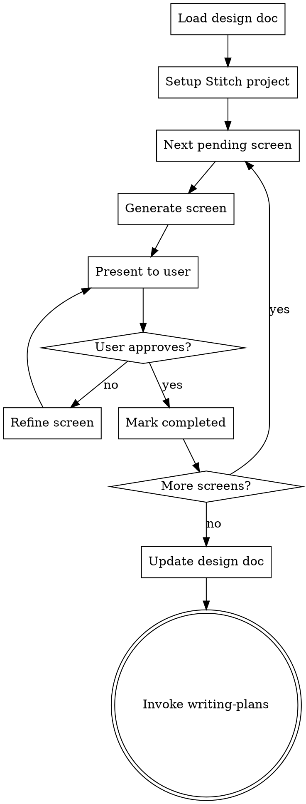
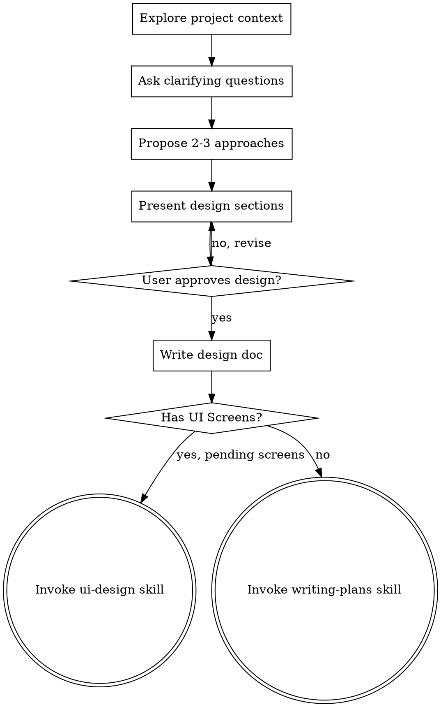
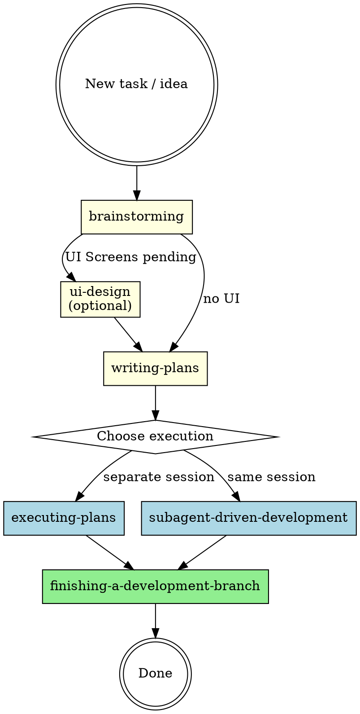

# Stitch UI Design Integration — Implementation Plan

> **For Claude:** REQUIRED SUB-SKILL: Use superpowers:executing-plans to implement this plan task-by-task.

**Goal:** Add an optional UI/UX design phase using Google Stitch between brainstorming and writing-plans in the development pipeline.

**Architecture:** Create a new `ui-design` skill that reads a `## UI Screens` table from the design doc, generates screens in Stitch one by one via MCP, iterates with the user, and updates the design doc with Stitch references. Modify `brainstorming` to detect UI needs and emit the table. Modify `development-process` to recognize the new state.

**Tech Stack:** Markdown skill files, Google Stitch MCP tools

---

### Task 1: Create the `ui-design` skill

**Files:**
- Create: `registry/skills/ui-design/SKILL.md`

**Step 1: Create the skill directory**

```bash
mkdir -p registry/skills/ui-design
```

**Step 2: Write the SKILL.md file**

Create `registry/skills/ui-design/SKILL.md` with the following exact content:

````markdown
---
name: ui-design
description: "Design UI screens using Google Stitch. Reads screens from the design doc's ## UI Screens table, generates them one by one via Stitch MCP, iterates with user feedback, and updates the design doc with Stitch references. Invoke after brainstorming when UI Screens section exists with pending screens."
---

# UI Design with Google Stitch

## Overview

Design UI screens using Google Stitch via MCP. This skill reads the `## UI Screens` table from an approved design doc, generates each screen in Stitch, iterates with the user until approved, and updates the design doc with Stitch references.

**Announce at start:** "I'm using the ui-design skill to design UI screens with Stitch."

<HARD-GATE>
Do NOT write any implementation code. This skill only produces visual designs in Stitch and updates the design doc with references. Implementation happens later in the pipeline via writing-plans → execution.
</HARD-GATE>

## Checklist

You MUST create a task for each of these items and complete them in order:

1. **Load design doc** — find and read the design doc, extract the `## UI Screens` table
2. **Setup Stitch project** — detect or create the Stitch project and design system
3. **Design screens** — generate each pending screen one by one, iterate with user until approved
4. **Update design doc** — update the table with Stitch references, commit
5. **Transition to planning** — invoke writing-plans skill

## Process Flow



**The terminal state is invoking writing-plans.** Do NOT invoke any other skill.

---

## Step 1: Load Design Doc

1. Scan `docs/plans/` for the most recent `*-design.md` that contains a `## UI Screens` section.
2. Parse the table to extract screens with their fields: Screen, Description, Device, Status.
3. Filter to only screens with status `pending`.
4. If no pending screens found, inform the user and invoke `writing-plans` immediately.

**Expected table format:**

```markdown
## UI Screens

| Screen | Description | Device | Status |
|--------|-------------|--------|--------|
| Login  | Login screen with email and OAuth | MOBILE | pending |
```

---

## Step 2: Setup Stitch Project

### Detect existing project

1. Call `list_projects` to check if a project with the feature name already exists.
2. If found, reuse it. If not, create one with `create_project`.

**Project naming convention:** Use the feature/topic name from the design doc filename. For example, `2026-03-25-checkout-flow-design.md` → project title "Checkout Flow".

### Design system

1. Call `list_design_systems` for the project.
2. **If a design system exists:** Reuse it silently. Inform the user which design system is active.
3. **If no design system exists:** Ask the user how they want to define the visual identity:

Present these options:
> "No design system found for this project. How would you like to define the visual identity?"
>
> **A) Describe the vibe** — Tell me the style you want (e.g., "minimalist, dark colors, rounded corners") and I'll generate a design system
>
> **B) Derive from reference** — Provide a URL or image with existing branding to extract the visual identity
>
> **C) Skip** — Don't use a design system; each screen will use Stitch's default styling

- **Option A:** Take the user's description, call `create_design_system` with the appropriate properties (colors, typography, roundness, colorMode), then `update_design_system` to finalize it.
- **Option B:** Use the reference to inform the design system properties, call `create_design_system` + `update_design_system`.
- **Option C:** Proceed without a design system.

If a design system was created or exists, it will be automatically applied to generated screens.

---

## Step 3: Design Screens (one by one)

For each screen with status `pending`, in the order listed in the table:

### 3a. Generate

1. Build a prompt combining:
   - The screen's Description from the table
   - Relevant context from the design doc (feature summary, user flows, constraints)
   - Any design system context (if active)
2. Call `generate_screen_from_text` with:
   - `projectId`: The Stitch project ID
   - `prompt`: The constructed prompt
   - `deviceType`: Map the Device column — `MOBILE`, `DESKTOP`, `TABLET`, or `AGNOSTIC`
   - `modelId`: `GEMINI_3_1_PRO` by default (high quality)
3. Generation takes a few minutes. Do NOT retry on connection errors — call `get_screen` to check status.
4. If `output_components` in the response contains suggestions, present them to the user. If accepted, call `generate_screen_from_text` again with the suggestion as the new prompt.

### 3b. Present

Present the generated screen to the user:
- Show the screenshot (Stitch returns a screenshot URL in the response)
- Describe the key UI elements generated
- Ask: *"Does this look good, or would you like changes?"*

### 3c. Iterate (if needed)

If the user requests changes:
- Use `edit_screens` with the user's feedback as the prompt. Make **one major change at a time**.
- Use specific UI/UX keywords in the edit prompt ("navigation bar", "call-to-action button", "card layout").
- Present the result again and ask for approval.
- If the user wants to explore alternatives, use `generate_variants` with appropriate settings:
  - `variantCount`: 2-3
  - `creativeRange`: `REFINE` for small tweaks, `EXPLORE` for broader changes, `REIMAGINE` for radical alternatives
  - `aspects`: As relevant — `LAYOUT`, `COLOR_SCHEME`, `IMAGES`, `TEXT_FONT`, `TEXT_CONTENT`
- Repeat until user approves.

### 3d. Approve

When user approves, record the screen's Stitch screen ID (from the `name` field in the response, format `screens/{id}`).

Inform the user: *"Screen '{name}' approved. Moving to next screen..."* (or *"All screens designed!"* if this was the last one).

**Model override:** If the user requests faster iteration at any point, switch to `GEMINI_3_FLASH` for subsequent generations. Inform: *"Switching to fast mode for quicker iterations."*

---

## Step 4: Update Design Doc

After all screens are approved:

1. Read the current design doc.
2. Replace the `## UI Screens` section with the updated table that includes the Stitch project reference and screen IDs:

```markdown
## UI Screens

> Stitch Project: `projects/{projectId}`

| Screen | Description | Device | Status | Stitch Screen |
|--------|-------------|--------|--------|---------------|
| Login  | Login screen with email and OAuth | MOBILE | completed | screens/xyz1 |
| Dashboard | Main view with key metrics | DESKTOP | completed | screens/xyz2 |
```

3. Commit the updated design doc:

```bash
git add docs/plans/<design-doc-filename>.md
git commit -m "docs: update design doc with Stitch UI screen references"
```

---

## Step 5: Transition to Planning

After committing the updated design doc:

- Invoke the `writing-plans` skill to create the implementation plan.
- Do NOT invoke any other skill. `writing-plans` is the only valid next step.

---

## Key Principles

- **One screen at a time** — Don't batch-generate. Present and approve each individually.
- **One edit at a time** — When refining, make one major change per edit call.
- **Use UI/UX keywords** — "navigation bar", "hero section", "card grid", "floating action button".
- **GEMINI_3_1_PRO by default** — Switch to GEMINI_3_FLASH only if user requests speed.
- **References only** — Store Stitch IDs in the design doc, don't download screenshots or HTML to the repo.
- **No implementation** — This skill designs screens, it does not write code.

---

## Stitch MCP Tools Reference

| Tool | When to use |
|------|-------------|
| `create_project(title)` | Create a new Stitch project for the feature |
| `get_project(name)` | Retrieve project details. Format: `projects/{project}` |
| `list_projects(filter?)` | List projects. Filter: `view=owned` (default) or `view=shared` |
| `list_screens(projectId)` | List all screens in a project |
| `get_screen(name, projectId, screenId)` | Retrieve screen details with htmlCode, screenshot, figmaExport URLs |
| `generate_screen_from_text(projectId, prompt, deviceType?, modelId?)` | Generate a new screen from a text prompt |
| `edit_screens(projectId, selectedScreenIds[], prompt, deviceType?, modelId?)` | Edit existing screens with a change prompt |
| `generate_variants(projectId, selectedScreenIds[], prompt, variantOptions)` | Generate design variants for exploration |
| `create_design_system(designSystem, projectId?)` | Create a new design system |
| `update_design_system(name, projectId, designSystem)` | Update an existing design system |
| `list_design_systems(projectId?)` | List design systems for a project |
| `apply_design_system(projectId, selectedScreenInstances[], assetId)` | Apply design system to specific screens |

**Device types:** `MOBILE`, `DESKTOP`, `TABLET`, `AGNOSTIC`

**Models:** `GEMINI_3_1_PRO` (high quality, default), `GEMINI_3_FLASH` (fast wireframing)

**Variant options:**
- `variantCount`: 1-5 (default 3)
- `creativeRange`: `REFINE` | `EXPLORE` | `REIMAGINE`
- `aspects`: `LAYOUT` | `COLOR_SCHEME` | `IMAGES` | `TEXT_FONT` | `TEXT_CONTENT`
````

**Step 3: Verify the file was created correctly**

```bash
head -5 registry/skills/ui-design/SKILL.md
```

Expected: The YAML frontmatter with `name: ui-design`.

**Step 4: Commit**

```bash
git add registry/skills/ui-design/SKILL.md
git commit -m "feat: add ui-design skill for Stitch integration"
```

---

### Task 2: Modify brainstorming to detect UI and emit `## UI Screens`

**Files:**
- Modify: `registry/skills/brainstorming/SKILL.md`

**Step 1: Update the terminal state paragraph**

Find this text at line 55:

```markdown
**The terminal state is invoking writing-plans.** Do NOT invoke frontend-design, mcp-builder, or any other implementation skill. The ONLY skill you invoke after brainstorming is writing-plans.
```

Replace with:

```markdown
**The terminal state is invoking either `ui-design` or `writing-plans`:**
- If the design doc contains a `## UI Screens` section with pending screens → invoke `ui-design`
- If no `## UI Screens` section exists → invoke `writing-plans`

Do NOT invoke any other implementation skill.
```

**Step 2: Update the process flow diagram**

Find the existing `digraph brainstorming` block (lines 36-52) and replace the entire block with:



**Step 3: Update the "After the Design" section**

Find the "Implementation" subsection under "After the Design" (lines 85-87):

```markdown
**Implementation:**
- Invoke the writing-plans skill to create a detailed implementation plan
- Do NOT invoke any other skill. writing-plans is the next step.
```

Replace with:

```markdown
**Next step routing:**
- If the design doc has a `## UI Screens` section with pending screens → invoke `ui-design`
- Otherwise → invoke `writing-plans` to create a detailed implementation plan
- Do NOT invoke any other skill.
```

**Step 4: Add UI Detection section before "Key Principles"**

Insert the following new section before the `## Key Principles` section (before line 89):

```markdown
## UI Screen Detection

During the "Presenting the design" phase, evaluate whether the feature involves UI screens that would benefit from visual design with Stitch:

**Criteria (all must be true):**
1. The feature has direct user interaction (not purely backend, API, or CLI)
2. It requires new screens or significant layout changes
3. The visual complexity justifies a designer (a button text change does not)

**If UI screens are detected:**

After the user approves the full design, before writing the design doc, present the detected screens:

> "I detected N screens that could benefit from UI design with Stitch: [list screens]. Do you want to go through the UI design phase or skip it?"

- **User accepts** → add a `## UI Screens` section to the design doc with a table:

```markdown
## UI Screens

| Screen | Description | Device | Status |
|--------|-------------|--------|--------|
| [name] | [description] | [MOBILE/DESKTOP/TABLET] | pending |
```

- **User skips** → do not add the section. Proceed directly to `writing-plans`.

**If no UI screens detected:** Do not add the section. Proceed directly to `writing-plans`.
```

**Step 5: Verify the changes look correct**

```bash
grep -n "ui-design\|UI Screens\|writing-plans" registry/skills/brainstorming/SKILL.md
```

Expected: Multiple matches showing the new routing logic and UI detection section.

**Step 6: Commit**

```bash
git add registry/skills/brainstorming/SKILL.md
git commit -m "feat: add UI screen detection and ui-design routing to brainstorming"
```

---

### Task 3: Modify development-process to recognize the UI Design state

**Files:**
- Modify: `registry/skills/development-process/SKILL.md`

**Step 1: Update the lifecycle diagram**

Find the existing `digraph lifecycle` block (lines 16-37) and replace with:



**Step 2: Update the pipeline skills table**

Find the existing pipeline skills table (lines 42-48):

```markdown
| Phase | Skill | Trigger | Output |
|-------|-------|---------|--------|
| 1. Design | `brainstorming` | New feature, new task, creative work | Design doc in `docs/plans/YYYY-MM-DD-<topic>-design.md` |
| 2. Planning | `writing-plans` | Design doc approved | Implementation plan in `docs/plans/YYYY-MM-DD-<topic>-plan.md` |
| 3a. Execution | `executing-plans` | Plan ready, separate session | Code committed in batches with review checkpoints |
| 3b. Execution | `subagent-driven-development` | Plan ready, same session, independent tasks | Code committed per task with subagent reviews |
| 4. Completion | `finishing-a-development-branch` | All tasks done, tests pass | Merge, PR, or branch cleanup |
```

Replace with:

```markdown
| Phase | Skill | Trigger | Output |
|-------|-------|---------|--------|
| 1. Design | `brainstorming` | New feature, new task, creative work | Design doc with optional `## UI Screens` section |
| 1.5. UI Design | `ui-design` | Design doc has `## UI Screens` with pending screens | Design doc updated with Stitch screen references |
| 2. Planning | `writing-plans` | Design doc without pending UI screens | Implementation plan in `docs/plans/YYYY-MM-DD-<topic>-plan.md` |
| 3a. Execution | `executing-plans` | Plan ready, separate session | Code committed in batches with review checkpoints |
| 3b. Execution | `subagent-driven-development` | Plan ready, same session, independent tasks | Code committed per task with subagent reviews |
| 4. Completion | `finishing-a-development-branch` | All tasks done, tests pass | Merge, PR, or branch cleanup |
```

**Step 3: Update the state identification table**

Find the existing state identification table (lines 66-71):

```markdown
| Files found | State | Next action |
|-------------|-------|-------------|
| No design or plan files for the topic | **New** | Invoke `brainstorming` |
| `*-design.md` exists but no `*-plan.md` | **Designed** | Invoke `writing-plans` |
| `*-plan.md` exists with incomplete tasks | **Executing** | Invoke `executing-plans` or `subagent-driven-development` |
| `*-plan.md` exists, all tasks complete | **Finishing** | Invoke `finishing-a-development-branch` |
```

Replace with:

```markdown
| Files found | State | Next action |
|-------------|-------|-------------|
| No design or plan files for the topic | **New** | Invoke `brainstorming` |
| `*-design.md` with `## UI Screens` section containing `pending` screens | **UI Design pending** | Invoke `ui-design` |
| `*-design.md` without `## UI Screens` or all screens completed, no `*-plan.md` | **Designed** | Invoke `writing-plans` |
| `*-plan.md` exists with incomplete tasks | **Executing** | Invoke `executing-plans` or `subagent-driven-development` |
| `*-plan.md` exists, all tasks complete | **Finishing** | Invoke `finishing-a-development-branch` |
```

**Step 4: Update the "build X" decision rule**

Find the decision rule (lines 96-100):

```markdown
### When user says "build X" or "add feature Y"
1. Check `docs/plans/` for existing design/plan
2. If nothing exists → `brainstorming` (do NOT skip to coding)
3. If design exists → `writing-plans`
4. If plan exists → execution skill
```

Replace with:

```markdown
### When user says "build X" or "add feature Y"
1. Check `docs/plans/` for existing design/plan
2. If nothing exists → `brainstorming` (do NOT skip to coding)
3. If design exists with `## UI Screens` containing `pending` screens → `ui-design`
4. If design exists without pending UI → `writing-plans`
5. If plan exists → execution skill
```

**Step 5: Verify the changes look correct**

```bash
grep -n "ui-design\|UI Design\|UI Screens" registry/skills/development-process/SKILL.md
```

Expected: Multiple matches in the lifecycle diagram, pipeline table, state table, and decision rules.

**Step 6: Commit**

```bash
git add registry/skills/development-process/SKILL.md
git commit -m "feat: add ui-design phase to development process orchestrator"
```

---

### Task 4: Verify full integration

**Step 1: Verify all three files exist and have the expected content**

```bash
# Verify ui-design skill exists
test -f registry/skills/ui-design/SKILL.md && echo "OK: ui-design skill exists" || echo "FAIL: ui-design skill missing"

# Verify brainstorming has UI detection
grep -q "UI Screen Detection" registry/skills/brainstorming/SKILL.md && echo "OK: brainstorming has UI detection" || echo "FAIL: brainstorming missing UI detection"

# Verify development-process has UI Design state
grep -q "UI Design pending" registry/skills/development-process/SKILL.md && echo "OK: dev-process has UI state" || echo "FAIL: dev-process missing UI state"
```

Expected: All three lines print "OK".

**Step 2: Verify the routing chain is consistent**

Check that:
1. `brainstorming` references `ui-design` as a possible terminal state
2. `ui-design` references `writing-plans` as its terminal state
3. `development-process` lists `ui-design` between brainstorming and writing-plans

```bash
# brainstorming → ui-design
grep -c "invoke.*ui-design" registry/skills/brainstorming/SKILL.md

# ui-design → writing-plans
grep -c "invoke.*writing-plans" registry/skills/ui-design/SKILL.md

# dev-process lists ui-design
grep -c "ui-design" registry/skills/development-process/SKILL.md
```

Expected: Each command returns at least 1.

**Step 3: No commit needed — this is verification only.**
