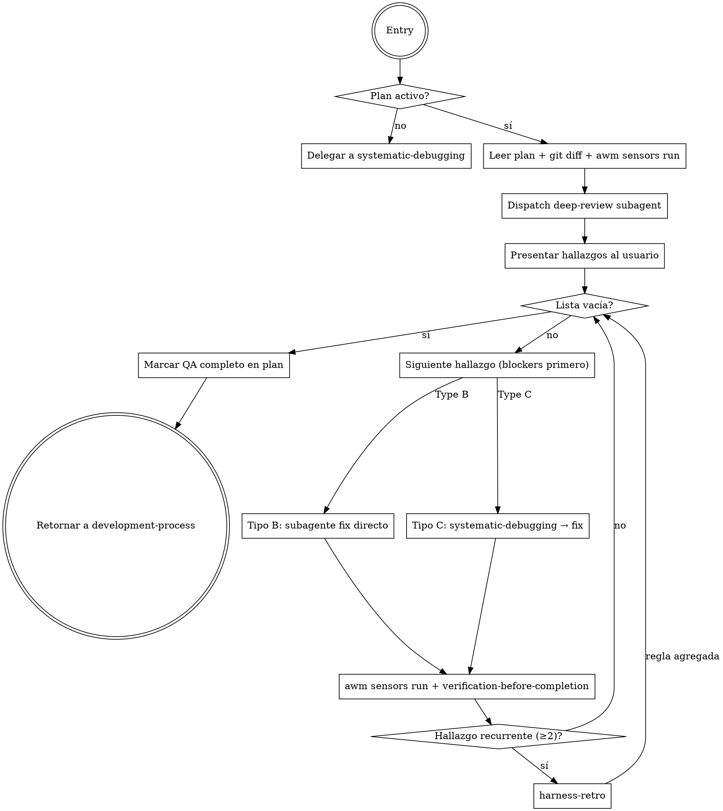

# New Skills — Plan Consolidado
<!-- awm-qa-complete: 2026-05-31 -->

> **For agentic workers:** REQUIRED SUB-SKILL: Use `subagent-driven-development` (recommended) o `executing-plans` para implementar este plan tarea por tarea. Los steps usan sintaxis checkbox (`- [ ]`) para tracking.

**Goal:** Dos workstreams independientes en una sola sesión de ejecución: (A) vendorizar las skills de diseño al registry AWM, y (B) agregar la fase formal de QA post-implementación al harness.

**Architecture:**
- **Workstream A:** `frontend-craft` (orquestador con emil + design-taste como referencias), `impeccable` (vendorizado sin capa live/Codex), 3 stitch-skills de Google. Se registran en `processes.json` y `skills-lock.json`.
- **Workstream B:** Skill nueva `post-implementation-qa` con subagente de revisión profunda, integrada en `development-process` como fase entre ejecución y finishing. Detectable por marker `<!-- awm-qa-complete -->` en el plan.

**Tech Stack:** Markdown (skills), JSON (processes.json, skills-lock.json), TypeScript + Jest (tests de validación del registry), Node.

**Specs de referencia:**
- `docs/plans/2026-05-29-design-skills-integration-design.md`
- `docs/plans/2026-05-31-post-implementation-qa-design.md`

> **Nota:** Este plan consolida y reemplaza `2026-05-29-design-skills-vendoring-plan.md` y `2026-05-31-post-implementation-qa-plan.md`. Ambos están superseded.

---

## File Map

### Workstream A — Design Skills

| Acción | Archivo |
|--------|---------|
| Crear | `cli/tests/registry/design-skills.test.ts` |
| Crear | `registry/skills/frontend-craft/SKILL.md` |
| Crear | `registry/skills/frontend-craft/reference/emil-design-eng.md` |
| Crear | `registry/skills/frontend-craft/reference/design-taste-frontend.md` |
| Crear | `registry/skills/impeccable/**` (vendorizado y podado) |
| Crear | `registry/skills/extract-design-md/**` |
| Crear | `registry/skills/code-to-design/**` |
| Crear | `registry/skills/react-components/**` |
| Modificar | `registry/processes.json` |
| Modificar | `skills-lock.json` |

### Workstream B — Post-Implementation QA

| Acción | Archivo |
|--------|---------|
| Crear | `registry/skills/post-implementation-qa/SKILL.md` |
| Crear | `registry/skills/post-implementation-qa/deep-review-prompt.md` |
| Modificar | `registry/skills/development-process/SKILL.md` |
| Instalar | `~/.awm/registry/registry/skills/post-implementation-qa/` |
| Instalar | `~/.claude/skills/post-implementation-qa` (symlink) |

---

# WORKSTREAM A — Design Skills Vendoring

## Task 1: Test de validación estructural (ancla TDD)

Define el estado final esperado del registry. Se escribe primero y falla; las tareas siguientes lo hacen pasar por bloques.

**Files:**
- Create: `cli/tests/registry/design-skills.test.ts`

- [ ] **Step 1: Escribir el test (falla en su totalidad al inicio)**

```typescript
import fs from 'fs';
import path from 'path';

const REGISTRY = path.join(__dirname, '..', '..', '..', 'registry');
const SKILLS = path.join(REGISTRY, 'skills');
const PROCESSES_FILE = path.join(REGISTRY, 'processes.json');
const LOCK_FILE = path.join(__dirname, '..', '..', '..', 'skills-lock.json');

function frontmatter(skill: string): string {
  const content = fs.readFileSync(path.join(SKILLS, skill, 'SKILL.md'), 'utf-8');
  const match = content.match(/^---\n([\s\S]*?)\n---/);
  expect(match).not.toBeNull();
  return match![1];
}

describe('frontend-craft skill', () => {
  it('exists with valid frontmatter', () => {
    const fm = frontmatter('frontend-craft');
    expect(fm).toMatch(/^name:\s*frontend-craft\s*$/m);
    expect(fm).toMatch(/^description:\s*.+$/m);
  });

  it('bundles emil and taste as internal references', () => {
    const ref = path.join(SKILLS, 'frontend-craft', 'reference');
    expect(fs.existsSync(path.join(ref, 'emil-design-eng.md'))).toBe(true);
    expect(fs.existsSync(path.join(ref, 'design-taste-frontend.md'))).toBe(true);
  });

  it('SKILL.md points to its reference files', () => {
    const content = fs.readFileSync(path.join(SKILLS, 'frontend-craft', 'SKILL.md'), 'utf-8');
    expect(content).toMatch(/reference\/emil-design-eng\.md/);
    expect(content).toMatch(/reference\/design-taste-frontend\.md/);
  });
});

describe('impeccable skill (non-live scope)', () => {
  const base = path.join(SKILLS, 'impeccable');

  it('exists with valid frontmatter', () => {
    expect(fs.existsSync(path.join(base, 'SKILL.md'))).toBe(true);
  });

  it('has no literal .agents/skills/impeccable paths in markdown', () => {
    const mdFiles = [
      path.join(base, 'SKILL.md'),
      ...fs.readdirSync(path.join(base, 'reference')).map((f) => path.join(base, 'reference', f)),
    ];
    for (const f of mdFiles) {
      const content = fs.readFileSync(f, 'utf-8');
      expect(content).not.toMatch(/\.agents\/skills\/impeccable/);
    }
  });

  it('dropped the live/Codex layer', () => {
    expect(fs.existsSync(path.join(base, 'agents'))).toBe(false);
    expect(fs.existsSync(path.join(base, 'reference', 'live.md'))).toBe(false);
    expect(fs.existsSync(path.join(base, 'reference', 'codex.md'))).toBe(false);
    const liveScripts = fs.readdirSync(path.join(base, 'scripts')).filter((f) => /^live-/.test(f) || f === 'modern-screenshot.umd.js');
    expect(liveScripts).toEqual([]);
  });

  it('kept the static detector and non-live support scripts', () => {
    const scripts = path.join(base, 'scripts');
    for (const keep of ['detect.mjs', 'context.mjs', 'critique-storage.mjs', 'impeccable-paths.mjs']) {
      expect(fs.existsSync(path.join(scripts, keep))).toBe(true);
    }
    expect(fs.existsSync(path.join(scripts, 'detector'))).toBe(true);
  });

  it('removed the live row from the commands table', () => {
    const content = fs.readFileSync(path.join(base, 'SKILL.md'), 'utf-8');
    expect(content).not.toMatch(/\|\s*`live`\s*\|/);
  });
});

describe('google stitch skills', () => {
  for (const s of ['extract-design-md', 'code-to-design', 'react-components']) {
    it(`${s} exists with SKILL.md`, () => {
      expect(fs.existsSync(path.join(SKILLS, s, 'SKILL.md'))).toBe(true);
    });
  }
});

describe('processes.json', () => {
  const processes = JSON.parse(fs.readFileSync(PROCESSES_FILE, 'utf-8')) as Array<{
    name: string; skills: string[]; workflows: string[]; agents?: string[];
  }>;

  it('core-dev includes frontend-craft', () => {
    const core = processes.find((p) => p.name === 'core-dev');
    expect(core).toBeDefined();
    expect(core!.skills).toContain('frontend-craft');
  });

  it('frontend-design process exists with the heavy design skills', () => {
    const fd = processes.find((p) => p.name === 'frontend-design');
    expect(fd).toBeDefined();
    for (const s of ['impeccable', 'ui-design', 'extract-design-md', 'code-to-design', 'react-components']) {
      expect(fd!.skills).toContain(s);
    }
  });

  it('every skill referenced by any process exists on disk', () => {
    for (const p of processes) {
      for (const skill of p.skills) {
        expect(fs.existsSync(path.join(SKILLS, skill, 'SKILL.md'))).toBe(true);
      }
    }
  });
});

describe('skills-lock.json', () => {
  const lock = JSON.parse(fs.readFileSync(LOCK_FILE, 'utf-8')) as { version: number; skills: Record<string, { source: string; sourceType: string }> };

  it('records provenance for the new external skills', () => {
    for (const s of ['emil-design-eng', 'design-taste-frontend', 'impeccable', 'extract-design-md', 'code-to-design', 'react-components']) {
      expect(lock.skills[s]).toBeDefined();
      expect(lock.skills[s].source).toMatch(/.+\/.+/);
      expect(lock.skills[s].sourceType).toBe('github');
    }
  });
});
```

- [ ] **Step 2: Correr el test para verificar que falla**

Run: `cd cli && npx jest tests/registry/design-skills.test.ts`
Expected: FAIL — todos los `describe` fallan (los archivos/entradas aún no existen).

- [ ] **Step 3: Commit**

```bash
git add cli/tests/registry/design-skills.test.ts
git commit -m "test(registry): validación estructural de skills de diseño (failing)"
```

---

## Task 2: Crear frontend-craft con emil y design-taste como referencias

Hace pasar el bloque `describe('frontend-craft skill')`.

**Files:**
- Create: `registry/skills/frontend-craft/reference/emil-design-eng.md`
- Create: `registry/skills/frontend-craft/reference/design-taste-frontend.md`
- Create: `registry/skills/frontend-craft/SKILL.md`

- [ ] **Step 1: Copiar el conocimiento de emil y design-taste como referencias**

```bash
mkdir -p registry/skills/frontend-craft/reference
cp ~/.agents/skills/emil-design-eng/SKILL.md registry/skills/frontend-craft/reference/emil-design-eng.md
cp ~/.agents/skills/design-taste-frontend/SKILL.md registry/skills/frontend-craft/reference/design-taste-frontend.md
```

- [ ] **Step 2: En cada referencia, neutralizar el frontmatter para que NO dispare como skill**

Editar el frontmatter de ambos archivos copiados. En `reference/emil-design-eng.md` y `reference/design-taste-frontend.md`, reemplazar el bloque `---\nname: ...\ndescription: ...\n---` por un encabezado de referencia plano (sin frontmatter de skill):

Para `reference/emil-design-eng.md` — primera línea queda:
```markdown
# Referencia: Emil Kowalski — Design Engineering (conocimiento de craft/animación)
```
Para `reference/design-taste-frontend.md` — primera línea queda:
```markdown
# Referencia: tasteskill — Anti-Slop Frontend (Design Read, dials, hard-rules)
```
Eliminar las líneas `---`/`name:`/`description:` originales. Conservar TODO el resto del contenido (cuerpo íntegro). Esto evita que el discovery o el harness los traten como skills triggerables.

- [ ] **Step 3: Escribir el SKILL.md orquestador de frontend-craft**

Crear `registry/skills/frontend-craft/SKILL.md` con el siguiente contenido exacto:

```markdown
---
name: frontend-craft
description: Use during development when implementing or adjusting any frontend/UI surface (landing pages, dashboards, components, forms, layouts, responsive behavior, styling, animation, polish). The single entry point for frontend craft — applies anti-slop, typography, color and responsive rules, and escalates to the impeccable engine for UI-centric work. NOT for backend, API, CLI, or non-UI tasks.
---

# Frontend Craft

The single orchestrator for frontend craft during development. It exists because LLM-built UI defaults to generic, templated output. This skill injects taste and rules, and decides how deep to go.

**Announce at start:** "I'm using the frontend-craft skill to apply frontend craft."

## Knowledge base

This skill draws on two bundled references. Read the relevant one before acting:
- `reference/design-taste-frontend.md` — Design Read (infer the brief), dials, anti-slop tells, layout/typography/color hard-rules. Read FIRST for any new surface.
- `reference/emil-design-eng.md` — animation decision framework, springs, easing, micro-interactions, component polish. Read when motion/interaction quality matters.

## When invoked

1. **Read the Design Direction.** If the design doc has a `## Design Direction` section (from brainstorming), treat it as the brief. If absent, infer it using `reference/design-taste-frontend.md` §0 (Read the Room) before writing UI.
2. **Apply the always-on rules** from the references: typography scale, color calibration, spacing rhythm, responsive hard-rules, and the anti-slop / AI-tells checklist. These are mandatory for every UI task.
3. **Decide depth:**
   - **Minor change** (button, copy, single component tweak) → apply the rules directly, no escalation.
   - **UI-centric work** (a landing, a dashboard, a full page or redesign) → escalate to the `impeccable` engine: invoke its matching sub-command (`craft`/`shape` to build, `polish`/`audit`/`critique` to refine) per its routing rules.
4. **Self-check** against the anti-slop checklist before declaring the UI task done.

## Escalation contract

When escalating, hand impeccable the surface/target and the Design Direction. impeccable owns its own flow from there; return to the calling execution skill when it finishes.

## Boundaries

- Does NOT design screens from scratch in a tool — that is `ui-design` (Stitch), which runs earlier in the pipeline.
- Does NOT do backend/API/CLI work.
```

- [ ] **Step 4: Correr el bloque para verificar que pasa**

Run: `cd cli && npx jest tests/registry/design-skills.test.ts -t "frontend-craft skill"`
Expected: PASS (3 tests).

- [ ] **Step 5: Commit**

```bash
git add registry/skills/frontend-craft
git commit -m "feat(skills): frontend-craft orquestador con emil + design-taste como referencias"
```

---

## Task 3: Vendorizar impeccable (copiar árbol completo)

**Files:**
- Create: `registry/skills/impeccable/**` (copia desde `~/.agents/skills/impeccable`)

- [ ] **Step 1: Copiar el árbol completo**

```bash
mkdir -p registry/skills/impeccable
cp -R ~/.agents/skills/impeccable/. registry/skills/impeccable/
```

- [ ] **Step 2: Verificar la copia**

Run: `ls registry/skills/impeccable && ls registry/skills/impeccable/scripts | head`
Expected: aparecen `SKILL.md`, `agents/`, `reference/`, `scripts/`.

- [ ] **Step 3: Commit (snapshot intacto antes de podar)**

```bash
git add registry/skills/impeccable
git commit -m "chore(skills): vendor impeccable (snapshot intacto)"
```

---

## Task 4: Podar la capa live/Codex de impeccable

Hace pasar `it('dropped the live/Codex layer')` y `it('kept the static detector...')`.

**Files:**
- Delete: `registry/skills/impeccable/agents/` (dir completo)
- Delete: `registry/skills/impeccable/scripts/live-*.mjs`, `live-browser*.js`, `modern-screenshot.umd.js`
- Delete: `registry/skills/impeccable/reference/live.md`, `reference/codex.md`

- [ ] **Step 1: Eliminar la capa live/Codex**

```bash
cd registry/skills/impeccable
rm -rf agents
rm -f scripts/live-*.mjs scripts/live-browser.js scripts/live-browser-session.js scripts/modern-screenshot.umd.js
rm -f reference/live.md reference/codex.md
cd -
```

- [ ] **Step 2: Verificar que solo quedan scripts no-live**

Run: `ls registry/skills/impeccable/scripts | grep -E "^live|modern-screenshot" || echo "OK: sin scripts live"`
Expected: `OK: sin scripts live`

- [ ] **Step 3: Verificar que sobreviven los scripts clave**

Run: `ls registry/skills/impeccable/scripts/{detect.mjs,context.mjs,critique-storage.mjs,impeccable-paths.mjs} registry/skills/impeccable/scripts/detector`
Expected: todos existen.

- [ ] **Step 4: Commit**

```bash
git add -A registry/skills/impeccable
git commit -m "refactor(impeccable): podar capa live/Codex (fuera de alcance)"
```

---

## Task 5: Arreglar paths y quitar la fila `live` de impeccable

Hace pasar `it('has no literal .agents/skills/impeccable paths...')` y `it('removed the live row...')`.

**Files:**
- Modify: `registry/skills/impeccable/SKILL.md`
- Modify: `registry/skills/impeccable/reference/init.md`
- Modify: `registry/skills/impeccable/reference/critique.md`
- Modify: `registry/skills/impeccable/reference/polish.md`

- [ ] **Step 1: Reemplazar las invocaciones literales de path**

En los 4 archivos, reemplazar TODA ocurrencia del prefijo literal `.agents/skills/impeccable/scripts/` por `"$CLAUDE_PLUGIN_ROOT/scripts/"`. Ejemplo en SKILL.md:

- Antes: `` Run `node .agents/skills/impeccable/scripts/context.mjs` once per session. ``
- Después: `` Run `node "$CLAUDE_PLUGIN_ROOT/scripts/context.mjs"` once per session. ``

Aplicar el mismo reemplazo a todas las invocaciones de `context-signals.mjs`, `detect.mjs`, `pin.mjs` y cualquier otro script en los 4 archivos.

- [ ] **Step 2: Eliminar la fila `live` de la tabla de comandos en SKILL.md**

Borrar la línea de la tabla "## Commands":
```
| `live` | Iterate | Visual variant mode: pick elements in the browser, generate alternatives | [reference/live.md](reference/live.md) |
```
En "### Routing rules" y "## Pin / Unpin", eliminar las menciones a `live`. Donde el texto recomiende `live` para iteración visual, reemplazar por: "para iteración visual usá el loop de verificación visual del pipeline (Playwright)".

- [ ] **Step 3: Verificar que no quedan paths literales ni fila live**

Run: `grep -rn "\.agents/skills/impeccable" registry/skills/impeccable/SKILL.md registry/skills/impeccable/reference/ ; grep -n "\`live\`" registry/skills/impeccable/SKILL.md || echo "OK"`
Expected: sin coincidencias de `.agents/skills/impeccable`; sin fila `live`.

- [ ] **Step 4: Correr el bloque impeccable del test**

Run: `cd cli && npx jest tests/registry/design-skills.test.ts -t "impeccable skill"`
Expected: PASS (6 tests).

- [ ] **Step 5: Commit**

```bash
git add registry/skills/impeccable
git commit -m "fix(impeccable): resolver paths contra dir de skill + quitar comando live"
```

---

## Task 6: De-tuning de prosa GPT→Claude en impeccable

**Files:**
- Modify: `registry/skills/impeccable/SKILL.md` y `registry/skills/impeccable/reference/*.md` (los que mencionen GPT)

- [ ] **Step 1: Listar archivos con prosa GPT**

Run: `grep -rln "GPT\|Codex\|codex" registry/skills/impeccable/SKILL.md registry/skills/impeccable/reference/`
Expected: lista de archivos (SKILL.md + varias refs).

- [ ] **Step 2: Reescribir las menciones de prosa**

En cada archivo listado, reemplazar frases con sabor GPT por su equivalente neutro/Claude:
- `"GPT is capable of extraordinary work. Don't hold back."` → `"Produce extraordinary work. Don't hold back."`
- `"GPT"` como sujeto que actúa → `"you"` / `"the agent"`
- Referencias a `reference/codex.md` (ya borrado) → eliminar la línea/enlace
- Menciones a flujos Codex-only de `live` → eliminar

NO tocar bloques de código ni nombres de scripts; solo prosa instruccional.

- [ ] **Step 3: Verificar que no quedan menciones GPT/Codex en prosa**

Run: `grep -rn "GPT\|Codex" registry/skills/impeccable/SKILL.md registry/skills/impeccable/reference/ || echo "OK: prosa de-tuneada"`
Expected: `OK: prosa de-tuneada` (o solo coincidencias en bloques de código legítimos).

- [ ] **Step 4: Commit**

```bash
git add registry/skills/impeccable
git commit -m "refactor(impeccable): de-tuning de prosa GPT a Claude"
```

---

## Task 7: Vendorizar las 3 stitch-skills de Google

Hace pasar `describe('google stitch skills')`.

**Files:**
- Create: `registry/skills/extract-design-md/**`
- Create: `registry/skills/code-to-design/**`
- Create: `registry/skills/react-components/**`

- [ ] **Step 1: Clonar el repo de Google en un temporal**

```bash
git clone --depth 1 https://github.com/google-labs-code/stitch-skills.git /tmp/stitch-skills
```
Expected: clona el repo.

- [ ] **Step 2: Copiar las 3 skills a registry/skills**

```bash
cp -R /tmp/stitch-skills/plugins/stitch-design/skills/extract-design-md registry/skills/extract-design-md
cp -R /tmp/stitch-skills/plugins/stitch-design/skills/code-to-design registry/skills/code-to-design
cp -R /tmp/stitch-skills/plugins/stitch-build/skills/react-components registry/skills/react-components
```

- [ ] **Step 3: Verificar que cada una tiene SKILL.md**

Run: `ls registry/skills/{extract-design-md,code-to-design,react-components}/SKILL.md`
Expected: los 3 existen. (Si la ruta interna difiere, ajustar con `find /tmp/stitch-skills -name SKILL.md -path '*extract-design-md*'`.)

- [ ] **Step 4: Limpiar el temporal**

```bash
rm -rf /tmp/stitch-skills
```

- [ ] **Step 5: Correr el bloque stitch del test**

Run: `cd cli && npx jest tests/registry/design-skills.test.ts -t "google stitch skills"`
Expected: PASS (3 tests).

- [ ] **Step 6: Commit**

```bash
git add registry/skills/extract-design-md registry/skills/code-to-design registry/skills/react-components
git commit -m "feat(skills): vendor stitch-skills de Google (extract-design-md, code-to-design, react-components)"
```

---

## Task 8: Registrar en processes.json

Hace pasar `describe('processes.json')`.

**Files:**
- Modify: `registry/processes.json`

- [ ] **Step 1: Añadir `frontend-craft` al array `skills` del proceso `core-dev`**

En el objeto con `"name": "core-dev"`, agregar `"frontend-craft"` al final del array `skills`. Queda, p.ej., `..., "project-constitution", "frontend-craft"]`.

- [ ] **Step 2: Añadir el nuevo proceso `frontend-design`**

Agregar este objeto al array de processes:

```json
{
  "name": "frontend-design",
  "description": "Capa de diseño e implementación frontend: motor de craft (impeccable), diseño visual con Stitch (ui-design) y handoff Stitch→código (extract-design-md, code-to-design, react-components).",
  "skills": ["impeccable", "ui-design", "extract-design-md", "code-to-design", "react-components"],
  "workflows": [],
  "agents": []
}
```

- [ ] **Step 3: Verificar JSON válido**

Run: `node -e "JSON.parse(require('fs').readFileSync('registry/processes.json','utf8')); console.log('JSON OK')"`
Expected: `JSON OK`

- [ ] **Step 4: Correr el bloque processes del test**

Run: `cd cli && npx jest tests/registry/design-skills.test.ts -t "processes.json"`
Expected: PASS (3 tests).

- [ ] **Step 5: Commit**

```bash
git add registry/processes.json
git commit -m "feat(registry): frontend-craft en core-dev + proceso frontend-design"
```

---

## Task 9: Registrar procedencia en skills-lock.json

Hace pasar `describe('skills-lock.json')`.

**Files:**
- Modify: `skills-lock.json`

- [ ] **Step 1: Añadir entradas de procedencia**

Dentro del objeto `"skills"` de `skills-lock.json`, agregar:

```json
"emil-design-eng": { "source": "emilkowalski/skill", "sourceType": "github" },
"design-taste-frontend": { "source": "Leonxlnx/taste-skill", "sourceType": "github" },
"impeccable": { "source": "pbakaus/impeccable", "sourceType": "github" },
"extract-design-md": { "source": "google-labs-code/stitch-skills", "sourceType": "github" },
"code-to-design": { "source": "google-labs-code/stitch-skills", "sourceType": "github" },
"react-components": { "source": "google-labs-code/stitch-skills", "sourceType": "github" }
```

- [ ] **Step 2: Verificar JSON válido**

Run: `node -e "JSON.parse(require('fs').readFileSync('skills-lock.json','utf8')); console.log('JSON OK')"`
Expected: `JSON OK`

- [ ] **Step 3: Correr el bloque lock del test**

Run: `cd cli && npx jest tests/registry/design-skills.test.ts -t "skills-lock.json"`
Expected: PASS.

- [ ] **Step 4: Commit**

```bash
git add skills-lock.json
git commit -m "chore(registry): registrar procedencia de skills de diseño en skills-lock"
```

---

## Task 10: Verificación completa del registry (Workstream A)

**Files:** (ninguno nuevo — verificación)

- [ ] **Step 1: Correr toda la suite del CLI**

Run: `cd cli && npm test`
Expected: PASS, incluyendo `tests/registry/design-skills.test.ts` completo y sin romper tests existentes.

- [ ] **Step 2: Self-review final Workstream A**

Confirmar:
- `frontend-craft` no colisiona (emil/design-taste sin frontmatter de skill).
- impeccable sin paths literales, sin capa live, sin prosa GPT.
- processes.json y skills-lock.json válidos y con todas las entradas.

---

# WORKSTREAM B — Post-Implementation QA Skill

## Task 11: Crear `deep-review-prompt.md`

**Files:**
- Create: `registry/skills/post-implementation-qa/deep-review-prompt.md`

- [ ] **Step 1: Crear el directorio y el archivo de prompt**

```bash
mkdir -p registry/skills/post-implementation-qa
```

Crear `registry/skills/post-implementation-qa/deep-review-prompt.md` con el siguiente contenido exacto:

````markdown
# Deep Review Prompt Template

Use this template when dispatching the deep-review subagent in `post-implementation-qa`.

**Purpose:** Find Type B (fidelity) and Type C (quality) issues by comparing the plan against what was actually built.

```
Agent tool (general-purpose):
  description: "Deep QA review: plan vs implementation"
  prompt: |
    You are performing a post-implementation QA review. Your job is to find gaps and bugs — be thorough and adversarial, not diplomatic. The team needs real issues, not reassurance.

    ## The Plan

    [PASTE FULL PLAN TEXT HERE]

    ## What Was Implemented (git diff from base branch)

    [PASTE FULL GIT DIFF HERE]

    ## Sensor Results (awm sensors run)

    [PASTE FULL SENSOR OUTPUT HERE]

    ## Your Job

    Find and classify ALL issues into two types:

    **Type B — Fidelity gaps** (plan says X, code does Y):
    - Missing features or requirements from the plan
    - Features implemented that were NOT in the plan
    - Requirements misunderstood (right intent, wrong execution)
    - Plan sections skipped or partially implemented
    - Acceptance criteria not met

    **Type C — Quality bugs** (code is defective regardless of plan):
    - Logic errors (wrong result for valid input)
    - Unhandled edge cases (null, empty, boundary values, concurrent calls)
    - Unexpected behavior under normal use
    - Error paths that crash or behave silently instead of handling gracefully
    - Data that could get into an inconsistent state
    - Missing validations at system boundaries (user input, external APIs)

    **Do NOT report** things already flagged in sensor results unless they point to a specific logic problem not visible from the sensor output alone.

    ## How to Review

    1. Read each section of the plan, locate where it appears in the diff
    2. For each plan requirement: is it fully implemented? If not → Type B finding
    3. For each changed file in the diff: does the logic hold for edge cases? → Type C findings
    4. Check error paths: what happens when inputs are invalid, services are down, or data is missing?

    ## Output Format (return ONLY this JSON, no preamble)

    {
      "findings": [
        {
          "id": "B1",
          "type": "B",
          "severity": "blocker|important|minor",
          "title": "Short description (one line)",
          "detail": "Specific what and where — include file:line if applicable",
          "plan_reference": "Quote or reference the plan section this relates to"
        }
      ],
      "summary": "N Type-B and M Type-C issues found. K blockers."
    }

    If no issues found:
    {
      "findings": [],
      "summary": "No issues found — implementation matches plan and code appears correct."
    }

    Severity guide:
    - blocker: prevents correct function or violates a core requirement
    - important: degraded behavior, missing requirement, could cause real problems
    - minor: cosmetic, inconsistency, or improvement opportunity

    Be thorough. A finding list that is too short is more dangerous than one that is too long.
```
````

- [ ] **Step 2: Commit**

```bash
git add registry/skills/post-implementation-qa/deep-review-prompt.md
git commit -m "feat(skills): add deep-review-prompt template for post-implementation-qa"
```

---

## Task 12: Crear `SKILL.md` para `post-implementation-qa`

**Files:**
- Create: `registry/skills/post-implementation-qa/SKILL.md`

- [ ] **Step 1: Crear el SKILL.md con contenido completo**

Crear `registry/skills/post-implementation-qa/SKILL.md` con el siguiente contenido exacto:

````markdown
---
name: post-implementation-qa
description: Use after implementation is complete and before finishing the branch — reviews plan vs. implementation, finds Type B (fidelity) and Type C (quality) issues, and drives a fix loop until clean. Also works standalone when a bug is found independently.
---

# Post-Implementation QA

**Announce at start:** "I'm using the post-implementation-qa skill to review what was built vs. what was planned."

## Overview

El harness previene bugs futuros (preventivo). Este skill cierra los bugs encontrados ahora (correctivo). Corre entre ejecución y finishing, reemplazando el prompt informal de "review total antes de cerrar".

**Core principle:** Ninguna rama se cierra sin evidencia de que lo construido coincide con lo planeado Y de que el código es correcto.

## Dos Entry Points

### Entry Point 1 — Desde development-process (desarrollo activo)
Invocado cuando `subagent-driven-development` o `executing-plans` reporta todas las tareas completas. El plan está disponible en `docs/plans/`.

### Entry Point 2 — Standalone
El usuario invoca directamente al encontrar un bug o querer un QA pass sin desarrollo previo.
- Si existe `*-plan.md` para la rama actual en `docs/plans/` → úsalo como referencia
- Si no hay plan → delegar directamente a `systematic-debugging`

## Tipos de Hallazgos

| Tipo | Descripción | Remediación |
|------|-------------|-------------|
| **B — Fidelidad** | El plan dice X, el código hace Y (falta algo, sobra algo, mal entendido) | Subagente de corrección apuntado al gap, sin root cause analysis |
| **C — Calidad** | Bug lógico, edge case, comportamiento inesperado | `systematic-debugging` → root cause → subagente fix |

## El Proceso



## Paso a Paso

### Paso 1: Localizar el plan activo

```bash
git branch --show-current
ls docs/plans/ | grep -v design | sort | tail -5
```

Si no hay plan para la rama actual → standalone mode → `systematic-debugging`.

### Paso 2: Reunir evidencia

```bash
git diff main...HEAD
awm sensors run
```

### Paso 3: Dispatch del subagente de revisión profunda

Usar template `./deep-review-prompt.md`. Inyectar:
- Texto completo del plan
- Git diff completo de la rama
- Output completo de `awm sensors run`

El subagente retorna JSON con lista de hallazgos clasificados.

### Paso 4: Presentar hallazgos al usuario

```
## Hallazgos QA

Type B — Fidelidad (N hallazgos)
  [B1] 🔴 BLOCKER: Falta implementar X (plan sección 3.2)
  [B2] 🟡 IMPORTANT: Feature Y no estaba en el plan

Type C — Calidad (M hallazgos)
  [C1] 🔴 BLOCKER: Edge case Z no manejado (file.ts:45)
  [C2] ⚪ MINOR: Mensaje de error poco claro

Resumen: N Type-B, M Type-C. K blockers.
```

Preguntar: "¿Procedemos con todos los hallazgos, o hay alguno que quieras descartar?"
Esperar confirmación antes de iniciar el fix loop.

### Paso 5: Fix loop (blockers primero, luego importantes, luego minors)

**Para Type B:**
- Dispatch subagente con descripción exacta del gap + sección del plan relevante
- Sin root cause analysis — el gap está claro del plan
- Después del fix: `awm sensors run` + `verification-before-completion`

**Para Type C:**
- Invocar `systematic-debugging` → root cause confirmado → dispatch subagente fix
- Después del fix: `awm sensors run` + `verification-before-completion`

**Si el mismo hallazgo aparece ≥2 veces:** invocar `harness-retro` antes de continuar.

**Si el usuario descarta un hallazgo:** anotar el motivo y continuar.

### Paso 6: Gate de completion

Solo proceder cuando TODOS:
- [ ] Lista de hallazgos vacía (todos resueltos o descartados con motivo)
- [ ] `awm sensors run` limpio
- [ ] `verification-before-completion` pasado para cada fix

### Paso 7: Marcar QA completo

Agregar al comienzo del plan (primera línea después del header `#`):
```markdown
<!-- awm-qa-complete: YYYY-MM-DD -->
```

Reportar: "QA completo. N hallazgos encontrados y cerrados. Listo para `finishing-a-development-branch`."

## Ley de Hierro

```
NO CLAIM DE "QA COMPLETO" SIN:
1. awm sensors run limpio
2. verification-before-completion por cada fix
3. Lista vacía o descartes justificados
```

## Red Flags

- "Solo un fix rápido, no necesito correr sensores" → CORRER SENSORES
- "La implementación se ve bien" → EVIDENCIA, no apariencias
- "Este hallazgo es menor, lo salto" → presentar al usuario, que decida
- Mezclar tratamiento Type B y C
- Saltar confirmación antes del fix loop
- Olvidar el marker `<!-- awm-qa-complete -->`

## Conexiones

| Skill | Rol |
|-------|-----|
| `development-process` | Lo invoca como nueva fase |
| `systematic-debugging` | Para hallazgos Type C |
| `subagent-driven-development` | Ejecuta los fixes |
| `verification-before-completion` | Gate por cada fix |
| `harness-retro` | Si hallazgo es recurrente (≥2) |
| `finishing-a-development-branch` | Fase siguiente cuando QA está limpio |
````

- [ ] **Step 2: Commit**

```bash
git add registry/skills/post-implementation-qa/SKILL.md
git commit -m "feat(skills): add post-implementation-qa skill"
```

---

## Task 13: Modificar `development-process/SKILL.md`

**Files:**
- Modify: `registry/skills/development-process/SKILL.md`

Cuatro cambios quirúrgicos. Aplicar en orden.

- [ ] **Step 1: Actualizar el lifecycle diagram**

Localizar el bloque `digraph lifecycle {`. Reemplazar:

**Antes:**
```
    "executing-plans" -> "finishing-a-development-branch";
    "subagent-driven-development" -> "finishing-a-development-branch";
    "finishing-a-development-branch" -> "Done";
```

**Después:**
```
    "post-implementation-qa" [shape=box, style=filled, fillcolor=lightyellow, label="post-implementation-qa"];
    "executing-plans" -> "post-implementation-qa";
    "subagent-driven-development" -> "post-implementation-qa";
    "post-implementation-qa" -> "finishing-a-development-branch";
    "finishing-a-development-branch" -> "Done";
```

- [ ] **Step 2: Actualizar la tabla de Pipeline Skills**

Reemplazar la fila:

**Antes:**
```
| 4. Completion | `finishing-a-development-branch` | All tasks done, tests pass | Merge, PR, or branch cleanup |
```

**Después:**
```
| 4. QA | `post-implementation-qa` | All tasks done, before finishing | Hallazgos Type B/C cerrados, marker `awm-qa-complete` en plan |
| 5. Completion | `finishing-a-development-branch` | QA complete (`awm-qa-complete` marker present) | Merge, PR, or branch cleanup |
```

- [ ] **Step 3: Actualizar la tabla de detección de estado**

Reemplazar la fila:

**Antes:**
```
| `*-plan.md` exists, all tasks complete | **Finishing** | Invoke `finishing-a-development-branch` |
```

**Después:**
```
| `*-plan.md` exists, all tasks complete, no `<!-- awm-qa-complete` in plan | **QA Pending** | Invoke `post-implementation-qa` |
| `*-plan.md` exists, all tasks complete, `<!-- awm-qa-complete` present in plan | **Finishing** | Invoke `finishing-a-development-branch` |
```

- [ ] **Step 4: Agregar entrada en Decision Rules**

En la sección `## Decision Rules`, agregar antes del primer `### When user says`:

```markdown
### When all plan tasks are complete but QA marker is absent
1. Check `docs/plans/` plan file for `<!-- awm-qa-complete` anywhere in the file
2. If absent → invoke `post-implementation-qa`
3. Do NOT jump to `finishing-a-development-branch` without QA evidence
```

- [ ] **Step 5: Verificar coherencia**

Run:
```bash
grep -n "post-implementation-qa\|awm-qa-complete\|finishing-a-development-branch" \
  registry/skills/development-process/SKILL.md
```
Expected: al menos 6 líneas con `post-implementation-qa`, 2 con `awm-qa-complete`.

- [ ] **Step 6: Commit**

```bash
git add registry/skills/development-process/SKILL.md
git commit -m "feat(skills): integrate post-implementation-qa phase into development-process"
```

---

## Task 14: Instalar Workstream B y verificar todo

**Files:**
- Copy: `~/.awm/registry/registry/skills/post-implementation-qa/`
- Copy: `~/.awm/registry/registry/skills/development-process/SKILL.md`
- Symlink: `~/.claude/skills/post-implementation-qa`

- [ ] **Step 1: Copiar skill al AWM cache**

```bash
cp -r registry/skills/post-implementation-qa \
  /Users/cencosud/.awm/registry/registry/skills/post-implementation-qa
```

- [ ] **Step 2: Actualizar development-process en el AWM cache**

```bash
cp registry/skills/development-process/SKILL.md \
  /Users/cencosud/.awm/registry/registry/skills/development-process/SKILL.md
```

- [ ] **Step 3: Crear el symlink**

```bash
ln -s /Users/cencosud/.awm/registry/registry/skills/post-implementation-qa \
  /Users/cencosud/.claude/skills/post-implementation-qa
```

- [ ] **Step 4: Verificar instalación completa**

```bash
ls -la /Users/cencosud/.claude/skills/post-implementation-qa
# Esperado: symlink al AWM cache

ls /Users/cencosud/.claude/skills/post-implementation-qa/
# Esperado: SKILL.md  deep-review-prompt.md

grep -c "post-implementation-qa" \
  /Users/cencosud/.awm/registry/registry/skills/development-process/SKILL.md
# Esperado: ≥4
```

- [ ] **Step 5: Smoke test — verificar que el skill aparece en Claude Code**

```bash
ls /Users/cencosud/.claude/skills/ | grep post
# Esperado: post-implementation-qa
```

- [ ] **Step 6: Commit final**

```bash
git add registry/skills/post-implementation-qa/
git add registry/skills/development-process/SKILL.md
git commit -m "chore: install post-implementation-qa skill and update AWM cache"
```

---

## Self-Review

### Spec coverage

**Workstream A:**
- ✅ Test estructural ancla TDD (Task 1)
- ✅ frontend-craft con referencias neutralizadas (Task 2)
- ✅ impeccable vendorizado + podado live/Codex (Tasks 3-4)
- ✅ Paths corregidos + fila live eliminada (Task 5)
- ✅ De-tuning GPT→Claude (Task 6)
- ✅ 3 stitch-skills de Google (Task 7)
- ✅ processes.json actualizado (Task 8)
- ✅ skills-lock.json con procedencia (Task 9)
- ✅ Suite completa verde (Task 10)

**Workstream B:**
- ✅ deep-review-prompt.md con formato JSON estructurado (Task 11)
- ✅ SKILL.md completo con dot diagram, paso a paso, ley de hierro, red flags (Task 12)
- ✅ development-process integrado (diagram + tabla + estado + decision rules) (Task 13)
- ✅ Instalación + smoke test (Task 14)

### Sin placeholders
- Todos los archivos tienen contenido exacto listo para copiar
- Comandos con salida esperada
- Sin "TBD" ni "TODO"

### Consistencia
- `<!-- awm-qa-complete` consistente en Tasks 12, 13 y el marker de completion
- Tipos "B" y "C" consistentes en deep-review-prompt, SKILL.md y development-process
- Nombres de skills consistentes entre processes.json, skills-lock y directorios (Task 1 los valida)

### Riesgos conocidos
- `$CLAUDE_PLUGIN_ROOT` en Task 5: si el harness no resuelve esta variable, usar ruta absoluta de instalación. El test solo exige ausencia del path literal viejo.
- Rutas internas del repo stitch-skills (Task 7): confirmar con `find` si difieren de las rutas asumidas.
