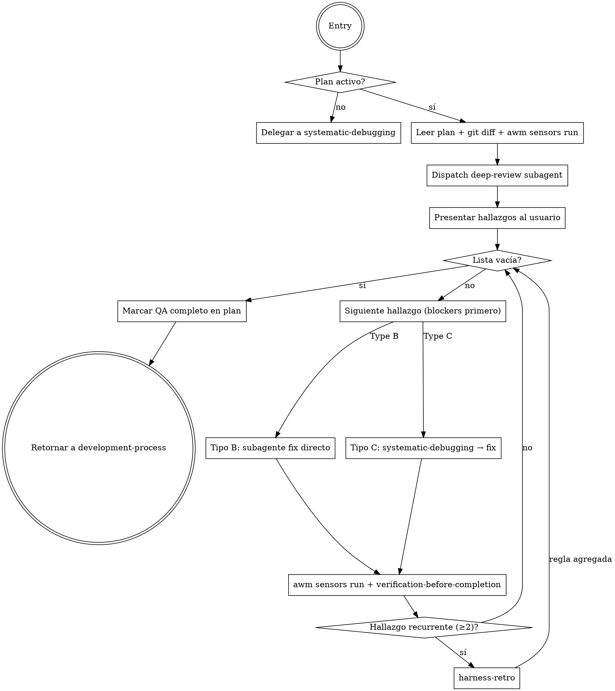

# Post-Implementation QA Skill — Implementation Plan

> **For agentic workers:** REQUIRED SUB-SKILL: Use `subagent-driven-development` (recommended) or `executing-plans` to implement this plan task-by-task. Steps use checkbox (`- [ ]`) syntax for tracking.

**Goal:** Agregar una fase formal de QA post-implementación al harness AWM que detecta gaps de fidelidad al plan (Type B) y bugs de calidad (Type C), y los cierra con un ciclo verificado antes de finishing.

**Architecture:** Skill nueva `post-implementation-qa` con dos entry points (desde development-process y standalone). Usa un subagente de revisión profunda (deep-review) para clasificar hallazgos, luego itera fixes vía systematic-debugging + subagentes. Se integra en development-process como nueva fase entre ejecución y finishing, detectable por un marker `<!-- awm-qa-complete -->` en el plan.

**Tech Stack:** Markdown (SKILL.md, prompt templates), edición de skills existentes en el registry AWM, symlink de instalación manual.

---

## File Map

| Acción | Archivo |
|--------|---------|
| Crear | `registry/skills/post-implementation-qa/SKILL.md` |
| Crear | `registry/skills/post-implementation-qa/deep-review-prompt.md` |
| Modificar | `registry/skills/development-process/SKILL.md` (lifecycle diagram, tabla de fases, detección de estado, decision rules) |
| Instalar | `~/.awm/registry/registry/skills/post-implementation-qa/` (copia para AWM cache) |
| Instalar | `~/.claude/skills/post-implementation-qa` (symlink) |

---

## Task 1: Crear `deep-review-prompt.md`

**Files:**
- Create: `registry/skills/post-implementation-qa/deep-review-prompt.md`

- [ ] **Step 1: Crear el directorio y el archivo de prompt**

```bash
mkdir -p registry/skills/post-implementation-qa
```

Crear `registry/skills/post-implementation-qa/deep-review-prompt.md` con el siguiente contenido exacto:

````markdown
# Deep Review Prompt Template

Use this template when dispatching the deep-review subagent in `post-implementation-qa`.

**Purpose:** Find Type B (fidelity) and Type C (quality) issues by comparing the plan against what was actually built.

```
Agent tool (general-purpose):
  description: "Deep QA review: plan vs implementation"
  prompt: |
    You are performing a post-implementation QA review. Your job is to find gaps and bugs — be thorough and adversarial, not diplomatic. The team needs real issues, not reassurance.

    ## The Plan

    [PASTE FULL PLAN TEXT HERE]

    ## What Was Implemented (git diff from base branch)

    [PASTE FULL GIT DIFF HERE]

    ## Sensor Results (awm sensors run)

    [PASTE FULL SENSOR OUTPUT HERE]

    ## Your Job

    Find and classify ALL issues into two types:

    **Type B — Fidelity gaps** (plan says X, code does Y):
    - Missing features or requirements from the plan
    - Features implemented that were NOT in the plan
    - Requirements misunderstood (right intent, wrong execution)
    - Plan sections skipped or partially implemented
    - Acceptance criteria not met

    **Type C — Quality bugs** (code is defective regardless of plan):
    - Logic errors (wrong result for valid input)
    - Unhandled edge cases (null, empty, boundary values, concurrent calls)
    - Unexpected behavior under normal use
    - Error paths that crash or behave silently instead of handling gracefully
    - Data that could get into an inconsistent state
    - Missing validations at system boundaries (user input, external APIs)

    **Do NOT report** things already flagged in sensor results unless they point to a specific logic problem not visible from the sensor output alone.

    ## How to Review

    1. Read each section of the plan, locate where it appears in the diff
    2. For each plan requirement: is it fully implemented? If not → Type B finding
    3. For each changed file in the diff: does the logic hold for edge cases? → Type C findings
    4. Check error paths: what happens when inputs are invalid, services are down, or data is missing?

    ## Output Format (return ONLY this JSON, no preamble)

    {
      "findings": [
        {
          "id": "B1",
          "type": "B",
          "severity": "blocker|important|minor",
          "title": "Short description (one line)",
          "detail": "Specific what and where — include file:line if applicable",
          "plan_reference": "Quote or reference the plan section this relates to"
        }
      ],
      "summary": "N Type-B and M Type-C issues found. K blockers."
    }

    If no issues found:
    {
      "findings": [],
      "summary": "No issues found — implementation matches plan and code appears correct."
    }

    Severity guide:
    - blocker: prevents correct function or violates a core requirement
    - important: degraded behavior, missing requirement, could cause real problems
    - minor: cosmetic, inconsistency, or improvement opportunity

    Be thorough. A finding list that is too short is more dangerous than one that is too long.
```
````

- [ ] **Step 2: Commit**

```bash
git add registry/skills/post-implementation-qa/deep-review-prompt.md
git commit -m "feat(skills): add deep-review-prompt template for post-implementation-qa"
```

---

## Task 2: Crear `SKILL.md` para `post-implementation-qa`

**Files:**
- Create: `registry/skills/post-implementation-qa/SKILL.md`

- [ ] **Step 1: Crear el SKILL.md con contenido completo**

Crear `registry/skills/post-implementation-qa/SKILL.md` con el siguiente contenido exacto:

````markdown
---
name: post-implementation-qa
description: Use after implementation is complete and before finishing the branch — reviews plan vs. implementation, finds Type B (fidelity) and Type C (quality) issues, and drives a fix loop until clean. Also works standalone when a bug is found independently.
---

# Post-Implementation QA

**Announce at start:** "I'm using the post-implementation-qa skill to review what was built vs. what was planned."

## Overview

El harness previene bugs futuros (preventivo). Este skill cierra los bugs encontrados ahora (correctivo). Corre entre ejecución y finishing, reemplazando el prompt informal de "review total antes de cerrar".

**Core principle:** Ninguna rama se cierra sin evidencia de que lo construido coincide con lo planeado Y de que el código es correcto.

## Dos Entry Points

### Entry Point 1 — Desde development-process (desarrollo activo)
Invocado cuando `subagent-driven-development` o `executing-plans` reporta todas las tareas completas. El plan está disponible en `docs/plans/`.

### Entry Point 2 — Standalone
El usuario invoca directamente al encontrar un bug o querer un QA pass sin desarrollo previo.
- Si existe `*-plan.md` para la rama actual en `docs/plans/` → úsalo como referencia
- Si no hay plan → delegar directamente a `systematic-debugging`

## Tipos de Hallazgos

| Tipo | Descripción | Remediación |
|------|-------------|-------------|
| **B — Fidelidad** | El plan dice X, el código hace Y (falta algo, sobra algo, mal entendido) | Subagente de corrección apuntado al gap, sin root cause analysis |
| **C — Calidad** | Bug lógico, edge case, comportamiento inesperado | `systematic-debugging` → root cause → subagente fix |

## El Proceso



## Paso a Paso

### Paso 1: Localizar el plan activo

```bash
git branch --show-current          # confirmar rama
ls docs/plans/ | grep -v design | sort | tail -5   # identificar plan relevante
```

Si no hay plan para la rama actual → standalone mode → `systematic-debugging`.

### Paso 2: Reunir evidencia

```bash
git diff main...HEAD               # diff completo de la rama
awm sensors run                    # gate estructural de calidad
```

### Paso 3: Dispatch del subagente de revisión profunda

Usar template `./deep-review-prompt.md`. Inyectar:
- Texto completo del plan
- Git diff completo de la rama
- Output completo de `awm sensors run`

El subagente retorna JSON con lista de hallazgos clasificados.

### Paso 4: Presentar hallazgos al usuario

Mostrar la lista agrupada por tipo y severidad:

```
## Hallazgos QA

Type B — Fidelidad (N hallazgos)
  [B1] 🔴 BLOCKER: Falta implementar X (plan sección 3.2)
  [B2] 🟡 IMPORTANT: Feature Y no estaba en el plan

Type C — Calidad (M hallazgos)
  [C1] 🔴 BLOCKER: Edge case Z no manejado (file.ts:45)
  [C2] ⚪ MINOR: Mensaje de error poco claro

Resumen: N Type-B, M Type-C. K blockers.
```

Preguntar: "¿Procedemos con todos los hallazgos, o hay alguno que quieras descartar?"

Esperar confirmación antes de iniciar el fix loop.

### Paso 5: Fix loop (blockers primero, luego importantes, luego minors)

**Para Type B (fidelidad):**
- Dispatch subagente con descripción exacta del gap + sección del plan relevante
- No se requiere root cause analysis — el gap está claro del plan
- Después del fix: `awm sensors run` + `verification-before-completion`
- Marcar hallazgo como resuelto

**Para Type C (calidad):**
- Invocar `systematic-debugging` para encontrar root cause (ANTES de fixear)
- Con root cause confirmado: dispatch subagente fix
- Después del fix: `awm sensors run` + `verification-before-completion`
- Marcar hallazgo como resuelto

**Si el mismo hallazgo aparece ≥2 veces en la sesión:** invocar `harness-retro` antes de continuar.

**Si el usuario descarta un hallazgo:** anotar el motivo junto al hallazgo y continuar.

### Paso 6: Gate de completion

Solo proceder a QA completo cuando TODOS:
- [ ] Lista de hallazgos vacía (todos resueltos o descartados con motivo)
- [ ] `awm sensors run` limpio (sin nuevos hallazgos)
- [ ] `verification-before-completion` pasado para cada fix

### Paso 7: Marcar QA completo

Agregar al comienzo del archivo del plan (primera línea después del header `#`):

```markdown
<!-- awm-qa-complete: YYYY-MM-DD -->
```

Reportar al usuario: "QA completo. N hallazgos encontrados y cerrados. Listo para `finishing-a-development-branch`."

Retornar control a `development-process`.

## Ley de Hierro de Completion

```
NO CLAIM DE "QA COMPLETO" SIN:
1. awm sensors run output reciente (limpio)
2. verification-before-completion por cada fix
3. Lista de hallazgos vacía o con descartes justificados
```

## Red Flags

- "Solo un fix rápido, no necesito correr sensores" → CORRER SENSORES
- "La implementación se ve bien" → EVIDENCIA, no apariencias
- "Este hallazgo es menor, lo salto" → presentar al usuario, que decida
- Mezclar tratamiento de Type B y C (fidelidad no necesita root cause analysis)
- Saltar confirmación del usuario antes del fix loop
- Marcar QA completo sin que todos los blockers estén resueltos
- Olvidar agregar el marker `<!-- awm-qa-complete -->` al plan

## Conexiones con Skills Existentes

| Skill | Rol en este skill |
|-------|------------------|
| `development-process` | Lo invoca como nueva fase; recibe control cuando QA está completo |
| `systematic-debugging` | Invocado para hallazgos Type C (root cause antes de fixear) |
| `subagent-driven-development` | Ejecuta los fixes individuales |
| `verification-before-completion` | Gate obligatorio después de cada fix |
| `harness-retro` | Invocado si algún hallazgo fue recurrente (≥2 veces) |
| `finishing-a-development-branch` | Fase siguiente cuando QA está limpio |
````

- [ ] **Step 2: Commit**

```bash
git add registry/skills/post-implementation-qa/SKILL.md
git commit -m "feat(skills): add post-implementation-qa skill"
```

---

## Task 3: Modificar `development-process/SKILL.md`

**Files:**
- Modify: `registry/skills/development-process/SKILL.md`

Cuatro cambios quirúrgicos en el archivo existente. Aplicar en orden.

- [ ] **Step 1: Actualizar el lifecycle diagram (dot)**

Localizar el bloque entre `digraph lifecycle {` y el `}` de cierre (approx líneas 18-40).

Reemplazar las líneas que definen nodos y edges de `executing-plans` y `finishing`:

**Antes:**
```
    "executing-plans" -> "finishing-a-development-branch";
    "subagent-driven-development" -> "finishing-a-development-branch";
    "finishing-a-development-branch" -> "Done";
```

**Después:**
```
    "post-implementation-qa" [shape=box, style=filled, fillcolor=lightyellow, label="post-implementation-qa"];
    "executing-plans" -> "post-implementation-qa";
    "subagent-driven-development" -> "post-implementation-qa";
    "post-implementation-qa" -> "finishing-a-development-branch";
    "finishing-a-development-branch" -> "Done";
```

- [ ] **Step 2: Actualizar la tabla de Pipeline Skills**

Localizar la tabla con header `| Phase | Skill | Trigger | Output |`.

Reemplazar la fila de Completion:

**Antes:**
```
| 4. Completion | `finishing-a-development-branch` | All tasks done, tests pass | Merge, PR, or branch cleanup |
```

**Después:**
```
| 4. QA | `post-implementation-qa` | All tasks done, before finishing | Hallazgos Type B/C cerrados, marker `awm-qa-complete` en plan |
| 5. Completion | `finishing-a-development-branch` | QA complete (`awm-qa-complete` marker present) | Merge, PR, or branch cleanup |
```

- [ ] **Step 3: Actualizar la tabla de detección de estado**

Localizar la tabla con header `| Files found | State | Next action |`.

Reemplazar la fila de "all tasks complete":

**Antes:**
```
| `*-plan.md` exists, all tasks complete | **Finishing** | Invoke `finishing-a-development-branch` |
```

**Después:**
```
| `*-plan.md` exists, all tasks complete, no `<!-- awm-qa-complete` in plan | **QA Pending** | Invoke `post-implementation-qa` |
| `*-plan.md` exists, all tasks complete, `<!-- awm-qa-complete` present in plan | **Finishing** | Invoke `finishing-a-development-branch` |
```

- [ ] **Step 4: Agregar entrada en Decision Rules**

Localizar la sección `## Decision Rules` y su tabla de Red Flags al final. Agregar antes del primer `### When user says`:

```markdown
### When all plan tasks are complete but QA marker is absent
1. Check `docs/plans/` plan file for `<!-- awm-qa-complete` anywhere in the file
2. If absent → invoke `post-implementation-qa`
3. Do NOT jump to `finishing-a-development-branch` without QA evidence
```

- [ ] **Step 5: Verificar que el archivo es válido y coherente**

```bash
grep -n "post-implementation-qa\|awm-qa-complete\|finishing-a-development-branch" \
  registry/skills/development-process/SKILL.md
```

Salida esperada: al menos 6 líneas con referencias a `post-implementation-qa` y 2 con `awm-qa-complete`.

- [ ] **Step 6: Commit**

```bash
git add registry/skills/development-process/SKILL.md
git commit -m "feat(skills): integrate post-implementation-qa phase into development-process"
```

---

## Task 4: Instalar skill y verificar

**Files:**
- Create (copy): `~/.awm/registry/registry/skills/post-implementation-qa/` (ambos archivos)
- Create (symlink): `~/.claude/skills/post-implementation-qa`

- [ ] **Step 1: Copiar skill al AWM cache**

```bash
cp -r registry/skills/post-implementation-qa \
  /Users/cencosud/.awm/registry/registry/skills/post-implementation-qa
```

- [ ] **Step 2: Actualizar development-process en el AWM cache**

```bash
cp registry/skills/development-process/SKILL.md \
  /Users/cencosud/.awm/registry/registry/skills/development-process/SKILL.md
```

- [ ] **Step 3: Crear el symlink en ~/.claude/skills/**

```bash
ln -s /Users/cencosud/.awm/registry/registry/skills/post-implementation-qa \
  /Users/cencosud/.claude/skills/post-implementation-qa
```

- [ ] **Step 4: Verificar instalación**

```bash
ls -la /Users/cencosud/.claude/skills/post-implementation-qa
# Esperado: symlink apuntando al AWM cache

ls /Users/cencosud/.claude/skills/post-implementation-qa/
# Esperado: SKILL.md  deep-review-prompt.md

cat /Users/cencosud/.awm/registry/registry/skills/development-process/SKILL.md | \
  grep -c "post-implementation-qa"
# Esperado: número > 0 (al menos 4 referencias)
```

- [ ] **Step 5: Smoke test — verificar que el skill aparece en Claude Code**

Abrir nueva sesión de Claude Code en el repo. El system prompt debería listar `post-implementation-qa` en los skills disponibles.

Verificar también en la sesión actual:

```bash
ls /Users/cencosud/.claude/skills/ | grep post
# Esperado: post-implementation-qa
```

- [ ] **Step 6: Commit final**

```bash
git add registry/skills/post-implementation-qa/
git add registry/skills/development-process/SKILL.md
git commit -m "chore: verify post-implementation-qa installation complete"
```

---

## Self-Review

### Spec coverage
- ✅ Skill nueva `post-implementation-qa` con SKILL.md completo
- ✅ Prompt template `deep-review-prompt.md` para subagente de revisión
- ✅ Dos entry points (desde development-process y standalone)
- ✅ Clasificación Type B / Type C
- ✅ Fix loop con systematic-debugging para Type C
- ✅ Gate de completion con marker `<!-- awm-qa-complete -->`
- ✅ Integración en development-process (diagram, tabla, estado, decision rules)
- ✅ Instalación vía copia + symlink

### No hay placeholders
- Todos los archivos tienen contenido exacto listo para copiar
- Comandos con salida esperada
- Sin "TBD" ni "TODO"

### Consistencia de tipos
- El marker `<!-- awm-qa-complete` es consistente entre SKILL.md, development-process y este plan
- Los tipos "B" y "C" son consistentes en todos los artefactos
