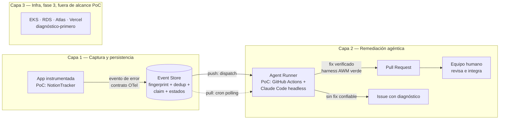
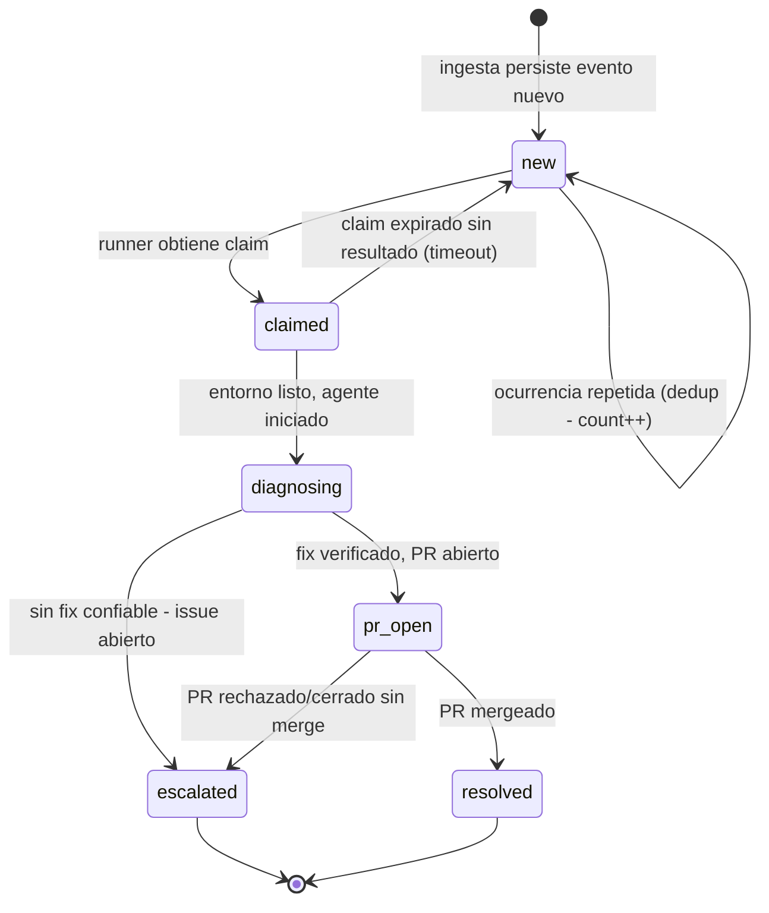

# Brief — Remediación Autónoma de Bugs: de la telemetría al Pull Request

| Campo | Valor |
|---|---|
| Proyecto | Remediación Autónoma de Bugs (nombre de producto: ver DA-1) |
| Fecha | 2026-07-21 |
| Estado | Aprobado para descubrimiento (R0) |
| Audiencia | Agente implementador (Claude Code) en sesiones futuras, sin contexto de la conversación de origen |
| Metodología | brief-spec (spec-driven handoff) · desarrollo bajo harness AWM |
| Dueño | Nicolás (nicolasf1402@gmail.com) |

---

## 1. Mandato de no-asunción

Este brief se construyó en una sesión de diseño conversacional **con acceso de solo lectura parcial** a los repositorios involucrados (listado de archivos de nivel superior; no se leyó el código de la aplicación). Por lo tanto:

1. **Nada de lo no verificado se asume.** Toda referencia a entidades, módulos, tablas, rutas o convenciones de los repos es **conceptual** salvo que esté en la lista de "verificado" de abajo. La estructura real se descubre en R0.
2. **Toda contradicción entre este brief y el sistema real se reporta al dueño** — nunca se resuelve asumiendo ni eligiendo silenciosamente.
3. **Toda definición técnica se delega al implementador tras R0**: esquemas de datos, rutas de endpoints, firmas de funciones, elección de librerías concretas (dentro de las decisiones de principio ya cerradas), estructura de workflows YAML.

**Verificado al momento de redacción** (por listado de archivos, 2026-07-21):

- `kodria/notion-tracker` es una app Next.js (`next.config.ts`), con Prisma (`prisma/`), tests con Vitest (`vitest.config.ts`), desplegada en Vercel (`vercel.json`), con harness AWM instalado (`.awm/`, `CONSTITUTION.md`, `AGENTS.md`, `.semgrep.awm.yml`, `eslint.config.awm.mjs`, `.dep-cruiser.awm.js`).
- `kodria/agentic-workflow` es el repo del CLI de AWM; el contenido (skills, sensores) vive en `kodria/awm-baseline-registry`.
- Existe un MCP server de NotionTracker y un MCP de Supabase conectados en el entorno de sesión del dueño.

**NO verificado (descubrir en R0):**

- Motor y proveedor de base de datos real de NotionTracker (se presume Supabase/Postgres por la presencia del MCP y Prisma; **confirmar**).
- Cómo maneja Next.js/NotionTracker hoy los errores de servidor (¿existe `instrumentation.ts`, error handlers globales, middleware de captura?).
- Convenciones internas del código de NotionTracker (estructura de `lib/`, `app/`, servicios).
- Mecanismo exacto de despliegue y variables de entorno disponibles en Vercel.
- Capacidades reales de la GitHub Action oficial de Claude Code en su versión vigente, y el mecanismo vigente de autenticación por suscripción (`claude setup-token` / `CLAUDE_CODE_OAUTH_TOKEN`); verificar contra documentación actual.
- Límites vigentes del plan de GitHub Actions de la cuenta/org Kodria.
- Formato exacto de las convenciones semánticas OTel para excepciones en la versión estable actual.

---

## 2. Contexto y necesidad de negocio

### El problema

Las plataformas de observabilidad tradicionales (Datadog, Sentry, etc.) asumen un humano mirando dashboards. En la práctica, nadie tiene tiempo de mirarlos: los errores de producción se acumulan sin triage, y el costo real no es la falta de visibilidad sino la falta de **acción**.

### La tesis del producto

> La telemetría no debe terminar en un dashboard: debe terminar en un Pull Request. Se reemplaza al humano-que-mira por un agente-que-actúa.

Un error 500 o crash en producción se captura, se persiste, y un agente de IA lo toma de forma desatendida: diagnostica, desarrolla el fix, lo verifica contra el harness de calidad del proyecto, y abre un PR. El equipo humano solo interviene donde aporta valor: revisar e integrar.

### Necesidades (N#)

| ID | Necesidad |
|---|---|
| N1 | Capturar errores de servidor (500/crashes) de aplicaciones productivas de forma estructurada y persistente. |
| N2 | Deduplicar y agrupar ocurrencias del mismo error para que un bug repetido N veces sea **un** caso de trabajo, no N. |
| N3 | Que un agente de IA procese cada caso de forma desatendida hasta producir un PR con fix verificado, o en su defecto un diagnóstico accionable. |
| N4 | Mantener al humano como gate final (revisión e integración del PR) sin exigirle triage ni monitoreo. |
| N5 | Que la arquitectura sea agnóstica al runtime del agente (Claude Code hoy; AWS AgentCore u otros en el entorno corporativo), al mecanismo de captura y al pipeline de ejecución. |
| N6 | Producir evidencia medible (métricas M1–M4, §10) que sustente la propuesta ante la organización del dueño. |
| N7 | (Fase futura) Observabilidad y diagnóstico a nivel infraestructura: Kubernetes/EKS, RDS, MongoDB Atlas, Vercel. |

### Contexto competitivo (para el pitch, no para el implementador)

Existen productos adyacentes: Sentry Seer/Autofix, GitHub Copilot Autofix, Datadog Bits AI. La diferenciación de esta propuesta: (a) agnosticismo del runtime del agente — crítico para un entorno corporativo AWS/AgentCore; (b) el loop completo integrado a la metodología de desarrollo del equipo (harness AWM) y no como botón de un SaaS; (c) el código y los datos no salen hacia un tercero.

---

## 3. Glosario

| Término | Definición |
|---|---|
| Bug-event | Registro persistido y deduplicado de un error de servidor, con su ciclo de vida (PR-1). Unidad de trabajo del agente. |
| Fingerprint | Identidad estable de un error (derivada de tipo de error + ubicación en código + ruta lógica) que agrupa ocurrencias repetidas en un único bug-event. |
| Event Store | Componente que persiste bug-events, ejecuta la deduplicación y expone el claim idempotente. Definido por contrato; en la PoC se implementa sobre la base de datos existente de NotionTracker. |
| Agent Runner | Componente que ejecuta el agente de IA sobre un bug-event. Intercambiable: GitHub Actions + Claude Code (PoC), AgentCore (corporativo), worker persistente (alternativa). |
| Claim idempotente | Operación por la cual un runner toma posesión exclusiva de un bug-event antes de trabajar; un segundo intento de claim sobre el mismo evento termina sin efecto. |
| Harness AWM | Conjunto de gates de calidad instalados por AWM en el repo (sensores semgrep/eslint, tests, constitution) que el agente debe pasar antes de abrir un PR. |
| Gatillo push | Disparo inmediato del Agent Runner cuando la ingesta persiste un bug-event nuevo (mecanismo tipo `repository_dispatch`). |
| Gatillo pull | Disparo periódico (cron) del Agent Runner que consulta el Event Store por bug-events sin procesar. Red de seguridad del push. |

---

## 4. Principios de diseño cerrados (P#)

Decisiones ya tomadas por el dueño en la conversación de diseño. **No se reabren** salvo que R0 encuentre una contradicción material (en cuyo caso: reportar, no decidir).

| ID | Principio |
|---|---|
| P1 | **Contrato de captura OpenTelemetry.** El formato/semántica de los eventos de error sigue las convenciones OTel. La instrumentación en la PoC puede ser mínima, pero el contrato es estándar y agnóstico a vendor. No se adopta Sentry ni ningún SaaS como fuente. |
| P2 | **Runtime PoC: GitHub Actions + Claude Code headless**, autenticado con la **suscripción** del dueño (no API key de pago por token). El costo variable adicional objetivo de la PoC es $0. |
| P3 | **Doble gatillo: push y pull, ambos configurados.** Push para latencia mínima; cron de polling como red de seguridad. Consecuencia obligatoria: el claim del bug-event es idempotente (RNF-T.1). |
| P4 | **Event Store por contrato, implementación mínima.** El contrato (evento OTel-compatible, fingerprinting, claim, máquina de estados) es independiente; la implementación PoC vive en la base de datos existente de NotionTracker. La extracción a servicio propio es fase 2 y no debe requerir cambiar el contrato. |
| P5 | **Autonomía escalonada.** El agente tiene exactamente dos salidas terminales: PR con fix verificado por el harness completo, o issue con diagnóstico completo. Nunca un PR sin harness en verde; nunca un evento en limbo. El "dial" de niveles de autonomía configurables es roadmap, no PoC. |
| P6 | **El agente corre dentro del harness AWM.** AWM no es contexto opcional: es el requisito de seguridad que hace confiable a un agente desatendido. El bootstrap de AWM en el entorno efímero del runner es parte del pipeline. |
| P7 | **Capa de infraestructura (N7) es fase 3.** En la PoC y fase 2 no se construye nada de observabilidad de infra; solo se deja definida en el roadmap con enfoque diagnóstico-primero. |
| P8 | **Los componentes se definen por contrato, con implementaciones intercambiables.** El brief describe responsabilidades; el implementador define formas concretas tras R0. |

---

## 5. Mapa de repositorios y entregables

**Regla para el implementador: cada pieza se desarrolla en el repo que se indica aquí.** Este brief vive en `kodria/agentic-workflow` porque es el repo de la metodología, pero **el desarrollo de la PoC NO ocurre en ese repo**.

| Repo | Rol en este proyecto | Qué se desarrolla ahí |
|---|---|---|
| `kodria/notion-tracker` | **App piloto de la PoC.** Aquí ocurre casi todo el desarrollo R1–R4. | Instrumentación de captura (R1), implementación PoC del Event Store sobre su base de datos (R1), endpoint/mecanismo de ingesta (R1), workflows de GitHub Actions del Agent Runner con ambos gatillos (R3), prompt/playbook del agente (R2–R3). |
| `kodria/agentic-workflow` | Repo de metodología. Hospeda este brief y futura documentación del producto. | Solo documentación. **Prohibido** tocar `~/.awm` o el CLI por este proyecto (ver CLAUDE.md de ese repo). |
| `kodria/awm-baseline-registry` | Registry de contenido AWM. | Nada en la PoC. Solo si en fases futuras se decide empaquetar el playbook del agente como skill genérica (DA-7). |
| *(nuevo, fase 2)* | Event Store como servicio independiente multi-app. | Se crea en fase 2 (fuera del alcance de la PoC). Su existencia futura condiciona el diseño: el contrato del Event Store debe poder extraerse sin romper consumidores (P4). |

Rama de trabajo actual para documentación: `claude/product-brief-repo-diagnostic-814tjf`. Los releases de implementación definirán sus propias ramas en `notion-tracker`.

---

## 6. Arquitectura conceptual

Tres capas con madurez decreciente; la PoC ejercita las capas 1 y 2 en su forma mínima.

Responsabilidades por componente (la forma concreta la define el implementador tras R0):

- **Instrumentación**: interceptar errores de servidor no controlados y 500s en la app piloto, construir el evento con semántica OTel (tipo, mensaje, stack, contexto de request sin datos sensibles — RNF-T.3) y entregarlo a la ingesta. No debe alterar el comportamiento observable de la app ante el usuario final.
- **Ingesta**: recibir el evento, calcular fingerprint, deduplicar (evento existente abierto con mismo fingerprint ⇒ incrementar contador y actualizar última ocurrencia; no crear caso nuevo), persistir, y disparar el gatillo push.
- **Event Store**: persistir bug-events con su máquina de estados (PR-1), exponer consulta de pendientes (para el pull) y claim idempotente (para ambos gatillos).
- **Agent Runner**: al dispararse, hacer claim; si lo obtiene, preparar el entorno (checkout del repo, bootstrap AWM), ejecutar el playbook del agente (PR-2) y registrar el resultado terminal en el Event Store.
- **Gate humano**: revisión estándar de PRs del equipo. Este proyecto no lo modifica.

---

## 7. Procesos (PR-#)

### PR-1 — Ciclo de vida del bug-event

Reglas: un evento `claimed` cuyo runner muere sin registrar resultado vuelve a `new` por expiración de claim (umbral configurable, DA-4), garantizando que el pull lo recoja. `resolved` y `escalated` son terminales; una regresión posterior del mismo error genera un bug-event nuevo (el fingerprint puede referenciar al histórico).

### PR-2 — Playbook del agente (por bug-event reclamado)

1. **Contextualizar**: leer el bug-event completo (stack, contexto, contador, historial del fingerprint si existe).
2. **Reproducir**: intentar escribir un test que reproduzca el error. Si no logra reproducirlo dentro de su presupuesto (RNF-T.2), salida `escalated` con diagnóstico de lo intentado.
3. **Diagnosticar**: identificar causa raíz y archivos involucrados.
4. **Corregir**: implementar el fix mínimo que hace pasar el test de reproducción sin romper el resto.
5. **Verificar (gate innegociable, P5/P6)**: suite de tests del repo en verde + sensores AWM limpios + test de regresión nuevo incluido. Si no se logra dentro del presupuesto: `escalated`.
6. **Entregar**: PR con fix, diagnóstico, referencia al bug-event y evidencia de verificación; o issue con diagnóstico completo (causa probable, archivos sospechosos, qué se intentó y por qué falló). Registrar estado terminal y métricas (§10) en el Event Store.

El playbook se materializa como prompt/configuración versionada en `notion-tracker` (forma exacta: implementador). Si R0 confirma que la GitHub Action oficial de Claude Code soporta el flujo completo, se usa; de lo contrario, fallback a instalación directa del CLI en el runner.

### PR-3 — Disparo del Agent Runner

- **Push**: la ingesta, tras persistir un evento en `new`, dispara el workflow (mecanismo tipo `repository_dispatch`; forma exacta: implementador, requiere token de GitHub en la app piloto — DA-5).
- **Pull**: cron (frecuencia configurable, DA-4) consulta pendientes (`new` + claims expirados) y dispara el procesamiento de cada uno.
- Ambos caminos convergen en el claim idempotente: quien no obtiene el claim termina sin efecto y sin error.

---

## 8. Releases

Secuencia ordenada por valor: primero lo que reemplaza el dolor que motivó el proyecto (errores invisibles → registro accionable), después la autonomía. Ningún release inicia sin los CA del anterior cumplidos y sus DA bloqueantes resueltas.

### R0 — Descubrimiento (solo lectura)

Valor productivo independiente: informe verificado del estado real que elimina el riesgo de construir sobre supuestos.

**Alcance**: leer el código real de `notion-tracker` y la documentación vigente de las tecnologías involucradas. **Prohibido modificar código o datos.**

Entregables:
- RF-0.1 — Informe del estado real: manejo actual de errores en la app, motor de BD confirmado, convenciones del código, mecanismo de despliegue y capacidades reales de la GitHub Action de Claude Code + autenticación por suscripción vigente.
- RF-0.2 — Mapeo conceptual→real de cada componente del §6 y contradicciones encontradas con este brief.
- RF-0.3 — Plan técnico de R1–R4 conforme a las convenciones descubiertas, con las DA bloqueantes marcadas como resueltas o re-planteadas al dueño.

CA-0.1 — El dueño valida el informe y el plan antes de iniciar R1.

### R1 — Captura, ingesta y Event Store (PoC)

Valor productivo independiente: NotionTracker deja de perder errores; existe un registro estructurado, deduplicado y consultable de todo 500/crash — útil aunque el agente no exista aún.

- RF-1.1 — Instrumentación de errores de servidor en la app piloto con contrato OTel (P1).
- RF-1.2 — Ingesta con fingerprinting y deduplicación (N2).
- RF-1.3 — Event Store sobre la BD existente con máquina de estados PR-1, claim idempotente y timestamps por transición de estado (base de las métricas §10).
- CA-1.1 — Un error real provocado en la app desplegada aparece como bug-event `new` con stack y contexto.
- CA-1.2 — El mismo error provocado N veces produce **un** bug-event con contador N (no N eventos).
- CA-1.3 — Dos claims concurrentes sobre el mismo evento: exactamente uno gana; el otro termina sin efecto.

### R2 — Agente de diagnóstico (triage autónomo → issue)

Valor productivo independiente: todo error de producción llega al equipo como issue investigado (causa probable, archivos sospechosos) en vez de stack trace crudo — aunque nunca se abra un PR.

- RF-2.1 — Workflow del Agent Runner (gatillo manual/pull en este release) que hace claim, bootstrapea AWM en el runner (P6) y ejecuta el playbook PR-2 limitado a pasos 1–3 + salida issue.
- RF-2.2 — Issue con formato de diagnóstico definido (accionable sin re-investigar).
- CA-2.1 — Un bug-event real termina en `escalated` con issue creado en `kodria/notion-tracker` conteniendo diagnóstico con causa probable y archivos referenciados que existen en el repo.
- CA-2.2 — El costo del ciclo (tokens/minutos) queda registrado en el bug-event.

### R3 — Fix autónomo → PR, con doble gatillo

Valor productivo independiente: el loop completo de la tesis — evento → PR revisable sin intervención humana.

- RF-3.1 — Playbook completo PR-2 (reproducir, corregir, verificar con harness, PR).
- RF-3.2 — Gatillo push desde la ingesta + gatillo pull por cron, conviviendo (P3).
- RF-3.3 — Guardrails activos (RNF-T.2): presupuesto de intentos, exclusiones, no-recursión.
- CA-3.1 — Un bug real provocado en la app desplegada termina, sin intervención humana, en un PR que incluye fix + test de regresión + evidencia de harness en verde, o en issue diagnosticado si el fix no fue confiable.
- CA-3.2 — Ningún PR del agente se abre con tests o sensores en rojo (verificable revisando los checks del PR).
- CA-3.3 — Con push deshabilitado artificialmente, el cron recoge y procesa el evento igualmente.

### R4 — Métricas y paquete de demo

Valor productivo independiente: la evidencia presentable ante la organización (N6) — el objetivo de negocio del dueño.

- RF-4.1 — Informe de métricas M1–M4 (§10) generado desde los datos reales del Event Store (forma: implementador; puede ser un reporte generado, no un dashboard — coherente con la tesis anti-dashboard).
- RF-4.2 — Guion de demo reproducible: provocar bug real en vivo → PR en minutos → mostrar costo del ciclo.
- CA-4.1 — El informe se genera desde eventos reales acumulados (no datos sintéticos) y contiene M1–M4 para al menos los casos procesados en R2–R3.
- CA-4.2 — El guion de demo fue ejecutado end-to-end al menos una vez, cronometrado.

---

## 9. Requisitos no funcionales transversales (RNF-T)

| ID | Requisito |
|---|---|
| RNF-T.1 | **Idempotencia**: el doble gatillo jamás produce trabajo duplicado ni PRs duplicados para un mismo bug-event. |
| RNF-T.2 | **Guardrails del agente desatendido**: presupuesto máximo de intentos/tiempo por bug-event (configurable, DA-4); lista de exclusión de archivos/áreas que el agente no toca (mínimo: archivos de configuración de secretos, workflows del propio pipeline, migraciones destructivas; lista final: DA-6); prevención de recursión (un error causado por un PR del agente no dispara un nuevo ciclo automático sobre sí mismo sin marca explícita; mecanismo: implementador). |
| RNF-T.3 | **Privacidad**: los bug-events no persisten datos sensibles de usuarios (tokens, contraseñas, PII más allá de lo necesario para diagnóstico). La instrumentación sanitiza antes de enviar. |
| RNF-T.4 | **Costo**: el pipeline PoC opera con costo variable $0 (minutos free tier de Actions + cuota de suscripción Claude). Si una decisión implica costo adicional, se reporta al dueño antes de implementarla. |
| RNF-T.5 | **Reversibilidad**: todo lo instalado en la app piloto (instrumentación, tablas, workflows) debe poder desactivarse/retirarse sin dejar la app rota. |
| RNF-T.6 | **Desarrollo bajo harness**: toda implementación de este brief se desarrolla con la disciplina AWM del repo correspondiente (tests, sensores, constitution). El pipeline que exige harness verde se construye, él mismo, con harness verde. |

---

## 10. Métricas de éxito

Instrumentadas desde R1 (timestamps por transición de estado + registro de costo por ciclo); reportadas en R4.

| ID | Métrica | Rol |
|---|---|---|
| M1 | **Tiempo evento → PR** (ocurrencia del error hasta PR abierto, sin intervención humana) | Métrica estrella de la demo. Contraste narrativo: cuánto tarda hoy un bug de producción en siquiera ser mirado. |
| M2 | **Costo por bug procesado** (tokens + minutos de CI por ciclo) vs. horas-desarrollador de triage+fix | Argumento económico. |
| M3 | **Tasa de resolución autónoma** (% de bug-events → PR mergeado sin retrabajo vs. escalados) | Métrica de madurez; requiere volumen, se acumula desde la PoC. |
| M4 | **Cobertura de triage** (% de eventos con output útil: PR o issue diagnosticado) | Defiende el "peor caso es un triage de calidad". Objetivo estructural: 100% por diseño (P5: ningún evento en limbo). |

---

## 11. Decisiones abiertas (DA-#)

| ID | Decisión | Posiciones conocidas | Bloquea |
|---|---|---|---|
| DA-1 | Nombre del producto | Título de trabajo: "Remediación Autónoma de Bugs". El dueño puede proponer nombre de producto. | Nada (cosmético; deseable antes de R4/presentación) |
| DA-2 | Motor de BD real de NotionTracker y su idoneidad para el Event Store PoC | Presunción: Supabase/Postgres. R0 confirma. | R1 |
| DA-3 | Mecanismo concreto de ejecución de Claude Code en Actions (action oficial vs. CLI directo) y vigencia de la autenticación por suscripción en CI | A decidir con evidencia de R0 (documentación vigente). Restricción dura: P2 (sin API key de pago por token). Si la suscripción no es utilizable en CI, **reportar al dueño** con alternativas y costos antes de continuar. | R2 |
| DA-4 | Parámetros operativos: frecuencia del cron, timeout de claim, presupuesto de intentos/tiempo por evento | Propuesta inicial razonable la define el implementador en R0; todos configurables, ninguno hardcodeado. | R2 (defaults), ajustables siempre |
| DA-5 | Provisión de credenciales: `CLAUDE_CODE_OAUTH_TOKEN` (o equivalente vigente) como secret del repo, y token de GitHub para el gatillo push desde la app | Requiere acción del dueño (generar tokens). El implementador prepara instrucciones exactas en R0. | R2 (token Claude), R3 (token push) |
| DA-6 | Lista final de exclusiones del agente (archivos/áreas intocables) | Mínimos definidos en RNF-T.2; completar con lo descubierto en R0. | R3 |
| DA-7 | Si el playbook del agente se empaqueta como skill AWM genérica en `awm-baseline-registry` | Diferido a post-PoC. Nota: la frontera genérico/específico del CLAUDE.md de `agentic-workflow` aplica — solo lo agnóstico al proyecto puede ir al registry. | Nada (post-PoC) |
| DA-8 | Alcance concreto de la fase 3 (infra: EKS/RDS/Atlas/Vercel) | Solo enfoque acordado: diagnóstico-primero (detectar y diagnosticar; remediación de infra no necesariamente vía PR). Diseño completo diferido. | Nada (fase 3) |

---

## 12. Riesgos

| Riesgo | Impacto | Mitigación |
|---|---|---|
| Contradicciones entre este brief y el sistema real | Construir sobre supuestos falsos | Mandato de no-asunción (§1) + R0 obligatorio + regla de reportar, no asumir |
| La autenticación por suscripción no funciona en CI (DA-3) | Se rompe la restricción de costo $0 (P2/RNF-T.4) | R0 verifica con documentación vigente antes de construir; si falla, decisión del dueño con alternativas |
| Tasa de éxito del agente baja en bugs reales | La demo pierde fuerza; PRs de baja calidad erosionan confianza | P5: el harness filtra los PRs malos (peor caso = issue diagnosticado, que sigue siendo valor); métrica M4 lo captura honestamente |
| Loop de retroalimentación (fix del agente causa un error nuevo que dispara otro ciclo) | Consumo descontrolado de cuota/minutos | RNF-T.2: no-recursión + presupuestos por evento |
| Fingerprinting deficiente (agrupa de más o de menos) | PRs duplicados o bugs enmascarados | Es el problema duro conocido del dominio (lo que hizo grande a Sentry); empezar con fingerprint simple, iterarlo con datos reales de R1; RNF-T.1 protege contra duplicación de trabajo |
| Datos sensibles en stacks/contextos persistidos | Riesgo de privacidad/compliance | RNF-T.3: sanitización en la instrumentación, desde R1 |
| Dependencia de disponibilidad del entorno (sesiones efímeras) | Pérdida de trabajo/contexto entre sesiones | Este brief es el contrato persistente; todo avance se commitea y pushea a la rama designada inmediatamente |

---

## 13. Fuera de alcance (explícito)

- **PoC (R1–R4) NO incluye**: capa de observabilidad de infraestructura (fase 3); Event Store como servicio independiente multi-app (fase 2); dial de niveles de autonomía configurables (roadmap); dashboard/UI de visualización (contrario a la tesis; solo informe R4); soporte a apps distintas de NotionTracker; captura de errores de cliente/browser (solo errores de servidor); integración con AgentCore (queda como implementación futura del contrato de Agent Runner).
- **Este proyecto nunca incluye**: modificar el CLI de AWM ni `~/.awm` (territorio del instalador, ver CLAUDE.md de `agentic-workflow`); reemplazar el proceso de code review humano (N4 lo preserva por diseño).

---

## 14. Roadmap post-PoC (referencial)

| Fase | Contenido | Condición de entrada |
|---|---|---|
| Fase 2 | Event Store extraído a servicio propio (repo nuevo), multi-app, dial de autonomía (nivel 0: solo diagnóstico / nivel 1: diagnóstico + PR), adapter AgentCore del Agent Runner | PoC validada (R4 presentado) |
| Fase 3 | Capa infra: ingestión de señales EKS/RDS/Atlas/Vercel, diagnóstico-primero (DA-8) | Fase 2 estable |
