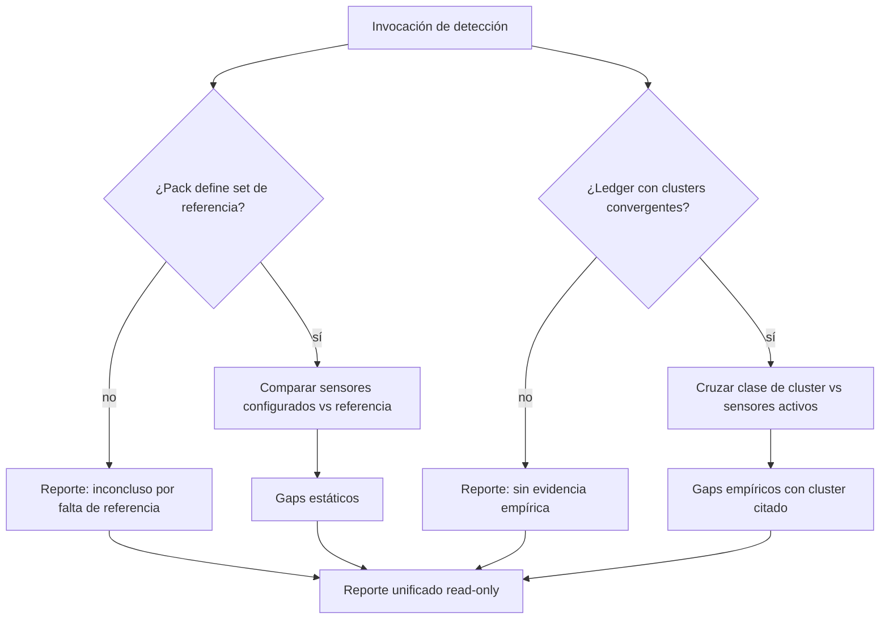
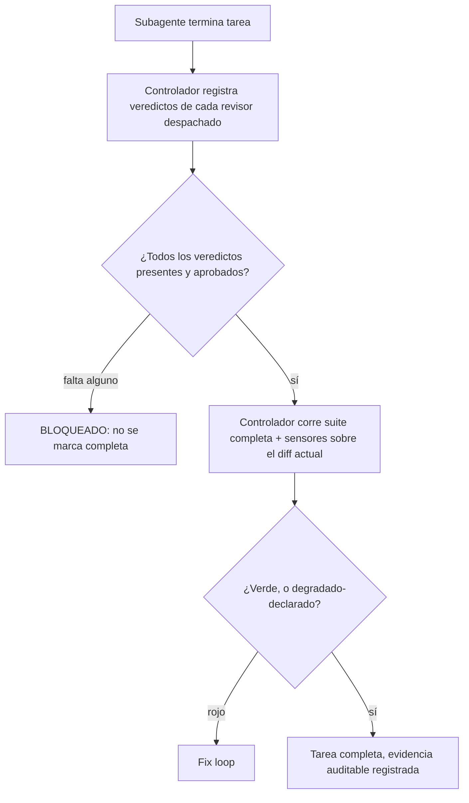

# Optimización del ciclo SDD sin pérdida de calidad — Product Brief

Audiencia: agente de análisis/pair (provider-neutral) · Metodología: brief-spec (AWM product-brief) · Este documento es autocontenido: no asume acceso a la sesión que produjo el diagnóstico.

## Business Need

- **N1** — El dueño del framework AWM ejecuta desarrollos vía el ciclo `subagent-driven-development` (SDD: un subagente implementador + dos subagentes revisores por tarea, más un panel de QA multi-lente al cierre) y cada desarrollo está tardando **horas**. En la única sesión instrumentada de punta a punta (2026-07-29, rama `claude/agentic-workflow-awm-issues-dqka6l`, PR agentic-workflow#19), un diff de +1878/−35 líneas en 15 archivos costó ~115 minutos post-plan (77 de ejecución SDD, 18 de QA, 7 de retro, más 13 de plan), 23 despachos de subagente, ~1.57M tokens de salida de subagentes y una relación revisión:implementación de 4.2:1. El costo de no resolverlo: cada ciclo de desarrollo paga ese sobreprecio, y el dueño lo paga en tiempo de calendario.
- **N2** — El rigor del proceso de calidad **es la fuente de su valor y no puede perderse**: el dueño reporta que cada vez se encuentran menos bugs al terminar un desarrollo, y en la sesión medida el aparato de revisión atrapó 3 defectos reales que ningún sensor mecánico habría detectado (un bug sutil de regex que venía especificado *en el plan mismo*, un crash con datos históricos mal formados, un gap de cobertura en la propiedad transitiva de un algoritmo). Cualquier optimización que degrade esa capacidad es una no-solución.
- **N3** — El dueño opera AWM con **tres providers**: Claude Code, Codex y OpenCode. Una optimización que solo funcione en uno no sirve: toda capacidad nueva debe funcionar en los tres o degradar de forma explícita y segura donde falte soporte.

## Business Cases

Catálogo medido (sesión 2026-07-29, fuentes: timestamps de commits, reportes de uso por subagente, comandos cronometrados):

- **Cómputo de verificación redundante**: la suite completa de tests (42s) y los sensores (46s, que incluyen la suite adentro) se corrieron ~22 veces —una por subagente— sobre estados del diff mayormente idénticos. Un test dirigido al área tocada tarda 3s. Ahorro estimado: 15–17 min/ciclo sin quitar ninguna verificación, calculándola una vez por estado del diff en lugar de una vez por agente.
- **Defectos de estilo escalando a revisión por agente**: 4 de ~9 hallazgos de revisión fueron indentación/convención (`test()` vs `it()`, 4 espacios vs 2). Cada uno costó un round-trip completo de fix + re-review; el patrón necesitó **tres intentos** para quedar totalmente atrapado, porque cada fix parcial solo re-barría las líneas que su propia tarea había tocado. Causa raíz verificada: el proyecto no tiene formatter y su sensor de lint corre solo 3 reglas — la clase entera de defecto no tenía detector mecánico, así que la atrapaba (o no) un revisor por suerte. Mecanizarla *sube* la calidad además de ahorrar ~15 min/ciclo.
- **Tracks independientes ejecutados en serie**: el plan de la sesión declaraba dos releases sin ningún archivo, tipo ni import compartido (verificado por revisión final), y aun así se ejecutaron secuencialmente. Serializarlos no agregó verificación alguna.
- **Veredicto de revisión perdido sin bloqueo**: un review de calidad despachado en background nunca reportó su veredicto al controlador, y el ciclo avanzó a la siguiente tarea igual. El gate existe como instrucción de prosa ("no marcar completo sin evidencia") pero nada lo fuerza mecánicamente.
- **Uso plano de modelo**: los 23 despachos corrieron en el modelo de la sesión, aunque la skill SDD ya documenta una regla de selección ("spec completo + 1-2 archivos → modelo barato") que aplicaba a la mayoría de las tareas. La regla existe como consejo; no hay mecanismo que la transporte ni la aplique.
- **Incidente de concurrencia (regla ya curada)**: 4 subagentes de QA en paralelo sobre el mismo working tree; uno corrió `git checkout <ref> -- .` para inspeccionar una versión anterior y el restore quedó incompleto, revirtiendo 7 archivos en silencio. Detectado solo por un `git status` de rutina del controlador. Cualquier paralelismo futuro debe tratar el aislamiento como condición, no como optimización.

Casos borde que el diseño debe cubrir:

- Provider sin selección de modelo por despacho → el tier declarado se ignora con aviso, el ciclo completa normal.
- Plan con un solo track, o con tracks que comparten archivos → el paralelismo no aplica; ejecución serial sin fricción añadida.
- Proyecto sin suite de tests o sin sensores configurados → el gate del controlador degrada a lo que exista y lo declara (estado honesto, nunca "verde vacuo").
- Pack del stack sin set de referencia de sensores → la detección estática reporta "sin referencia para este stack" (inconcluso), nunca "sin gaps".
- Ledger vacío o sin clusters → la detección empírica reporta "sin evidencia", nunca silencio ni error.
- Runtime sin soporte de worktrees → los tracks independientes caen a serial; jamás paralelo sobre árbol compartido.
- Entrada de ledger histórica mal formada → la detección empírica la tolera (el CLI ya valida shape al leer, desde v3.4.0).

## Users & Context

- **El dueño del framework** (operador único hoy) — lanza ciclos SDD desde Claude Code, Codex u OpenCode según el contexto; sufre N1 en tiempo de calendario y depende de N2 para confiar en merges sin re-revisión manual.
- **El agente controlador** — el agente que orquesta el ciclo SDD dentro de una sesión: despacha subagentes, aplica gates, marca tareas completas. Es el usuario directo de PR-2 y PR-4.
- **Los subagentes** (implementadores y revisores) — reciben prompts construidos desde templates del registry; son los destinatarios de PR-3 (tier) y del cambio de alcance de verificación en PR-2.
- **Consumidores del registry** — cualquier máquina/equipo que instale `awm-baseline-registry`: los cambios de proceso les llegan vía `awm update`, por lo que todo cambio debe ser retrocompatible con planes y proyectos existentes.

## Constraints

- **El aparato de revisión no se toca**: ninguna etapa se elimina ni se fusiona (la fusión spec+quality fue evaluada durante el diagnóstico y retirada — el quality review atrapó un bug en código que el plan especificaba verbatim, demostrando que revisar "transcripción" atrapa defectos de planificación). El tiering de modelo, si procede, aplica **solo al implementador**, nunca a revisores.
- **AWM permanece agnóstico a clases de problema** (doctrina existente del repo): la detección de sensores faltantes es una capacidad genérica de detección de ausencia de cobertura; los sets de referencia contienen clases genéricas de defecto, jamás reglas nacidas de un bug puntual de un proyecto.
- **Detección ≠ mutación**: `~/.awm` es territorio del instalador (`awm init`/`awm update`); cualquier detección reporta y sugiere, nunca modifica configuración por su cuenta.
- **Split contenido/CLI**: los cambios de proceso (skills, prompts, packs) viven en `awm-baseline-registry` y llegan vía tag + `awm update`; solo la pata de comando de la detección vive en el CLI (`agentic-workflow`), cuyo publish a npm es automático en CI.
- **Multi-provider como criterio de aceptación, no como aspiración**: toda capacidad declara su comportamiento en los tres providers (soportado / degradado explícito), verificado contra la matriz de capacidades de R0.
- **Retrocompatibilidad de contenido**: planes existentes sin los campos nuevos deben ejecutar exactamente igual que hoy.
- **Costo**: sin infraestructura paga nueva ni suscripciones adicionales. El presupuesto de tokens por ciclo debe bajar o mantenerse — es parte de N1; una optimización que compre velocidad subiendo el gasto de tokens no cumple la necesidad.
- **Privacidad**: sin dimensión nueva — el ledger, los planes y la evidencia de gates ya viven dentro del repositorio del proyecto y no salen de él. La detección de cobertura no exporta contenido del proyecto a ningún servicio externo.

## Non-Assumption Mandate

Este brief tiene una particularidad que se declara de frente: **el diagnóstico sí está verificado** — proviene de mediciones sobre una sesión real (timestamps de commits, reportes de uso por subagente, comandos cronometrados, ledger de la rama, código mergeado en `main` v3.4.0). Los números de Business Need/Cases no son estimaciones: son datos con procedencia citada, aunque de **n=1 sesión** (ver Risks).

Lo que **NO** está verificado — y debe confirmarse en R0 (descubrimiento read-only) antes de cualquier compromiso técnico:

- **Capacidades de los runtimes destino**: si Codex y OpenCode (y el propio harness de Claude Code, más allá de lo observado) soportan selección de modelo por despacho de subagente, despacho paralelo de subagentes, y aislamiento por worktree — y con qué mecanismo exacto cada uno.
- **Estructura real de los sensor-packs por stack** en `awm-baseline-registry` (`sensor-packs/generic/`, `sensor-packs/js-ts/`, otros): qué forma tendría un "set de referencia" por pack y si la estructura actual lo admite sin rediseño.
- **Mecánica de enforcement del gate del controlador en cada runtime**: el gate de PR-2 es prosa de skill hoy; qué mecanismo lo vuelve mecánico (checklist en el plan, artefacto en el ledger, hook) y si ese mecanismo es expresable en los tres providers.
- **Suficiencia del esquema actual del ledger** para la mitad empírica de PR-1: si `class`/`signature`/`ref` bastan para mapear un cluster convergente a una "clase de defecto sin sensor", o si hace falta vocabulario adicional.
- **Convenciones de código y tests del CLI** para la pata de comando de PR-1 (más allá de lo tocado en la sesión medida).

Cualquier contradicción entre este brief y el sistema real encontrada durante R0 se reporta al dueño y jamás se resuelve asumiendo — el dueño decide y la resolución queda registrada (actualización de este brief o nuevo `DA-#`). Toda definición técnica (esquemas, rutas, firmas, formato del set de referencia, mecanismo del gate) queda delegada al implementador, a producir solo después del descubrimiento de R0.

## Glossary

| Term | Definition |
|------|------------|
| SDD | `subagent-driven-development`: ciclo donde cada tarea del plan la ejecuta un subagente implementador fresco, revisado por un subagente de spec-compliance y otro de code-quality antes de marcarse completa. |
| Controlador | El agente de la sesión que orquesta el SDD: despacha subagentes, aplica gates, marca tareas. |
| Sensor | Verificación mecánica configurada en `.awm/sensors.json` (typecheck, lint, tests, security, etc.) que `awm sensors run` ejecuta y agrega en un veredicto. |
| Sensor-pack | Conjunto de configuraciones de sensores por stack, distribuido vía registry (`sensor-packs/js-ts/`, etc.). |
| Ledger | Registro por-rama (`awm ledger`) donde revisores y QA emiten hallazgos y aciertos; insumo de `harness-retro`. |
| Cluster convergente | Grupo de hallazgos del ledger con firmas distintas que `awm ledger recurring` (v3.4.0+) une por archivo compartido o afinidad léxica: la señal de que revisores independientes encontraron el mismo defecto. |
| Provider / runtime | El agente-host donde corre AWM: Claude Code, Codex u OpenCode. |
| Worktree | Checkout adicional de git (`git worktree add`) que aísla un árbol de trabajo del principal. |
| Tier | Declaración de complejidad por tarea del plan que expresa qué capacidad de modelo necesita su implementador. |
| Gate | Condición verificable que debe cumplirse antes de avanzar de fase; "mecánico" = su incumplimiento bloquea por construcción, no por memoria del agente. |

## Processes

- **PR-1 — Detección de cobertura de sensores.** Responde, para un proyecto dado: *"¿qué clases de defecto no tienen detector mecánico acá?"*. Dos mitades complementarias, ambas read-only:
  - **Estática**: compara los sensores configurados del proyecto contra el set de referencia de su pack/stack y reporta cada clase ausente o presente-pero-sin-configuración-efectiva (ej.: lint presente pero corriendo un set mínimo de reglas sin config de proyecto). Si el pack no define set de referencia para el stack, el resultado es "inconcluso por falta de referencia" — nunca "sin gaps" (un estado nunca significa dos cosas: doctrina existente).
  - **Empírica**: cruza los clusters convergentes del ledger contra los sensores activos: una clase de hallazgo que aparece recurrentemente *a mano* (emitida por revisores) mientras ningún sensor la reporta es exactamente un gap de cobertura pagándose en revisión por agente. Si R0 confirma que el esquema actual del ledger basta, el cruce usa `class` + análisis del cluster; si no, la resolución del vocabulario faltante se registra como decisión.
  - La salida es un reporte; si DA-6 se resuelve a favor, incluye la remediación sugerida como comando/config propuesto que el dueño aplica — la detección jamás muta nada.

- **PR-2 — Gate de verificación en el controlador.** La evidencia de verificación se calcula **una vez por estado del diff**, no una vez por subagente:
  - Los subagentes implementadores corren verificación dirigida al área que tocaron (tests del módulo, no la suite completa).
  - El controlador corre la suite completa + sensores una vez antes de marcar cada tarea completa, sobre el estado real del diff — evidencia propia, no reportada.
  - El gate es mecánico contra veredictos perdidos: cada despacho de revisor queda registrado con su veredicto; una tarea no puede marcarse completa con un veredicto pendiente o ausente. (Motivación directa: en la sesión medida un veredicto se perdió en background y el ciclo avanzó igual.)
  - Si el proyecto no tiene suite o sensores, el gate degrada a lo que exista y lo **declara** en la evidencia — estado honesto, nunca verde por vacuidad.

- **PR-3 — Tier declarativo de complejidad por tarea** *(condicionado a R0 + DA-2)*. El plan transporta la intención; el runtime la honra con lo que tenga:
  - `writing-plans` admite un campo opcional por tarea (p. ej. `**Complejidad:** mecánica | integración | diseño`), análogo a los campos `**Skills:**`/`**Modo de ejecución:**` ya existentes.
  - Donde el runtime soporta selección de modelo por despacho, el controlador la aplica **solo al implementador** — los revisores corren siempre a plena capacidad (el aparato de revisión riguroso es justamente lo que hace seguro abaratar la implementación).
  - Donde no hay soporte, degradación a no-op **reportado**: el ciclo completa normal y la evidencia registra que el campo se ignoró. Si R0 confirma soporte en los tres providers, la degradación será excepcional; si no, DA-2 decide si el no-op satisface el criterio del dueño ("funcional en todo o no sirve").
  - Campo ausente → comportamiento idéntico al actual.

- **PR-4 — Paralelismo entre tracks independientes con aislamiento** *(condicionado a R0 + DA-3)*:
  - La independencia se verifica mecánicamente (intersección vacía de los `Files:` declarados entre tracks), nunca se asume de la prosa del plan.
  - Cada track paralelo corre en su propio worktree; el merge de vuelta es del controlador. Si el runtime no ofrece aislamiento, fallback a serial — jamás paralelo sobre árbol compartido (incidente real documentado en `AGENTS.md` del repo del CLI: corrupción silenciosa de 7 archivos por `git checkout` concurrente).

## Requirements

- **RF-1.1** — WHEN se invoca la detección de cobertura sobre un proyecto con sensores configurados y pack con set de referencia, THE detección SHALL reportar cada clase de defecto del set ausente en el proyecto, y cada sensor presente cuya configuración efectiva no cubra su clase (con el criterio de "configuración efectiva" definido en R0).
  - **CA-1.1** — Corrida contra el repo real `agentic-workflow` (estado actual conocido: sin formatter; lint con 3 reglas y sin config de proyecto), el reporte nombra ambos gaps. Dato real, no mock.
- **RF-1.2** — WHEN el ledger de una rama (activo o archivado) contiene clusters convergentes cuya clase no está cubierta por ningún sensor activo, THE detección SHALL reportar el gap empírico citando el cluster que lo evidencia.
  - **CA-1.2** — Corrida contra el ledger archivado real de la sesión 2026-07-29 (`.awm/ledger/archive/`, cluster convergente de 3 hallazgos de indentación con firmas distintas), el reporte señala la clase estilo/formato como sin cobertura. Dato real.
- **RF-1.3** — IF el proyecto no tiene ledger, o el ledger no produce clusters, THEN THE detección SHALL reportar "sin evidencia empírica" de forma explícita — nunca silencio, nunca error.
  - **CA-1.3** — Corrida en un proyecto recién inicializado, la mitad empírica reporta el estado explícito y sale con éxito.
- **RF-1.4** — THE detección SHALL ser íntegramente read-only: cero escrituras a `.awm/`, `~/.awm/` o archivos de configuración del proyecto.
  - **CA-1.4** — Hash del árbol del proyecto y de `~/.awm` antes/después de la corrida: idénticos.
- **RF-1.5** — IF el pack del stack no define set de referencia, THEN THE mitad estática SHALL reportar "inconcluso por falta de referencia" como estado distinto de "sin gaps".
  - **CA-1.5** — Corrida sobre un stack sin referencia definida, el reporte distingue explícitamente ese estado.
- **RF-2.1** — WHEN un subagente implementador verifica su propia tarea, THE prompt del implementador SHALL requerir verificación dirigida al área tocada, no la suite completa del proyecto.
  - **CA-2.1** — En un ciclo SDD real post-cambio, los reportes de implementadores muestran comandos de test dirigidos; la suite completa no aparece en sus transcripts.
- **RF-2.2** — WHEN el controlador va a marcar una tarea completa, THE controlador SHALL contar con evidencia propia (corrida por él, no reportada por un subagente) de suite completa + sensores sobre el estado actual del diff.
  - **CA-2.2** — En un ciclo SDD real, la evidencia por tarea existe y es atribuible al controlador; una tarea sin esa evidencia no aparece marcada completa.
- **RF-2.3** — IF cualquier revisor despachado no tiene veredicto registrado (perdido, pendiente, o nunca reportado), THEN THE controlador SHALL NOT marcar la tarea completa, por mecanismo verificable y no por prosa.
  - **CA-2.3** — Escenario controlado en ciclo real: se omite deliberadamente un veredicto; el cierre de la tarea queda bloqueado hasta re-despachar u obtener el veredicto.
- **RF-2.4** — IF el proyecto carece de suite de tests o de sensores, THEN THE gate SHALL degradar a la evidencia disponible declarando qué falta — nunca reportar verde por ausencia de verificadores.
  - **CA-2.4** — Corrida en proyecto sin sensores: la evidencia registra "sensores: no configurados" como estado explícito.
- **RF-3.1** — WHEN un plan declara el campo de complejidad en una tarea, THE controlador SHALL aplicar la selección de modelo correspondiente al implementador de esa tarea únicamente, y SHALL NOT aplicarla a ningún revisor.
  - **CA-3.1** — En runtime con soporte: transcript del ciclo muestra implementador en el modelo del tier y revisores en el modelo pleno.
- **RF-3.2** — IF el runtime no soporta selección de modelo por despacho, THEN THE controlador SHALL completar el ciclo ignorando el campo y registrando el no-op en la evidencia.
  - **CA-3.2** — En el provider sin soporte identificado por R0: el mismo plan ejecuta de punta a punta; la evidencia registra el no-op.
- **RF-3.3** — IF una tarea no declara el campo, THEN THE comportamiento SHALL ser idéntico al actual (retrocompatibilidad).
  - **CA-3.3** — Un plan pre-existente (sin el campo) ejecuta sin ninguna diferencia observable.
- **RF-4.1** — WHEN un plan declara dos o más tracks cuyos `Files:` no se intersectan AND el runtime ofrece aislamiento por worktree, THE controlador SHALL poder ejecutarlos en paralelo, cada uno en su worktree.
  - **CA-4.1** — Un plan real de dos tracks independientes ejecuta en paralelo; el diff final es equivalente al de la ejecución serial del mismo plan.
- **RF-4.2** — IF el aislamiento no está disponible, o la intersección de `Files:` no es vacía, THEN THE ejecución SHALL ser serial — nunca paralela sobre el árbol compartido.
  - **CA-4.2** — Mismo plan en runtime sin worktrees: ejecución serial, cero mutaciones concurrentes del árbol (verificable por `git status` limpio entre tareas).
- **RF-4.3** — THE verificación de independencia SHALL ser mecánica (cómputo sobre los `Files:` declarados), no inferida de la prosa del plan.
  - **CA-4.3** — Un plan con tracks que comparten un archivo es rechazado para paralelismo aunque su prosa los declare independientes.
- **RNF-T.1** — (transversal) THE optimización SHALL preservar la capacidad de detección de defectos del proceso: ninguna etapa de revisión eliminada ni fusionada, y la métrica de no-regresión de calidad (DA-1) no empeora en la ventana de medición acordada.
  - **CA-T.1** — Comparación de la métrica DA-1 entre ciclos pre- y post-cambio, sobre desarrollos reales.
- **RNF-T.2** — (transversal) THE framework SHALL declarar, para cada capacidad nueva, su comportamiento en cada uno de los tres providers (soportado / degradado explícito), verificado contra la matriz de capacidades de R0 — nunca "no probado".
  - **CA-T.2** — La documentación de cada release nombra los tres providers con su estado verificado.
- **RNF-T.3** — (transversal) THE sets de referencia de sensores SHALL contener exclusivamente clases genéricas de defecto, reutilizables entre proyectos — jamás reglas nacidas de un bug puntual (doctrina existente del framework).
  - **CA-T.3** — Revisión del set de referencia entregado: cada entrada nombra una clase, ninguna referencia a un proyecto específico.
- **RNF-T.4** — (transversal) THE ciclo SDD SHALL dejar rastro suficiente (timestamps, evidencia de gates) para derivar la duración por fase de un ciclo sin instrumentación manual, de modo que N1 sea medible contra el baseline.
  - **CA-T.4** — De un ciclo real post-cambio se deriva la tabla de duración por fase usando solo artefactos persistidos.

## Open Decisions

| ID | Decision | Blocks | Known Positions |
|----|----------|--------|------------------|
| DA-1 | Métrica de no-regresión de calidad y ventana de medición: ¿hallazgos de QA post-implementación por ciclo? ¿bugs escapados a producción/uso? ¿ambos? ¿cuántos ciclos de ventana? | Release 1 | (a) findings del panel de QA por ciclo, ventana de 3 ciclos; (b) bugs reportados post-merge, ventana de 30 días; (c) combinación |
| DA-2 | ¿La degradación a no-op reportado satisface el criterio del dueño "funcional en todo o no sirve" para el tiering de modelo, o el tiering se retiene hasta que los tres providers soporten selección nativa? | Release 4 | (a) no-op reportado es aceptable (la intención viaja en el plan, agnóstica); (b) retener hasta soporte pleno confirmado por R0 |
| DA-3 | Aislamiento por worktree para paralelismo: ¿requisito duro (sin worktree no hay feature) o fallback a serial aceptable como degradación? | Release 5 | (a) fallback a serial (propuesto: el plan sigue siendo válido en los tres providers); (b) requisito duro |
| DA-4 | ¿Dónde viven los sets de referencia de sensores y quién los mantiene? | Release 2 | (a) dentro de cada sensor-pack del registry baseline, mantenidos con el pack (propuesto); (b) archivo separado por stack en el registry; (c) en el CLI |
| DA-5 | Umbral de la detección empírica: ¿cuántos hallazgos convergentes manuales de una clase disparan el reporte de "sensor faltante"? | none | Configurable con default (propuesto: cluster convergente de ≥2, alineado con `--min 2` de `awm ledger recurring`) |
| DA-6 | ¿La detección solo reporta el gap, o además sugiere la remediación (comando/config propuesto, sin ejecutarlo)? | Release 2 | (a) reporte + sugerencia no ejecutada (propuesto); (b) solo reporte |

## Out of Scope

- **Fusionar o eliminar etapas de revisión** (spec-compliance + code-quality en un solo despacho, o menos lentes de QA): evaluado durante el diagnóstico y retirado con evidencia — el review de calidad atrapó un bug real en código que el plan especificaba verbatim; revisar transcripción atrapa defectos de planificación.
- **Auto-instalar o auto-configurar sensores**: la detección reporta (y a lo sumo sugiere, según DA-6); aplicar cambios de configuración es siempre acción del dueño. `~/.awm` no se toca.
- **Cambiar la composición del panel de QA** (lentes, tracks A/B) o el ciclo TDD: fuera de esta optimización.
- **Instrumentación pesada de telemetría**: RNF-T.4 se satisface con artefactos que el ciclo ya produce (commits, ledger, evidencia de gates), no con un subsistema nuevo de métricas.
- **Optimizar el costo del plan mismo** (`writing-plans` tardó 13 min en el baseline): fuera de alcance; este brief cubre ejecución, QA y sus gates.

## Releases

El orden es por valor de negocio: primero lo que reduce el dolor de N1 en *todos* los ciclos futuros (incluidos los que implementan el resto de este brief) y cierra el hueco de calidad observado; después la capacidad nueva; al final lo condicionado a decisiones abiertas y a la matriz de R0.

### Release 0 — Descubrimiento (read-only)

- **Value:** independiente por sí mismo: la matriz de capacidades por provider (selección de modelo, despacho paralelo, worktrees, mecánica de gates) es el insumo que resuelve DA-2/DA-3 y valida o contradice los supuestos de este brief; el mapeo conceptual→real de sensor-packs y ledger define la forma de R2/R3.
- **Scope:** verificación de todo lo listado en el Non-Assumption Mandate. Sin escritura de código ni datos.
- **Blocked by:** none.
- **Acceptance:** informe de estado real + mapeo conceptual→real + contradicciones encontradas + plan técnico conforme a las convenciones descubiertas, validado por el dueño.

### Release 1 — Gate de verificación en el controlador (core)

- **Value:** ahorra 15–17 min/ciclo de cómputo redundante en cada ciclo futuro y cierra el hueco real de veredictos perdidos — ahorro y *subida* de calidad a la vez, sin quitar ninguna verificación.
- **Scope:** RF-2.1, RF-2.2, RF-2.3, RF-2.4 · RNF-T.1, RNF-T.4. (Cambio de contenido en el registry: skill SDD + prompts.)
- **Blocked by:** DA-1 (la aceptación necesita la métrica de no-regresión definida).
- **Acceptance:** CA-2.1, CA-2.2, CA-2.3, CA-2.4, CA-T.1, CA-T.4 — sobre un ciclo SDD real, no simulado.

### Release 2 — Detección estática de cobertura de sensores (core, mitad 1)

- **Value:** el dueño puede preguntarle al framework "¿qué clases de defecto no tienen detector acá?" y recibir una respuesta accionable — elimina en origen la clase de desperdicio "estilo escalando a revisores" en cualquier proyecto, no solo el diagnosticado.
- **Scope:** RF-1.1, RF-1.4, RF-1.5 · RNF-T.2, RNF-T.3. (CLI: comando de reporte · Registry: sets de referencia por pack.)
- **Blocked by:** DA-4, DA-6.
- **Acceptance:** CA-1.1, CA-1.4, CA-1.5, CA-T.2, CA-T.3.

### Release 3 — Detección empírica de cobertura (core, mitad 2)

- **Value:** convierte el ledger en detector de gaps: la recurrencia manual convergente —visible desde v3.4.0— se vuelve señal automática de sensor faltante, cerrando el loop de aprendizaje del harness.
- **Scope:** RF-1.2, RF-1.3 · RNF-T.2. (CLI, sobre la base de Release 2.)
- **Blocked by:** none — DA-5 queda abierta pero no bloquea: se implementa con el default propuesto (configurable) y el dueño lo ajusta cuando decida.
- **Acceptance:** CA-1.2, CA-1.3 — contra el ledger archivado real citado.

### Release 4 — Tier declarativo de modelo (condicionado)

- **Value:** la mayor parte del costo en tokens del baseline (implementadores + spec-reviewers ≈ 582k tokens) corre en el modelo que cada tarea necesita, no en el máximo por defecto — con los revisores siempre a plena capacidad como red.
- **Scope:** RF-3.1, RF-3.2, RF-3.3 · RNF-T.2. (Registry: `writing-plans` + skill SDD.)
- **Blocked by:** DA-2 + matriz de capacidades de R0.
- **Acceptance:** CA-3.1, CA-3.2, CA-3.3 — CA-3.1/3.2 ejecutados en los providers que la matriz de R0 marque como soportado/no-soportado respectivamente.

### Release 5 — Paralelismo entre tracks independientes (condicionado)

- **Value:** planes con releases genuinamente independientes (caso real medido) dejan de pagar la suma de sus duraciones y pagan el máximo, con la independencia verificada mecánicamente y el aislamiento como condición.
- **Scope:** RF-4.1, RF-4.2, RF-4.3 · RNF-T.2. (Registry: `writing-plans` + skill SDD.)
- **Blocked by:** DA-3 + matriz de capacidades de R0.
- **Acceptance:** CA-4.1, CA-4.2, CA-4.3.

## Risks

| Risk | Impact | Mitigation |
|------|--------|------------|
| Contradicciones entre este brief y el sistema real (capacidades de providers, estructura de packs, esquema del ledger) | Retrabajo; diseño inaplicable en algún runtime | Mandato de no-asunción + R0 read-only antes de todo compromiso; releases 4–5 explícitamente condicionados a la matriz |
| Baseline de n=1 sesión: los ahorros estimados pueden no generalizar | Expectativas infladas; optimizar el caso equivocado | RNF-T.4 hace medibles los ciclos siguientes; DA-1 fija la métrica antes de Release 1; revisar estimaciones tras 2–3 ciclos medidos |
| Presión de optimización erosionando gates con el tiempo ("ya que ahorramos acá, saltemos esto") | Pérdida gradual de N2 — el valor central del proceso | RNF-T.1 como requisito transversal con CA propio; Out of Scope explícito sobre etapas de revisión; tier jamás aplica a revisores |
| Corrupción de estado por concurrencia (incidente real: 7 archivos revertidos por `git checkout` concurrente de subagentes) | Trabajo perdido, evidencia contaminada, difícil de detectar | RF-4.2 (aislamiento o serial, sin tercera opción); RF-4.3 (independencia mecánica); regla ya curada en `AGENTS.md` del CLI |
| Sets de referencia degenerando en reglas específicas de proyecto | Viola la doctrina del framework; convierte hallazgos locales en obligaciones globales | RNF-T.3 con CA de revisión por entrada; doctrina existente citada en Constraints |
| Drift de capacidades entre providers (un runtime agrega/quita soporte tras R0) | La matriz queda obsoleta; degradaciones inesperadas | RNF-T.2 exige comportamiento declarado y verificado por release; re-verificación de matriz al activar releases 4–5 |
| Veredicto de revisor perdido que el gate nuevo no logre atrapar en algún runtime | El hueco que motivó PR-2 persiste parcialmente | CA-2.3 se ejecuta como escenario controlado en cada provider durante la aceptación de Release 1 |
