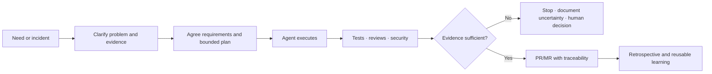

# AWM Presentation, Public Website and Controlled Pilot — Product Brief

Audience: implementing agent (provider-neutral) · Methodology: brief-spec (AWM product-brief) · Owner: Sendara · Repository classification: public

## Business Need

- **N1** — Development leadership and teams currently lack a shared, measurable methodology for using AI across the product-development lifecycle. The cost of leaving this unresolved is invisible and inconsistent adoption, with no common way to demonstrate how generated work was planned, tested, reviewed or accepted.
- **N2** — Technical leads and reviewers carry the risk of accepting AI-assisted code through conventional self-review and pull-request practices without consistent upstream controls. The cost is avoidable rework, late findings and reduced confidence in AI-assisted delivery.
- **N3** — Delivery leads and developers often begin from Jira items with partial specifications or limited bug evidence. Unresolved assumptions surface during implementation and may survive until after integration, creating misalignment and rework.
- **N4** — Project decisions, evidence and lessons are not routinely recorded as durable development documentation. The cost is that each project repeats discovery and quality work instead of accumulating reusable organizational knowledge.
- **N5** — AWM is an open-source personal contribution by Sendara that needs a clear public presence and an accurate internal introduction. Without both, the methodology cannot be understood independently of its creator or evaluated responsibly for a controlled corporate pilot.

## Business Cases

- **Internal management presentation:** explain AWM to management, technical leads, delivery leads and development teams, gather their assessment and identify interested pilot participants.
- **Existing evidence — AWM:** use the fact that the framework has been developed through its own lifecycle as evidence of methodological viability, while avoiding unsupported claims of organizational scalability.
- **Existing evidence — NotionTracker:** use the public Sendara project as an example; any non-public usage context is supplied only to the private presentation outside this repository.
- **Primary private new-project evidence:** use an already configured greenfield project as the principal private pilot/evidence case. Its name, organization, code, screenshots, metrics and results remain outside this public repository.
- **New feature from incomplete Jira input:** take a partially specified business need, make assumptions and acceptance conditions explicit, and carry it to a verifiable pull request.
- **Support bug with limited evidence:** transform an incomplete support report into reproducible evidence, a bounded diagnosis, a verified fix and a traceable pull request.
- **Legacy-system bug:** first discover the actual technology and constraints, limit changes to the smallest justified scope, and establish characterization tests before modifying behavior.
- **Legacy system without a verifiable baseline:** attempt to establish characterization evidence; if that is not possible, stop, document the uncertainty and request an explicit human decision rather than claiming completion.
- **Urgent hotfix:** shorten optional ceremony while preserving minimum security, scope, verification and human-approval controls.
- **Security, audit or compliance change:** strengthen evidence, approval and traceability requirements rather than treating the normal path as sufficient.
- **Provider/account variation:** require a controlled pilot to record and authorize each repository/provider combination while keeping the methodology independent of any single subscription.
- **Jira without automated connector:** accept a manual, traceable transfer of the ticket context until API/MCP feasibility is evaluated; automation is an enhancement, not an entry dependency.
- **Public visitor:** understand the methodology, then reach documentation/examples, the repository and installation guidance, with GitHub as the initial contact path.
- **Presentation-time exception:** deliver a coherent 15-minute core narrative that can expand to 30 minutes without depending on a full live demonstration.

## Users & Context

- **Area manager:** evaluates organizational value, risk and whether a controlled pilot merits support during a management-wide session.
- **Technical leads:** evaluate compatibility, safety, quality controls, ownership and candidate repositories; they authorize the temporary pilot perimeter.
- **Delivery leads:** evaluate whether AWM improves the translation of business needs into explicit, verifiable development outcomes.
- **Developers:** evaluate whether the methodology reduces mechanical work, supports different stacks and gives them a practical adoption path without excessive initial configuration.
- **Support-originated work owners:** benefit when incomplete incident evidence is converted into a reproducible and traceable development case.
- **Public open-source visitors:** encounter AWM through a Spanish-language Sendara website and need to understand the method before deciding whether to read documentation, install it or contact the project through GitHub.
- **Presentation owner:** is the technical lead and creator of AWM, presenting it as a personal open-source contribution by Sendara rather than as an already endorsed product of the target organization.

## Constraints

- **Deadline:** the internal presentation has a near-term fixed deadline; the core narrative must fit 15 minutes and support expansion up to 30 minutes.
- **Mandatory deliverables:** both the internal presentation and the public website are required; the website is not an optional follow-up artifact.
- **Brand ownership:** public and private materials use `Agentic Workflow Methodology (AWM)` as the primary identity and `an open-source project by Sendara` as the secondary signature. They must not imply corporate ownership or endorsement.
- **Information boundary:** no private organization name, project name, code, screenshot, metric, process detail or result may appear in this public repository or on the public website. Private evidence may appear only in the private presentation after owner selection and must be supplied outside version control.
- **Public language:** the first public release is Spanish. English is a later independent release.
- **Existing workflow:** AWM must complement Jira, GitLab merge requests/pull requests and existing CI/CD rather than require their replacement.
- **Cost:** no new paid subscription, hosting commitment or recurring service is assumed without owner approval; model/token consumption must be observed during the pilot rather than estimated as fact.
- **Current quality baseline:** standard pipelines exist, but project-specific tests and additional quality controls often require explicit construction.
- **Documentation baseline:** durable product/development documentation is not currently routine; AWM is expected to begin creating traceability from its adoption point onward.
- **AI access:** this public brief does not assert which models, account classes or policies exist in the private target environment. Every pilot repository requires an explicit private technical-lead decision about the permitted provider/account and data boundary.
- **Pilot flexibility:** AWM must not depend on one centrally provisioned provider, but no pilot case may infer permission to expose code from the mere availability of an account.
- **Adoption:** initial setup must be low-friction, controls must adapt to the real stack, and participants need examples plus an explicit learning path.
- **Website ownership:** the website is public, belongs to the Sendara open-source presence and uses a `*.sendaraconsulting.com` domain; the exact subdomain remains open.
- **Contact:** GitHub is the only confirmed initial contact channel; no separate Sendara contact channel is currently available.
- **Demonstration:** the presentation must not depend on completing an end-to-end live development flow during the session.

## Non-Assumption Mandate

This brief was constructed from the owner's sanitized discovery input and with access to the public AWM repository, but without access to the private target systems, repositories, running applications or measurement data that a pilot would use. The following have **not** been verified and must be confirmed in R0 (read-only discovery) before any technical or evidentiary commitment is made:

The owner maintains a separate confidential context companion outside every public repository. The implementing agent must request and read that companion together with this brief for private presentation work and pilot R0. The companion is an input source, never a versioned deliverable: none of its organization, person, project or process identifiers may be copied into this repository, the public website, public issues, commits, pull requests, logs or screenshots. If the companion is not supplied, private evidence selection remains blocked while public-site discovery may continue.

- The exact AWM configuration, version, generated artifacts and usable evidence in the primary private new-project case.
- The exact private content that is approved for the internal presentation.
- The real Jira issue shapes, workflows, permissions and availability of an approved API or MCP connector.
- The target git host's project conventions, merge-request rules, branch protections and CI/CD templates used by each candidate team.
- The technology, dependency age, test coverage and safe characterization strategy of any legacy candidate.
- The classification and sensitivity of each candidate repository, the target organization's authorization rules and the data-handling terms of every AI account/provider used in the pilot.
- The current baseline for need-to-PR time, rework/defects and developer AI adoption.
- The canonical public AWM repository URL, documentation URL and GitHub contact URL to expose on the site.
- Whether the public website belongs in the existing AWM repository or in a dedicated repository.
- The selected hosting/deployment mechanism, DNS control and availability of `awm.sendaraconsulting.com` or another Sendara subdomain.
- The available Sendara brand assets, typography, visual conventions and accessibility baseline.
- The exact presentation environment, network availability, audience count and permission to show selected private evidence.
- The final command names, screenshots and examples that remain accurate against the latest AWM release at presentation time.

Any contradiction found between this brief and the real repositories, systems or policies during R0 is reported to the owner and never resolved by assuming. The owner decides, and the resolution is recorded as an update to this brief or a new `DA-#`. All schemas, routes, connector mechanisms, site architecture, deployment choices and tool signatures are delegated to the implementer after R0 discovery.

## Glossary

| Term | Definition |
|------|------------|
| AWM | Agentic Workflow Methodology, an open-source framework that governs the product-development lifecycle from a need to a verifiable pull request. |
| Sendara | The owner's personal registered brand under which AWM and related open-source projects are published. |
| Agentic development | A workflow in which agents execute bounded development work while humans retain intent, decisions, review and accountability. |
| Verifiable PR | A pull/merge request whose scope, requirements, tests, reviews, security checks and known limitations are traceable. |
| Harness | The installed AWM context, skills, sensors, rules and process gates that adapt the methodology to a repository. |
| Sensor | A project-adapted automated check that produces evidence about quality, tests, security or structural integrity. |
| Characterization test | A test that records existing legacy behavior so a proposed change can be bounded and compared safely. |
| Fail-closed | A rule that stops and reports uncertainty when required evidence cannot be obtained, instead of treating uncertainty as success. |
| Controlled pilot | A time-bounded evaluation on selected repositories and participants, authorized by the responsible technical lead and measured against an agreed baseline. |
| Private evidence | Target-organization project information permitted only in the internal presentation and excluded from this repository and every public artifact. |

## Processes

- **PR-1 — Current work intake and delivery:** the private discovery identified a ticket-to-merge workflow in which requirement depth, evidence, review and documentation can vary. Exact organizational practices remain private and are supplied outside this repository when tailoring the internal presentation.
- **PR-2 — AWM target lifecycle:** begin from a recorded need, make the problem and acceptance conditions explicit, plan bounded work, execute with agents, collect tests/reviews/security evidence, reconcile the result with the original need, create the pull/merge request and preserve decisions plus learning as durable project context.
- **PR-3 — Internal presentation:** establish the unmanaged-adoption problem, explain the human/agent responsibility split, show the complete lifecycle, present private real evidence conservatively, state limits and invite feedback plus controlled pilot participation.
- **PR-4 — Public website:** explain the methodology without corporate context, establish AWM/Sendara identity, show the lifecycle and quality model, then route visitors to documentation/examples, repository/installation and GitHub contact.
- **PR-5 — Controlled pilot:** use the primary private new-project case, admit additional volunteers selectively, capture a baseline, execute real work under repository-specific controls, compare outcomes and report both value and limitations.
- **PR-6 — Legacy compatibility case:** perform read-only discovery, identify stack and constraints, establish characterization evidence, propose the smallest justified change and stop for human escalation if verification cannot be made credible.
- **PR-7 — Hotfix/sensitive-work variants:** shorten optional steps for urgency or strengthen evidence for regulated work, while retaining minimum scope, security, verification and human-approval gates.
- **PR-8 — Jira intake without automation:** transfer ticket context manually with its identifier and source preserved; if later discovery confirms an approved API/MCP route, automate intake without making it a prerequisite for methodology use.

## Requirements

- **RF-0.1** — WHEN Release 0 begins, THE discovery SHALL inspect available public assets and separately inventory private presentation evidence without modifying source systems or copying private evidence into this repository.
  - **CA-0.1** — The owner approves a read-only discovery report that records inspected sources, public/private classification, contradictions and missing inputs, while repository diff checks show no imported private artifact.
- **RF-0.2** — IF R0 finds a contradiction between this brief and a real source, THEN THE discovery SHALL report the contradiction and request an owner decision instead of silently choosing an interpretation.
  - **CA-0.2** — A reconciliation table records every contradiction, its source and owner disposition; unresolved contradictions remain explicit and block the affected release.
- **RF-1.1** — WHEN the internal presentation begins, THE presentation SHALL frame AWM as a methodology for controlled, verifiable agentic development rather than as a code-generation tool.
  - **CA-1.1** — In a timed rehearsal, an independent listener can state the methodology's purpose and distinguish it from generic AI coding after the opening section.
- **RF-1.2** — WHEN the methodology is explained, THE presentation SHALL show the complete lifecycle from problem/need definition through planning, agent execution, tests, reviews, security, pull request and reusable learning.
  - **CA-1.2** — The final deck contains a single readable lifecycle and the speaker can traverse every stage without relying on a live terminal.
- **RF-1.3** — WHEN human and agent responsibilities are described, THE materials SHALL state that agents execute bounded work while developers retain intent, decisions, validation and accountability.
  - **CA-1.3** — The statement appears explicitly in both the private presentation and public website and is preserved in the speaker notes.
- **RF-1.4** — WHEN quality is discussed, THE materials SHALL describe mandatory controls and evidence without promising absolute defect-free outcomes.
  - **CA-1.4** — A content review finds no unqualified use of `guarantee`, `zero defects` or an equivalent absolute claim and does find the fail-closed limitation.
- **RF-1.5** — WHEN the 15-minute core presentation ends, THE audience SHALL have received the problem, value proposition, lifecycle, real evidence, limits and invitation to express pilot interest.
  - **CA-1.5** — A timed rehearsal completes those elements in at most 15 minutes; optional material extends discussion to at most 30 minutes without being required for comprehension.
- **RF-1.6** — WHEN private evidence is selected, THE presentation SHALL distinguish verified facts from hypotheses and SHALL NOT transfer private evidence into any public artifact.
  - **CA-1.6** — The owner approves the private evidence inventory, and an automated plus manual content comparison confirms none of its corporate identifiers appear in the public build.
- **RF-1.7** — WHEN the presentation concludes, THE call to action SHALL first request organizational feedback and interested teams, then offer a controlled pilot rather than broad adoption.
  - **CA-1.7** — The final slide identifies the approved primary private case and asks for selectively evaluated volunteers without requesting mass rollout or immediate budget.
- **RF-2.1** — WHEN a visitor opens the public website, THE site SHALL identify the project as `Agentic Workflow Methodology (AWM)` and display `an open-source project by Sendara` as the secondary signature.
  - **CA-2.1** — The public production URL renders both identities in the primary page experience and does not display corporate branding.
- **RF-2.2** — WHEN a visitor explores the public website, THE site SHALL explain the problem, human/agent responsibility split, lifecycle, quality controls, fail-closed behavior and suitable adoption cases before requiring navigation to external documentation.
  - **CA-2.2** — A first-time Spanish-speaking evaluator can explain those six concepts after using only the public site.
- **RF-2.3** — WHEN a visitor decides to continue, THE site SHALL provide discoverable routes to documentation/examples, the canonical repository and installation guidance, with GitHub as the initial contact route.
  - **CA-2.3** — Every configured production link resolves successfully and a keyboard-only evaluator can reach each action from the landing page.
- **RF-2.4** — IF corporate information is present in source content, THEN THE public-site release process SHALL block publication until names, identifiers, code, screenshots, metrics and results are removed.
  - **CA-2.4** — The public build passes an explicit prohibited-content scan and manual privacy review before deployment.
- **RF-2.5** — WHEN the initial public website is released, THE website SHALL present its complete core content in Spanish and SHALL NOT require the English release to be useful.
  - **CA-2.5** — A Spanish production build independently satisfies CA-2.1 through CA-2.4; English absence does not produce incomplete labels or dead navigation.
- **RF-3.1** — WHEN a pilot is proposed, THE pilot SHALL use the approved primary private new-project case and SHALL admit additional teams or repositories only through controlled technical-lead evaluation.
  - **CA-3.1** — The pilot register identifies the principal case, each added repository, its authorizing technical lead, participants, provider and approved scope.
- **RF-3.2** — BEFORE pilot work begins, THE pilot SHALL record a real baseline for need-to-PR time, rework/defects and AI adoption among participating developers.
  - **CA-3.2** — The owner approves a baseline report derived from real recent work and a matching post-pilot measurement method before the first comparison is claimed.
- **RF-3.3** — WHEN an AI account is proposed for pilot use, THE pilot SHALL require technical-lead authorization for the repository/provider combination and SHALL record the provider/account class used for each case.
  - **CA-3.3** — Every pilot case has a documented authorization, repository boundary and provider record before agent access begins.
- **RF-3.4** — WHEN a legacy candidate lacks sufficient tests, THE pilot SHALL create characterization evidence before behavior-changing work.
  - **CA-3.4** — The legacy case shows the characterization suite failing under a discriminating behavioral mutation and passing on the unchanged baseline before the fix is implemented.
- **RF-3.5** — IF a legacy baseline cannot be made verifiable, THEN THE pilot SHALL stop, document what remains uncertain and request an explicit human decision instead of claiming successful completion.
  - **CA-3.5** — A deliberately unverifiable rehearsal produces a non-success outcome, an evidence report and a named approval/escalation step with no integrated code change.
- **RF-3.6** — WHEN AWM enters a repository, THE pilot SHALL adapt controls to the discovered stack and project rules while limiting implementation to the smallest scope justified by the need.
  - **CA-3.6** — Each pilot case includes a before-change discovery report, an approved scope statement and a final diff reconciliation with unexplained changes equal to zero.
- **RF-4.1** — WHEN Jira automation is unavailable, THE methodology SHALL preserve the Jira identifier and source context through a manual intake path without blocking use.
  - **CA-4.1** — A real pilot ticket can be traced from its Jira identifier through requirements, plan, commits and pull/merge request without an API/MCP connector.
- **RF-4.2** — WHEN Jira API/MCP feasibility is later evaluated, THE evaluation SHALL verify authorization, data boundaries, available operations and failure behavior before recommending automation.
  - **CA-4.2** — A read-only feasibility report records verified capabilities, constraints and a recommendation without modifying Jira.
- **RNF-1.1** — THE public website SHALL be usable on current desktop and mobile browsers and support keyboard navigation, readable contrast and semantic structure.
  - **CA-1.8** — The production build passes the agreed automated accessibility/performance checks and a manual keyboard/mobile review with no blocking issue.
- **RNF-1.2** — THE internal presentation SHALL remain usable without network access.
  - **CA-1.9** — The final package includes an offline deck/PDF and local evidence snapshots sufficient to deliver the 15-minute core with the network disabled.
- **RNF-T.1** — THE presentation, website and pilot SHALL keep verified evidence, inference and future roadmap visibly distinct.
  - **CA-T.1** — A fresh reviewer classifies every material claim as verified, proposed or future and reports zero ambiguous claims.
- **RNF-T.2** — THE methodology SHALL remain provider-neutral and SHALL NOT make its value proposition depend on a single AI subscription.
  - **CA-T.2** — Public messaging and pilot design describe provider variation explicitly and contain no mandatory provider-specific claim outside verified compatibility notes.
- **RNF-T.3** — THE delivered artifacts SHALL preserve traceability from each requirement to its acceptance evidence.
  - **CA-T.3** — The final package includes a requirement/evidence matrix with no orphan RF/RNF or acceptance criterion.

## Open Decisions

| ID | Decision | Blocks | Known Positions |
|----|----------|--------|-----------------|
| DA-1 | Should the public website live in the existing `agentic-workflow` repository or in a dedicated repository? | Release 2 | Same repo simplifies shared docs/releases / dedicated repo isolates web stack and deployment |
| DA-2 | What Sendara subdomain will be canonical for AWM? | Release 2 publication | `awm.sendaraconsulting.com` is the current simple candidate / another `*.sendaraconsulting.com` name after DNS review |
| DA-3 | Which private new-project evidence, NotionTracker evidence and AWM evidence is approved for the private deck? | Release 1 | Approved screenshots and trace artifacts supplied outside this repository / narrative-only evidence if approval or time is insufficient |
| DA-4 | What hosting and deployment mechanism will publish the public website? | Release 2 | Discover current Sendara hosting conventions in R0 / choose a new mechanism only after comparison |
| DA-5 | What exact repository, documentation, installation and GitHub contact URLs will the public site expose? | Release 2 | Existing AWM GitHub destinations after verification / placeholders are forbidden in production |
| DA-6 | What real historical window and counting rules define the pilot baseline metrics? | Release 4 | Recent comparable Jira items and GitLab history / a short prospective pre-pilot measurement period |
| DA-7 | Which repositories and volunteers may join beyond the primary private case? | Release 4 | Interested teams proposed after the presentation / technical-lead selection based on sensitivity, stack and scope |
| DA-8 | Who owns English translation and review? | Release 5 | Sendara owner / qualified external reviewer after the Spanish release is stable |
| DA-9 | Which authorized Jira environment and credentials may be used for read-only feasibility discovery? | Release 6 | A selected pilot environment / defer automation assessment until authorization exists |

## Out of Scope

- Completing AWM R3 before the presentation; R3 appears only as roadmap and is not evidence required for the current story.
- Publishing any private target-organization or project identifier, code, screenshot, metric, process detail or result in this repository or on the public website.
- Representing AWM as an official corporate product, approved standard or organization-wide mandate.
- Promising defect-free software, automatic compliance or absolute quality guarantees.
- Replacing Jira, GitLab, existing CI/CD, delivery ownership, technical review or human accountability.
- Executing an end-to-end live development demo during the 15-minute core presentation.
- Organization-wide rollout, mandatory developer adoption or a complete corporate AI policy in the initial proposal.
- Waiting for centrally provisioned licenses before a selected-repository pilot can begin.
- Implementing Jira API/MCP automation in the initial presentation/site releases.
- Publishing the English version in the initial website release.
- Defining the website's technical stack or repository before R0 and DA-1 are resolved.
- Creating a new non-GitHub Sendara contact channel for the initial release.

## Releases

Release order follows the immediate business deadline first, then public reuse and measured adoption. No release starts before the previous release's acceptance criteria pass and its own blocking decisions are resolved.

### Release 0 — Read-only evidence and delivery discovery

- **Value:** prevents unsupported claims and privacy mistakes by producing an owner-validated inventory before any presentation or web implementation.
- **Scope:** RF-0.1, RF-0.2; supports RF-1.6, RF-2.4, RF-2.3, RNF-T.1 and every unverified item in the Non-Assumption Mandate.
- **Blocked by:** none.
- **Acceptance:** CA-0.1 and CA-0.2 pass before Release 1.

### Release 1 — Private management presentation and speaker narrative

- **Value:** enables the near-term management conversation, organizational feedback and identification of interested pilot teams without requiring the website or pilot to prove value first.
- **Scope:** RF-1.1 through RF-1.7, RNF-1.2, RNF-T.1 through RNF-T.3.
- **Blocked by:** DA-3.
- **Acceptance:** CA-1.1 through CA-1.7, CA-1.9, CA-T.1 through CA-T.3 pass in a timed private rehearsal.

### Release 2 — Public Spanish AWM website

- **Value:** gives AWM a durable, shareable and corporate-neutral public explanation under Sendara, independently useful after the meeting.
- **Scope:** RF-2.1 through RF-2.5, RNF-1.1, RNF-T.1 through RNF-T.3.
- **Blocked by:** DA-1, DA-2, DA-4, DA-5.
- **Acceptance:** CA-2.1 through CA-2.5, CA-1.8, CA-T.1 through CA-T.3 pass against the public production URL.

### Release 3 — Presentation-day resilient package

- **Value:** reduces delivery risk by combining the approved deck, notes, public site references, offline fallback and optional 30-minute expansion into one rehearsed package.
- **Scope:** RF-1.5, RF-1.6, RNF-1.2, RNF-T.1, RNF-T.3.
- **Blocked by:** none beyond completed Releases 1 and 2.
- **Acceptance:** a network-disabled 15-minute rehearsal succeeds; the optional material expands to no more than 30 minutes; every private/public boundary and external link is rechecked on presentation day.

### Release 4 — Controlled private pilot

- **Value:** converts interest into measured evidence about speed, quality and developer adoption without committing the organization to broad rollout.
- **Scope:** RF-3.1 through RF-3.6, RF-4.1, RNF-T.1 through RNF-T.3.
- **Blocked by:** DA-6, DA-7.
- **Acceptance:** CA-3.1 through CA-3.6, CA-4.1 and CA-T.1 through CA-T.3 pass on real pilot work; the report includes negative findings and limitations as well as benefits.

### Release 5 — English public website

- **Value:** expands open-source accessibility beyond the initial Spanish audience without changing the usefulness of the Spanish release.
- **Scope:** an English equivalent of the accepted Release 2 content.
- **Blocked by:** DA-8.
- **Acceptance:** the English production content independently satisfies the public-site acceptance criteria and links to the same canonical project sources.

### Release 6 — Jira intake feasibility

- **Value:** determines whether automated ticket intake is authorized, responsible and worth its integration cost without making it an adoption prerequisite.
- **Scope:** RF-4.2.
- **Blocked by:** DA-9.
- **Acceptance:** CA-4.2 passes on a real authorized Jira environment and the report recommends automate, defer or reject with verified evidence.

## Risks

| Risk | Impact | Mitigation |
|------|--------|------------|
| Contradictions between this brief and the real repositories, evidence or environment | Rework, inaccurate claims or broken delivery | Enforce the Non-Assumption Mandate and owner-validated R0 read-only discovery before commitment. |
| One-day delivery window | Incomplete or unreviewed artifacts | Protect the 15-minute narrative first, reuse one content source for both deliverables, limit the initial public site to the approved Spanish core and keep optional depth outside the core path. |
| Public exposure of corporate information | Confidentiality breach and loss of trust | Maintain separate private/public content inventories, prohibit corporate identifiers in the web source, and require automated plus manual privacy review before deployment. |
| Unverified AI account/provider governance | Unclear data handling and inconsistent provider behavior | Limit the pilot to technical-lead-authorized repository/provider combinations, record account class privately, assess sensitivity per case and stop expansion when the boundary is unclear. |
| AWM is perceived as an official corporate product | Ownership, support and governance confusion | Use AWM/Sendara branding and state that it is an open-source personal contribution proposed for controlled evaluation. |
| AWM is perceived as replacing developers or delivery leads | Adoption resistance and reduced accountability | Center the human responsibility statement: agents execute; humans own problem definition, decisions, validation and outcome. |
| AWM is perceived as excessive process | Teams reject adoption before testing value | Demonstrate stack adaptation, low-friction setup, hotfix variants and measurable pilot criteria; distinguish mandatory evidence from optional ceremony. |
| Absolute-quality wording is interpreted as a guarantee | Credibility and legal/operational risk | Describe enforced controls, evidence and fail-closed behavior; prohibit unqualified guarantee/zero-defect claims. |
| Live demo consumes or destabilizes the session | Core message is lost due to timing, network or tooling failure | Use a rehearsed visual walkthrough and verified evidence snapshots; keep any live interaction optional and outside the 15-minute core. |
| Pilot baseline is unavailable or incomparable | Benefits cannot be measured credibly | Resolve DA-6 before the pilot using real historical Jira/GitLab data or a prospective measurement window; publish limitations with results. |
| Provider and token-cost variation | Uneven access, unpredictable participant cost and inconsistent experience | Keep AWM provider-neutral, record provider/account class, bound the pilot and use results to inform later licensing/governance decisions. |
| Legacy systems cannot support safe characterization | Unsafe modifications or false confidence | Apply RF-3.4/RF-3.5: establish discriminating characterization evidence or stop and escalate without integration. |
| Website scope competes with presentation readiness | Both artifacts become superficially complete | Use the same approved content model, keep web v1 focused on methodology and essential actions, and defer English/Jira automation. |
