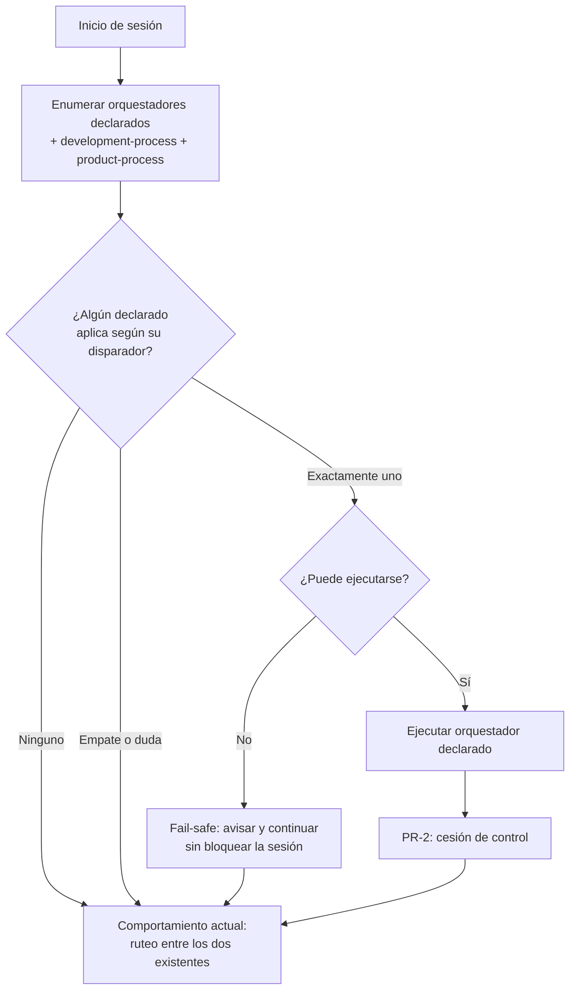

# Orquestadores de proceso declarados por registry — Product Brief

Audiencia: agente implementador (neutral respecto de proveedor) · Metodología: brief-spec (AWM `product-brief`) · Origen: sesión de `product-discovery` (fases 1–5) + decisión de `architecture-advisor` en modo contextual.

## Business Need

- **N1** — El autor de AWM y los líderes de equipo que ya solicitaron incorporar su propio proceso no tienen forma de hacerlo: `use-awm` conoce exclusivamente `development-process` y `product-process`, de modo que toda sesión se rutea a uno de esos dos aunque el trabajo real corresponda a otro proceso. El costo se paga por sesión, todos los días, en dos monedas: tiempo de re-encauce conversacional del agente, y adopción — un líder que comprueba que AWM no habla su idioma vuelve a usar el agente sin AWM, y recuperarlo cuesta más que haberlo retenido.

- **N2** — Al no existir un método estandarizado para crear un registry que aporte un proceso, los procesos propios se instalan hoy como skills sueltos fuera del contrato de registry: sin versionado, sin `awm update`, sin entrada en `catalog.json`. Cada skill suelto agrega deuda y riesgo de colisión de nombres; la trayectoria declarada por el dueño es de empeoramiento progresivo hasta que una actualización rompa una instalación.

## Business Cases

Catálogo confirmado como completo por el dueño durante `product-discovery` (fase 3). Se enumera como casos observables, no como requisitos.

**Ejecución y ciclo de vida**

- **Sesión ordinaria con dos procesos activos.** El usuario abre sesión en un repositorio de la compañía, siendo una de varias sesiones en paralelo. Aplican dos procesos: uno que sigue a la persona (su proceso de productividad) y otro que sigue al proyecto (infraestructura, formas de compilar y probar). El primero se resuelve, luego el segundo aporta lo suyo, y recién después entra el flujo de desarrollo o producto. Durante el trabajo, el primero sigue activo y actualiza sus registros. Al cerrar, cierra lo que abrió.
- **Solo proceso de proyecto.** Un integrante del equipo abre sesión en el mismo repositorio. Le aplica únicamente el proceso del producto; el proceso personal del dueño no se le menciona, no se le ofrece y no le corre.
- **Solo proceso personal.** El repositorio no tiene proceso de proyecto declarado (o es un repositorio personal). Aplica solamente el proceso que sigue a la persona.
- **Ningún proceso propio.** Ni la persona ni el repositorio tienen procesos declarados. La sesión se comporta exactamente como hoy: `use-awm` rutea a `development-process` o `product-process`.
- **N sesiones en paralelo sobre tareas distintas.** El usuario mantiene varias sesiones abiertas simultáneamente sobre trabajos diferentes. Cada una lleva su propio hilo de registro sin pisar el de las otras: si dos sesiones compiten por el mismo registro, el sistema externo termina mintiendo sobre en qué se trabajó.
- **Eventos durante el trabajo.** El usuario pausa, se distrae, cambia de tarea o cierra. El proceso que lo requiera actualiza su sistema externo sin que el usuario tenga que pedirlo.
- **Captura suelta.** Llega algo por un canal externo (mensajería, correo) que todavía no es una tarea. Se guarda sin convertirse en tarea, y se procesa más tarde en un momento distinto.

**Autoría y distribución**

- **Un equipo construye su proceso desde cero.** Hoy no existe método: se copia del registry base a mano, sin contrato ni validación.
- **Un proceso se actualiza y debe propagarse.** El autor edita, versiona con tag, y las máquinas y personas que usan ese registry reciben el cambio con `awm update`.
- **Aislamiento.** El proceso personal de una persona no queda registrado, visible ni ejecutable dentro del repositorio de la compañía.

**Conflicto y degradación**

- **Falla o conflicto.** El sistema externo con el que habla un proceso no responde o carece de credenciales; o bien dos procesos declarados quieren tomar el control simultáneamente. En ninguno de los dos escenarios el usuario puede quedar bloqueado sin poder trabajar.

## Users & Context

- **Autor de AWM (dueño de este brief).** Mantiene varias sesiones abiertas en paralelo, sobre trabajos personales y corporativos indistintamente, en repositorios de la compañía y propios. Encuentra el problema al inicio de cada sesión y durante el trabajo. Su proceso de productividad personal es un sistema propio que usa solamente él.
- **Líderes de equipo con proceso propio pendiente.** Ya solicitaron explícitamente incorporar su proceso (demanda concreta, no hipotética). Lo encuentran cuando intentan adoptar AWM y comprueban que solo conoce procesos de desarrollo y de producto.
- **Integrantes de equipo.** Trabajan en repositorios donde otra persona tiene procesos personales instalados. Su contexto exige que esos procesos les sean invisibles: no deben verlos, ejecutarlos ni enterarse de que existen.

## Constraints

**Frontera personal ↔ corporativo (confirmadas como duras por el dueño)**

- Nada personal puede quedar commiteado en un repositorio de la compañía: ni configuración, ni identificadores, ni referencias al sistema personal.
- El proceso personal no debe ser visible ni ejecutable por otras personas con acceso al mismo repositorio. La exigencia es invisibilidad, no meramente inactividad.
- Credenciales y tokens nunca en el repositorio ni en el registry publicado.
- **No es restricción:** que datos del repositorio corporativo (títulos de tarea, nombres de rama) fluyan hacia el sistema personal del dueño. Es su propia bitácora de trabajo. Se deja asentado explícitamente para que no se lo trate como omisión.

**Sistema existente (intocable)**

- El contrato de registry actual — layout validado, `awm-registry.json`, `catalog.json`, `awm registry add` — no se reemplaza ni pierde compatibilidad con quien ya lo usa.
- `~/.awm` es territorio exclusivo del instalador: solo `awm init` y `awm update` escriben ahí. Aplica también a cualquier estado que un proceso necesite persistir.
- `use-awm`, `development-process` y `product-process` no pueden sufrir regresión: quien no tenga procesos propios declarados debe obtener el comportamiento actual, idéntico.
- El gate de CI en las tres plataformas (`ubuntu-latest`, `windows-latest`, `macos-latest`) precede a toda publicación (D-005 en `docs/decisions.md`).

**Costo y recursos**

- Sin presupuesto asignado. El único recurso es el tiempo del propio dueño; no hay equipo disponible para tomar parte del trabajo.
- La solución no puede introducir suscripciones, servicios cloud ni dependencias pagas: debe funcionar íntegramente sobre lo que ya existe en la instalación actual de AWM y en el entorno de trabajo del usuario.
- Corolario de alcance: toda alternativa que exija infraestructura propia (un servicio corriendo, un almacén externo, un broker) queda descartada de plano, no diferida.

**Tiempo**

- Urgente. La productividad del dueño está mermando de forma activa y existen compromisos de entrega de funcionalidad con los equipos para la semana siguiente a la fecha de este brief. Esto condiciona el corte de alcance entre Release 1 y Release 2, no la calidad de ninguno de los dos.

## Non-Assumption Mandate

Este brief se construyó a partir de una conversación con el dueño más una lectura parcial y acotada del código durante esa misma sesión. La distinción entre lo uno y lo otro es normativa: lo que sigue como *verificado* fue leído en el árbol real; **todo lo demás no está verificado y debe confirmarse en R0 (descubrimiento de solo lectura) antes de cualquier compromiso técnico.**

**Verificado en sesión (con referencia):**

- `awm registry add` clona el remoto, valida el layout con `validateRegistryLayout` y detecta colisiones de contenido contra los registries ya conocidos *antes* de escribir la configuración, revirtiendo el clon si algo falla — `cli/src/commands/registry/add.ts:38-80`.
- El manifiesto de registry se llama `awm-registry.json` y los metadatos incluyen además `catalog.json`; los directorios de contenido válidos se enumeran en `REGISTRY_DIR_NAMES` — `cli/src/core/registries.ts:27-29`.
- El registry base declara sus bundles en `catalog.json` con un campo `scope` de valores `baseline` y `project`; cada `bundle.json` declara `name`, `version`, `description`, `scope`, `dependsOn`, `skills`, `workflows` y `agents`, y admite entradas de skill de la forma `{ "name": ..., "onSignal": true }`.
- El hook de arranque de sesión inyecta el contenido de `using-awm.md` leído desde `${AWM_HOOKS_ROOT}` y, por separado, el contenido de `$PWD/CONSTITUTION.md` si existe y no está vacío — `hooks/session-start:28,56` en `awm-baseline-registry`. La inyección de constitución está atada al directorio de trabajo actual.
- Los subsistemas `track` y `job` del CLI operan sobre un journal **por rama de git** y fallan si HEAD está desacoplado — `cli/src/commands/track/index.ts:20`. Implementan requests inmutables con `idempotencyKey`, un supervisor de escritor único, `heartbeat` y un `reap` que confirma identidad de proceso antes de emitir señal alguna.

**NO verificado — confirmar en R0:**

- Cómo trata `awm update` a un registry que declare un orquestador: si el flujo actual basta o requiere cambios.
- Si el mecanismo de instalación de skills (symlinks hacia `~/.awm/registries/<name>/skills/`) permite aislamiento por usuario en una misma máquina, y qué ocurre con dos usuarios del sistema operativo sobre el mismo repositorio. **Esta es la incógnita que más condiciona la restricción de invisibilidad.**
- Si los caminos de OpenCode y Codex tienen puntos de inyección equivalentes al de Claude Code, y si el contrato propuesto se expresa igual en los tres.
- Si `registries.json` es por usuario, por máquina o por instalación, y qué implica eso para un registry personal instalado en una máquina compartida.
- El contenido y forma reales del archivo `using-awm.md` tal como queda instalado, y qué parte de su texto es el punto de extensión a modificar.
- El mecanismo por el cual un registry podría declarar servidores MCP o dependencias externas, si es que existe.
- Convenciones de nomenclatura y de testing vigentes para código nuevo en `cli/src/`, más allá de lo observado incidentalmente.

Toda contradicción entre este brief y el sistema real hallada durante R0 se reporta al dueño y **nunca** se resuelve asumiendo: decide el dueño y la resolución se registra como actualización de este brief o como nueva `DA-#`. Toda definición de esquema, ruta, firma de función, formato de manifiesto y biblioteca queda delegada al implementador, y solo después de R0.

## Glossary

| Término | Definición |
|---|---|
| Orquestador declarado | Proceso aportado por un registry que se ofrece como punto de entrada de una sesión, del mismo modo que hoy lo son `development-process` y `product-process`. |
| Disparador | Texto en prosa con el que un orquestador declarado expresa cuándo aplica. Es lo que el agente lee para decidir. AWM no interpreta su semántica. |
| Precedencia | Regla que determina en qué orden se consideran los orquestadores declarados entre sí y frente a los dos existentes. |
| Contrato de terminación | Obligación de un orquestador declarado de ceder el control explícitamente y de nombrar a quién se lo cede. |
| Fail-safe | Garantía de que un orquestador declarado que no puede ejecutarse no impide que la sesión continúe. |
| Registry | Repositorio de contenido instalable con `awm registry add`, con layout validado y metadatos propios. |
| Bundle | Agrupación versionada de skills, workflows y agents dentro de un registry, declarada en `catalog.json`. |
| Proceso que sigue a la persona | Orquestador cuyo disparador se cumple según quién trabaja, con independencia del repositorio. |
| Proceso que sigue al proyecto | Orquestador cuyo disparador se cumple según dónde se trabaja, con independencia de quién. |

## Processes

- **PR-1 — Resolución de orquestadores al inicio de sesión.** Al comenzar una sesión, se enumeran los orquestadores declarados por los registries instalados, junto con los dos existentes. El agente lee el disparador de cada uno y selecciona el que corresponde al trabajo que la sesión inicia. Si ninguno declarado aplica, el comportamiento es el actual. Si uno declarado aplica, se ejecuta y luego cede el control según PR-2.
  - Si R0 confirma que el punto de inyección de `using-awm.md` admite una lista construida en tiempo de instalación, la enumeración se materializa ahí; en caso contrario, el implementador propone el punto de extensión equivalente y lo somete al dueño antes de comprometerlo.
  - Ante duda o empate entre dos orquestadores declarados, el comportamiento por defecto es **no aplicar ninguno** y continuar como hoy. La resolución definitiva del empate es `DA-3`.

- **PR-2 — Cesión de control.** Un orquestador declarado termina en un estado terminal explícito y nombra a quién cede el control: a otro orquestador declarado, a `development-process`, a `product-process`, o a nadie (la sesión termina ahí). No existe la co-existencia de dos orquestadores activos, del mismo modo que hoy `product-process` y `development-process` no co-existen. Lo que el orquestador declarado haya hecho internamente no viaja por ningún canal lateral: lo que no quede en el estado que él mismo produzca, no cruzó.

- **PR-3 — Autoría y publicación de un registry con orquestador.** Un autor parte de un método documentado y reproducible: crea el repositorio con el layout que el contrato exige, declara el orquestador y su disparador, valida localmente que el layout y la ausencia de colisiones se cumplen, publica con tag de versión, y las instalaciones lo reciben con `awm update`. El método no exige copiar del registry base a mano ni conocer detalles internos del CLI.
  - Si R0 confirma que existe validación local invocable antes de publicar, PR-3 la usa; en caso contrario, el implementador propone cómo el autor verifica su registry sin instalarlo en una máquina real.

## Requirements

**RF-1 — Declaración y descubrimiento**

- **RF-1.1** — CUANDO un registry instalado declare que aporta un orquestador, EL sistema DEBERÁ incluirlo en el conjunto de orquestadores considerados al inicio de la sesión.
  - **CA-1.1** — Con un registry de prueba que declara un orquestador instalado mediante `awm registry add`, iniciar una sesión real y comprobar que el orquestador declarado aparece entre las opciones consideradas. Verificable contra una instalación real, no contra mocks.
- **RF-1.2** — SI un registry declara un orquestador con una declaración malformada o incompleta, ENTONCES EL sistema DEBERÁ rechazar esa declaración e informarla, sin impedir que el resto de los orquestadores del mismo registry o de otros se consideren.
  - **CA-1.2** — Instalar un registry con una declaración inválida y comprobar que la sesión inicia, que el error se reporta de forma legible, y que los demás orquestadores siguen disponibles.
- **RF-1.3** — EL sistema NO DEBERÁ requerir conocimiento del dominio de un orquestador declarado para descubrirlo: la declaración se limita a identidad, disparador, precedencia y destino de terminación.
  - **CA-1.3** — Revisión del contrato publicado: ningún campo del manifiesto admite ni exige vocabulario específico de un proceso concreto. Se verifica declarando dos orquestadores de dominios ajenos entre sí y comprobando que ambos se expresan sin campos ad hoc.

**RF-2 — Selección y precedencia**

- **RF-2.1** — CUANDO existan uno o más orquestadores declarados aplicables, EL sistema DEBERÁ seleccionar exactamente uno para ejecutar, según su disparador y la regla de precedencia vigente.
  - **CA-2.1** — Con dos orquestadores declarados de disparadores disjuntos instalados, iniciar sesiones que correspondan a cada uno y comprobar que se selecciona el correcto en cada caso.
- **RF-2.2** — SI ningún orquestador declarado aplica, ENTONCES EL sistema DEBERÁ continuar con el ruteo actual entre `development-process` y `product-process`, sin mención alguna a los orquestadores declarados.
  - **CA-2.2** — Con orquestadores declarados instalados pero cuyos disparadores no aplican, comprobar que la sesión se comporta de forma indistinguible de una sesión sin ellos.
- **RF-2.3** — SI dos o más orquestadores declarados resultan aplicables simultáneamente y la precedencia no los desempata, ENTONCES EL sistema DEBERÁ no aplicar ninguno y continuar con el ruteo actual.
  - **CA-2.3** — Instalar dos orquestadores con disparadores deliberadamente solapados y comprobar que la sesión continúa con el comportamiento actual en lugar de elegir arbitrariamente.

**RF-3 — Terminación**

- **RF-3.1** — CUANDO un orquestador declarado concluya, EL sistema DEBERÁ requerir que haya nombrado explícitamente su destino de terminación.
  - **CA-3.1** — Ejecutar un orquestador declarado de prueba hasta su conclusión y comprobar que el destino queda registrado y es observable.
- **RF-3.2** — EL sistema NO DEBERÁ permitir que dos orquestadores estén activos simultáneamente.
  - **CA-3.2** — Provocar que un orquestador declarado intente invocar a otro sin haber concluido, y comprobar que se impide.

**RF-4 — Autoría y distribución**

- **RF-4.1** — EL sistema DEBERÁ proveer un método documentado y reproducible para crear un registry que aporte un orquestador, sin requerir copiar contenido del registry base a mano.
  - **CA-4.1** — Una persona ajena al desarrollo del CLI sigue el método documentado y produce un registry instalable que supera la validación de layout y de colisiones. Verificable con una persona real, no con una simulación.
- **RF-4.2** — CUANDO el autor de un registry publique una versión nueva con tag, EL sistema DEBERÁ entregar ese cambio a las instalaciones mediante `awm update`, sin pasos manuales adicionales.
  - **CA-4.2** — Publicar una versión nueva de un registry de prueba y comprobar en una instalación distinta que `awm update` la trae.

**RNF-T — Transversales**

- **RNF-T.1 (fail-safe)** — SI un orquestador declarado no puede ejecutarse por cualquier causa —incluida la indisponibilidad de un sistema externo del que dependa—, ENTONCES EL sistema DEBERÁ informarlo y continuar la sesión sin bloquear al usuario.
  - **CA-T.1** — Con un orquestador declarado cuya dependencia externa está deliberadamente caída, iniciar sesión y comprobar que el usuario puede trabajar, y que el fallo se reporta sin interrumpir.
- **RNF-T.2 (sin regresión)** — EL sistema DEBERÁ producir, en ausencia de orquestadores declarados, un comportamiento idéntico al vigente antes de este cambio.
  - **CA-T.2** — La suite de tests existente pasa sin modificaciones de expectativas, y una sesión sin registries adicionales se comporta igual que en la versión previa.
- **RNF-T.3 (aislamiento)** — EL sistema NO DEBERÁ hacer visible ni ejecutable, para una persona distinta de quien lo instaló, un orquestador aportado por un registry personal; ni DEBERÁ dejar rastro de ese registry en el árbol versionado del repositorio de trabajo.
  - **CA-T.3** — Con un registry personal instalado, comprobar que `git status` en el repositorio de trabajo no reporta archivo alguno atribuible a él, y que una sesión iniciada por otra identidad no enumera ni menciona ese orquestador. La forma concreta de esta garantía depende de `DA-1`.
- **RNF-T.4 (plataformas)** — EL sistema DEBERÁ comportarse de forma equivalente en `ubuntu-latest`, `windows-latest` y `macos-latest`.
  - **CA-T.4** — El job de CI existente pasa en las tres plataformas con los tests nuevos incluidos, como precondición de publicación (D-005).
- **RNF-T.5 (aislamiento de tests)** — Los tests de esta funcionalidad NO DEBERÁN tocar el `~/.awm` real, usando tmpdirs con `HOME` y `AWM_HOME` sobreescritos.
  - **CA-T.5** — Ejecutar la suite con un `~/.awm` poblado y comprobar que queda inalterado.

## Open Decisions

| ID | Decisión | Bloquea | Posiciones conocidas |
|---|---|---|---|
| DA-1 | Cómo se garantiza que un orquestador de un registry personal sea invisible para otra persona con acceso a la misma máquina o al mismo repositorio | Release 1 | Depende de lo que R0 encuentre sobre el modelo de instalación y symlinks. Posiciones a evaluar: aislamiento por directorio de usuario del sistema operativo / registry marcado como privado en su manifiesto / instalación fuera del alcance compartido. No se elige sin el hallazgo de R0. |
| DA-2 | Si la precedencia entre orquestadores la declara cada registry o si es fija y la define el framework | Release 2 | Declarada por el registry: más flexible, permite que un autor exprese "voy antes que el flujo de desarrollo". Fija en el framework: más predecible, evita que dos autores se declaren ambos primeros. |
| DA-3 | Qué ocurre cuando dos orquestadores declarados resultan aplicables a la vez y la precedencia no los desempata | Release 2 | Posición registrada en RF-2.3 como comportamiento por defecto seguro (no aplicar ninguno). Alternativas a evaluar: preguntar al usuario / desempatar por orden de instalación / rechazar la instalación que introduce el solapamiento. |
| DA-4 | Si se incorpora, y bajo qué disparador, la capa aditiva O1 (predicado determinista evaluado por el framework sobre un espacio de hechos de sesión) | ninguna | Se difiere deliberadamente. Se incorpora solo si el uso real demuestra que el juicio del agente sobre el disparador en prosa activa de más o de menos con frecuencia intolerable. Es aditiva por diseño: no rompe registries existentes. |

## Out of Scope

- **Runtime de sesión con estado y eventos (alternativa D).** Detección de inactividad, coordinación entre sesiones concurrentes y actualización automática de sistemas externos durante el trabajo. Queda para un brief propio. Motivo: no entra en la ventana de tiempo comprometida, y su ausencia no invalida el valor de los dos releases de este brief.
- **Concurrencia entre sesiones y detección de inactividad como garantía del framework.** Corresponden al proceso que las necesite, no a AWM. El framework solo debe no impedirlas. Esta exclusión es deliberada y es la consecuencia directa del requisito de agnosticismo: incorporarlas obligaría a AWM a conocer qué es un bloque de tiempo y qué es inactividad.
- **La bandeja de captura de ítems sueltos.** Es una capacidad del proceso de productividad del dueño, no del framework.
- **La implementación del proceso de productividad del dueño y su integración con su sistema personal.** Este brief entrega el mecanismo por el que ese proceso puede existir y distribuirse; el proceso en sí es contenido de un registry, y se desarrolla en su propio repositorio de registry.
- **Modificaciones a `development-process` y `product-process`.** No se tocan. Solo cambia quién los invoca y cuándo.

## Releases

Orden por valor de negocio, no por dependencia técnica. Release 1 va primero porque ataca directamente el costo que motivó el proyecto —la deuda de skills sueltos y la falta de aislamiento— y porque no depende de Release 2 para ser útil.

### R0 — Descubrimiento (solo lectura)

- **Valor:** ninguna decisión técnica se compromete sobre supuestos. Su entregable es el informe de estado real, el mapeo conceptual→real, las contradicciones halladas y el plan técnico conforme a las convenciones descubiertas.
- **Alcance:** las siete incógnitas listadas en el mandato de no asunción, con prioridad en la del modelo de instalación y symlinks, por ser la que condiciona `DA-1` y por tanto Release 1.
- **Bloqueado por:** nada.
- **Aceptación:** el dueño valida el informe antes de que comience Release 1. R0 no modifica código ni datos.

### Release 1 — Registry propio sobre el contrato existente

- **Valor productivo independiente:** el proceso propio deja de ser un skill suelto y pasa a estar versionado, aislado y distribuible con el contrato de registry que ya existe y funciona, sin tocar el CLI. Elimina la deuda de N2 y satisface la frontera personal↔corporativo, aun si Release 2 nunca se hiciera.
- **Alcance:** RF-4.1, RF-4.2, RNF-T.3, RNF-T.5. Método de autoría documentado (PR-3) y un registry propio real construido con ese método.
- **Bloqueado por:** DA-1.
- **Aceptación:** CA-4.1, CA-4.2, CA-T.3, CA-T.5.

### Release 2 — Punto de extensión en `use-awm`

- **Valor productivo independiente:** cualquier equipo declara su orquestador y AWM lo considera y lo rutea. Es lo que convierte a AWM de herramienta con dos procesos fijos en plataforma extensible, y es lo comprometido con los líderes.
- **Alcance:** RF-1.1, RF-1.2, RF-1.3, RF-2.1, RF-2.2, RF-2.3, RF-3.1, RF-3.2, RNF-T.1, RNF-T.2, RNF-T.4. Implementa PR-1 y PR-2.
- **Bloqueado por:** DA-2, DA-3.
- **Aceptación:** CA-1.1, CA-1.2, CA-1.3, CA-2.1, CA-2.2, CA-2.3, CA-3.1, CA-3.2, CA-T.1, CA-T.2, CA-T.4.

## Risks

| Riesgo | Impacto | Mitigación |
|---|---|---|
| Contradicciones entre este brief y el sistema real | Retrabajo, implementación incorrecta | Mandato de no asunción + R0 de solo lectura antes de todo compromiso |
| La activación depende del juicio del agente sobre prosa, no de un predicado verificable | Un orquestador se activa de más (ruido) o de menos (no aparece cuando debía), sin test que lo detecte | Precedencia explícita; comportamiento por defecto "no aplicar ninguno" ante duda o empate (RF-2.3); `DA-4` registrada como capa aditiva de escape si el uso real lo exige |
| Filtración de vocabulario de un proceso concreto al contrato del framework | AWM deja de ser agnóstico y hereda las particularidades del primer proceso que lo usa, repitiendo a otro nivel el antipatrón que la doctrina de sensor-packs ya prohíbe | RF-1.3 y su CA lo verifican declarando dos orquestadores de dominios ajenos; revisión explícita del contrato en code review con este criterio |
| La urgencia empuja a fusionar Release 1 y Release 2 | Se entrega un punto de extensión sin validar y sin aislamiento resuelto, y se rompe la restricción de invisibilidad | Release 1 no depende de Release 2; su valor está justificado de forma independiente y su aceptación es verificable por separado |
| `DA-1` se resuelve mal por presión de tiempo | El proceso personal termina siendo visible para compañeros, violando una restricción declarada dura | `DA-1` bloquea Release 1 de forma explícita; R0 prioriza la incógnita del modelo de instalación por encima de las demás |
| El aislamiento por usuario resulta imposible con el modelo de instalación actual | Release 1 no puede cumplir RNF-T.3 tal como está escrito | R0 lo detecta antes de comprometer trabajo; si ocurre, la contradicción se reporta al dueño y no se resuelve asumiendo — puede derivar en una `DA-#` nueva o en un cambio de alcance decidido por él |
