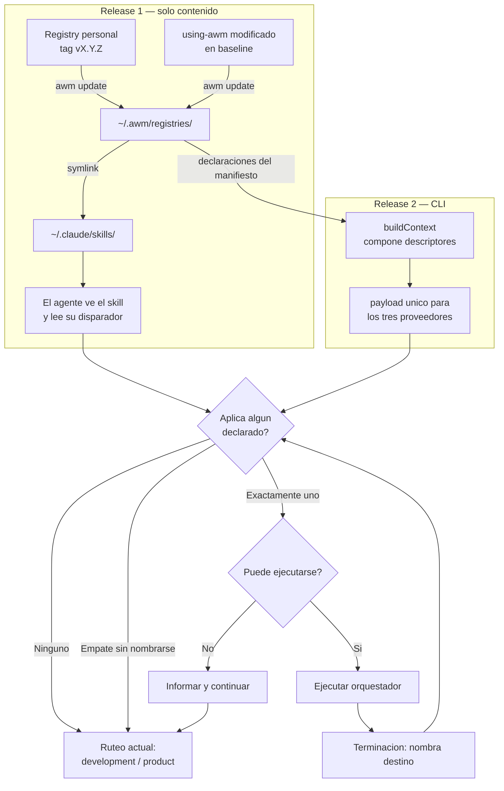

# Orquestadores de proceso declarados por registry — Design

Origen: [brief certificado `ready`](2026-08-21-registry-declared-orchestrators-brief.md) (`awm: product-brief`, `mode: brief`), vía `brainstorming` en Brief Preload Mode.

Decisión de activación tomada en `architecture-advisor` (modo contextual): **O2b** — el proceso declara su disparador en prosa y el agente juzga, consistente con el ruteo que `use-awm` ya hace hoy. El predicado determinista evaluado por el framework (O1) queda como capa aditiva futura, registrada en `DA-4` del brief.

## Requirements

Trazabilidad: cada `R#` referencia el `RF/RNF` del brief que lo origina.

**R1 — Declaración y descubrimiento**

- **R1.1** — CUANDO un registry instalado declare que aporta un orquestador, EL sistema SHALL incluirlo entre los orquestadores considerados al inicio de la sesión. *(brief RF-1.1)*
- **R1.2** — SI la declaración de un orquestador está malformada o incompleta, ENTONCES EL sistema SHALL rechazar esa declaración e informarla, sin invalidar los demás orquestadores del mismo registry ni de otros. *(brief RF-1.2 — reasignada a Release 2)*
- **R1.3** — EL contrato de declaración SHALL limitarse a identidad, disparador y destino de terminación, sin admitir ni exigir vocabulario de dominio de ningún proceso concreto. *(brief RF-1.3)*
- **R1.4** — SI un registry no declara ningún orquestador, ENTONCES EL sistema SHALL instalarlo y tratarlo exactamente como hoy. *(nuevo — deriva de RNF-T.2)*

**R2 — Selección y precedencia**

- **R2.1** — CUANDO uno o más orquestadores declarados resulten aplicables, EL sistema SHALL considerarlos antes que `development-process` y `product-process`. *(brief RF-2.1; DA-2 resuelta)*
- **R2.2** — EL orden entre orquestadores declarados SHALL derivarse del contrato de terminación de cada uno, y NO de ningún campo de precedencia del framework. *(DA-2 resuelta)*
- **R2.3** — SI ningún orquestador declarado aplica, ENTONCES EL sistema SHALL continuar con el ruteo actual entre `development-process` y `product-process`, sin mencionar los orquestadores declarados. *(brief RF-2.2)*
- **R2.4** — SI dos o más orquestadores declarados resultan aplicables y ninguno nombra al otro en su terminación, ENTONCES EL sistema SHALL no aplicar ninguno y continuar con el ruteo actual. *(brief RF-2.3; DA-3 reducida)*

**R3 — Terminación**

- **R3.1** — CUANDO un orquestador declarado concluya, EL sistema SHALL exigir que haya nombrado explícitamente su destino de terminación: otro orquestador declarado, `development-process`, `product-process`, o ninguno. *(brief RF-3.1)*
- **R3.2** — EL sistema SHALL mantener como máximo un orquestador activo a la vez. *(brief RF-3.2)*
- **R3.3** — SI un orquestador declarado nombra como destino a otro que no está instalado, ENTONCES EL sistema SHALL continuar con el ruteo actual e informarlo, sin abortar la sesión. *(nuevo — deriva del acoplamiento entre procesos aceptado al resolver DA-2)*

**R4 — Autoría y distribución**

- **R4.1** — EL sistema SHALL proveer un método documentado y reproducible para crear un registry que aporte un orquestador, sin requerir copiar contenido del registry base a mano. *(brief RF-4.1)*
- **R4.2** — CUANDO el autor publique una versión nueva con tag, EL sistema SHALL entregar ese cambio a las instalaciones mediante `awm update`, sin pasos manuales adicionales. *(brief RF-4.2)*

**R5 — Robustez y frontera**

- **R5.1** — SI un orquestador declarado no puede ejecutarse por cualquier causa, incluida la indisponibilidad de un sistema externo del que dependa, ENTONCES EL sistema SHALL informarlo y continuar la sesión sin bloquear al usuario. *(brief RNF-T.1)*
- **R5.2** — EL sistema SHALL garantizar que un registry instalado por una persona no deje archivo alguno en el árbol versionado del repositorio de trabajo. *(brief RNF-T.3, alcance fijado por DA-1)*
- **R5.3** — EL contrato de declaración SHALL rechazar credenciales y secretos: ningún campo del manifiesto los admite ni los presupone. *(brief Constraints — frontera personal/corporativo)*

**R6 — No regresión, plataformas y tests**

- **R6.1** — EL sistema SHALL producir, en ausencia de orquestadores declarados, un comportamiento idéntico al vigente antes de este cambio. *(brief RNF-T.2)*
- **R6.2** — EL sistema SHALL comportarse de forma equivalente en `ubuntu-latest`, `windows-latest` y `macos-latest`. *(brief RNF-T.4)*
- **R6.3** — SI un test de esta funcionalidad se ejecuta, ENTONCES EL test SHALL usar tmpdirs con `HOME` y `AWM_HOME` sobreescritos, y SHALL NOT tocar el `~/.awm` real. *(brief RNF-T.5)*

## Arquitectura

Dos capas con frontera dura, y el corte de releases la sigue en vez de seguir una dependencia técnica:

- **Capa de contenido** — registries versionados por tag, entregados con `awm update`. No pasa por npm ni por el gate de sensores.
- **Capa de CLI** — publicada a npm por `.github/workflows/release.yml`, con el gate de tests en tres plataformas como precondición (D-005).

**Release 1 vive enteramente en la capa de contenido.** Ningún archivo bajo `cli/` cambia. **Release 2 es el único que toca CLI**, y ahí se concentra todo el riesgo.

La regla agnóstica que sostiene el diseño: *AWM sabe que existen orquestadores declarados y que se consideran antes que los dos existentes. Nada más.* No hay campo de precedencia, no hay enum de scopes, no hay espacio de hechos de sesión. El orden entre declarados emerge del contrato de terminación (`R2.2`), igual que hoy `product-process` cede a `development-process`.

### Estado verificado del sistema

Verificado durante esta fase, con referencia:

- `awm registry add` clona, valida layout con `validateRegistryLayout` y detecta colisiones antes de escribir configuración — `cli/src/commands/registry/add.ts:38-80`.
- `buildContext` lee `using-awm/SKILL.md` de **un solo** `registryRoot` y solo emite los nombres de extensión como texto (`Active extensions: ...`); no compone contenido — `cli/src/core/context/provider.ts`.
- `profileExtensions` se pasa vacío en sus tres únicos llamadores — `cli/src/core/init/steps.ts:445`, `cli/src/core/diagnostics/context.ts:86`, `cli/src/core/diagnostics/provider-checks.ts:408`. Es una costura sin productor.
- **Claude Code saltea `buildContext`**: `cli/src/commands/hooks/claude.ts:42-49` symlinkea `skills/using-awm/SKILL.md` directo a `~/.awm/hooks/using-awm.md`, y el hook lee ese archivo crudo — `hooks/session-start:28` en `awm-baseline-registry`.
- La inyección de constitución está atada al cwd: `CONSTITUTION_FILE="$PWD/CONSTITUTION.md"` — `hooks/session-start:56`.
- `track`/`job` operan sobre un journal **por rama de git** y fallan en HEAD desacoplado — `cli/src/commands/track/index.ts:20`. No son un runtime de sesión reutilizable acá.

## Componentes

### Release 1 — capa de contenido

| Unidad | Responsabilidad | Depende de |
|---|---|---|
| `awm-baseline-registry` → `skills/using-awm/SKILL.md` | Su sección *Orchestration* deja de enumerar dos orquestadores fijos: pasa a considerar primero los declarados, con la regla de default seguro (`R2.4`) y la de fail-safe (`R5.1`). Es el único punto que cambia comportamiento en Release 1 | Nada. Es contenido |
| Registry personal (repo privado nuevo) | Aporta un orquestador: `awm-registry.json`, `catalog.json`, un bundle y `skills/<proceso>/SKILL.md` con su disparador y su destino de terminación | Contrato de registry actual, sin cambios |
| `agentic-workflow` → `docs/guides/` | Método de autoría reproducible (`R4.1`): layout exigido, cómo declarar, cómo validar localmente, cómo publicar con tag | Contrato de registry actual |

El descubrimiento en Release 1 es **por visibilidad**: los skills ya se enlazan a `~/.claude/skills/`, así que el agente los ve sin que nadie componga nada. Eso es lo que permite entregar sin tocar el CLI — y es también la razón por la que `R1.2` no puede cumplirse todavía.

### Release 2 — capa de CLI

| Unidad | Responsabilidad |
|---|---|
| `cli/src/core/registries.ts` | Leer y validar la declaración de orquestador del manifiesto (`R1.1`, `R1.2`, `R1.3`, `R5.3`) |
| `cli/src/core/context/provider.ts` | `buildContext` compone los descriptores declarados en el payload, en vez de emitir solo nombres |
| `cli/src/commands/hooks/claude.ts` | Rutear Claude Code por `buildContext`, cerrando el bypass — el cambio de mayor riesgo del release |
| `cli/src/commands/registry/add.ts` | Rechazar declaraciones malformadas informándolas, en el mismo punto donde ya se detectan colisiones |

## Flujo de datos

## Manejo de errores

| Condición | Comportamiento | Requisito |
|---|---|---|
| Declaración malformada | Rechazo informado, sin invalidar los demás orquestadores. **Solo desde Release 2** — en Release 1 no hay detección, y es deuda conocida y aceptada | `R1.2` |
| Orquestador que no puede ejecutarse | Se informa y la sesión continúa. Nunca bloquea al usuario | `R5.1` |
| Destino de terminación no instalado | Se informa y se sigue con el ruteo actual, sin abortar | `R3.3` |
| Dos declarados aplicables sin nombrarse | No se aplica ninguno; ruteo actual | `R2.4` |
| Ningún declarado | Comportamiento idéntico al de hoy, sin mención alguna | `R2.3`, `R6.1` |

El principio común: **ningún fallo del mecanismo de orquestadores declarados puede impedir trabajar.** El peor caso siempre degrada al comportamiento actual de AWM, que ya funciona.

## Testing

- **No-regresión primero.** La suite actual debe pasar sin tocar expectativas (`R6.1`). Es el test que más importa, porque Release 2 toca el camino de instalación de hooks, compartido por los tres proveedores.
- **Aislamiento obligatorio.** Todo test usa tmpdirs con `HOME` y `AWM_HOME` sobreescritos, siguiendo el patrón de `cli/tests/commands/hooks/install.test.ts`. Ningún test toca el `~/.awm` real (`R6.3`).
- **Release 1 no agrega tests de CLI**, porque no cambia código. Se verifica instalando el registry real y abriendo una sesión — contra uso real, nunca contra mocks.
- **Tres plataformas** como precondición de publicación, relevante solo en Release 2 (`R6.2`).
- **Casos de error primero.** Las condiciones `IF/THEN` de arriba se escriben como tests antes que los caminos felices: son la clase de fallo que de otro modo aparece tarde.

## Mapa release ↔ requisitos

| Release | Requisitos | Capa | Riesgo |
|---|---|---|---|
| **1** | `R2.1`, `R2.2`, `R2.3`, `R2.4`, `R3.1`, `R3.2`, `R3.3`, `R4.1`, `R4.2`, `R5.2`, `R5.3` | Contenido | Bajo — sin código, sin npm, sin gate de sensores |
| **2** | `R1.1`, `R1.2`, `R1.3`, `R1.4`, `R5.1`, `R6.1`, `R6.2`, `R6.3` | CLI | Alto — toca instalación de hooks y los tres proveedores |

**Naturaleza de la garantía por release.** En Release 1 los requisitos se cumplen **por convención**: quien los hace cumplir es el agente leyendo `using-awm`, no el CLI. Eso vale para `R2.x` y `R3.x` — un orquestador que no nombre su destino de terminación no es rechazado por nadie, solo queda mal escrito. Release 2 agrega la garantía **mecánica**: hay un lector del manifiesto que valida y reporta. La distinción es deliberada y es lo que hace que Release 1 entre en la ventana de tiempo, pero no debe leerse como equivalencia: son dos niveles de garantía distintos sobre los mismos requisitos.

`R1.2` es el único caso que **no** admite la versión por convención, y por eso está asignado a Release 2 y no a Release 1: detectar una declaración malformada exige un lector, y en Release 1 no hay ninguno.

`R5.1` (fail-safe) aparece en Release 2 porque su verificación exige que el framework sepa qué está declarado. En Release 1 la garantía se cumple de hecho —no hay mecanismo que pueda colgarse— pero no es verificable como criterio.

## Fuera de alcance

Heredado del brief, sin cambios: el runtime de sesión con estado y eventos (alternativa D); la concurrencia entre sesiones y la detección de inactividad, que corresponden al proceso y no a AWM; la bandeja de captura; y la implementación del proceso de productividad del dueño y su integración con su sistema personal.

Se agrega: **el predicado determinista O1** queda fuera de ambos releases, diferido en `DA-4` hasta que el uso real demuestre que el juicio del agente sobre el disparador en prosa activa de más o de menos con frecuencia intolerable.
