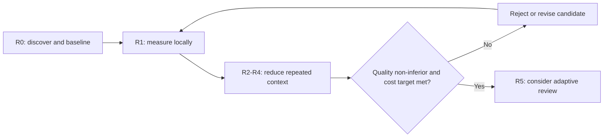

# Performance y tokens — Product Brief

Audience: AWM maintainers and implementing agents · Methodology: brief-spec (AWM product-brief)

## Business Need

- **N1** — Developers and future clients who fund AWM model usage currently absorb a very high token cost across a complete development cycle. The read-only evidence recorded in [issue #126](https://github.com/Kodria/agentic-workflow/issues/126) found a fixed context of 67,481 bytes and a review topology that can require at least `3N+5` subagent invocations for a plan with `N` tasks, before dynamic payloads. Leaving this unresolved makes otherwise high-quality AWM delivery difficult to scale economically.
- **N2** — The owner receives strong positive feedback on correctness, plan fidelity, cohesion, and low defect rates. Token reduction that weakens those outcomes would destroy the product's differentiator, so AWM needs the owner-approved target recorded in [issue #126](https://github.com/Kodria/agentic-workflow/issues/126): at least 50% reduction in billed-equivalent model cost while preserving quality and robustness.
- **N3** — AWM currently lacks provider-neutral, phase-level usage evidence in its own CLI. Without durable measurement, the team cannot distinguish raw-token reduction, cache savings, repeated payload, or cost shifted between phases and therefore cannot make safe optimization decisions.

## Business Cases

- Representative trivial change: measure and optimize a small, low-risk change without forcing the overhead profile of a large feature.
- Representative multi-file feature: preserve requirement traceability, TDD, independent review, and final QA while avoiding repeated transmission of unrelated plan and repository content.
- Critical or ambiguous change: fall back to full context and full verification when security, robustness, root configuration, public contracts, or uncertain impact demand it.
- Provider cache available: arrange stable shared context so a supported provider can reuse it, while reporting cache reads and writes separately from uncached usage.
- Provider cache unavailable or opaque: keep behavior and quality unchanged and report unavailable usage fields explicitly rather than as zero.
- Incomplete telemetry: permit read-only discovery and local evidence collection, but block cost claims and optimization rollout that cannot be compared honestly.
- Root or cross-cutting change: run the full required verification when the impact surface invalidates targeted-only evidence.
- Multi-session work: resume from committed artifacts and GitHub trace without replaying the full conversational history.
- Retrieval miss: allow an agent to fetch authoritative source evidence on demand, record that retrieval, and fail closed when required evidence remains unavailable.
- Quality regression: reject the candidate optimization even when it meets the cost target if acceptance coverage, independent review, robustness checks, or escaped-defect results regress.

## Users & Context

- Developer or client paying the model bill encounters the problem on every AWM-guided development cycle through Codex or Claude Code and needs predictable cost without weaker deliverables.
- AWM controller coordinates phases and subagents and needs to send each role sufficient, authoritative evidence without duplicating unrelated context.
- Implementer, specification reviewer, code-quality reviewer, and QA lens consume different evidence at different times and need explicit retrieval paths when their initial context is insufficient.
- CLI and baseline-registry maintainers evolve measurement, context assembly, skills, and process contracts across repositories and multiple work sessions.
- Product owner evaluates whether an optimization can advance by comparing reproducible quality and billed-equivalent cost evidence in GitHub.

## Constraints

- Technical: support both Codex and Claude Code; provider-specific acceleration may be used only behind a provider-neutral behavior contract.
- Quality: retain requirement traceability, TDD during implementation, independent review, final Track A and Track B QA, input validation, security, and robustness floors.
- Cost: introduce no new paid infrastructure; telemetry and reports must work locally with data already exposed by the provider or runtime.
- Privacy: usage records must not persist prompts, source code, secrets, credentials, or unrestricted model responses.
- Compatibility: existing projects and plans without new metadata must continue to work safely, defaulting to the current full-quality path.
- Traceability: material evidence, decisions, artifacts, commits, and pull requests must remain linked from GitHub issue #126 across sessions.
- Integrity: savings cannot be claimed by silently skipping required gates, narrowing acceptance criteria, hiding unavailable data, or shifting unmeasured work outside the reported cycle.
- Infrastructure: release and publication behavior defined by the repository constitution remains untouched; no direct package publication is part of this initiative.

## Non-Assumption Mandate

This brief incorporates read-only inspection of the current AWM repositories, the prior cycle evidence linked from issue #20, issue #126, and public provider documentation. It has not verified a production implementation of the proposed optimizations or complete runtime billing telemetry. The following must be confirmed in R0 before any technical commitment:

- The exact usage and cache fields exposed by each supported Codex and Claude Code execution path, including their units, lifecycle, and availability in nested agent runs.
- The authoritative pricing source and billed-cost calculation available for each provider/model combination; no static price is assumed.
- The actual prompt boundary, ordering, and cache behavior applied by each provider adapter at runtime.
- The exact hooks and event correlation needed to attribute usage to cycle, phase, role, task, retry, and retrieval without double counting.
- Which current skill payloads are transmitted verbatim, summarized by the provider, or recovered through runtime-native context mechanisms.
- The representative evaluation corpus, minimum sample, and non-inferiority margin needed to generalize beyond the historical cycle.
- The current harness path mismatch reported by `awm preflight` in the isolated worktree and whether it is machine configuration, generated project configuration, or CLI path resolution.
- The local storage schema, retention, redaction, and migration mechanism appropriate to the existing codebase.

Verified inputs are limited to: the owner feedback and initiative target in [issue #126](https://github.com/Kodria/agentic-workflow/issues/126); the historical cycle and explicit exclusions in [issue #20](https://github.com/Kodria/agentic-workflow/issues/20); repository context files `AGENTS.md`, `CONSTITUTION.md`, and `CLAUDE.md` at `agentic-workflow` commit `cb2513e`; and orchestration/QA skill text in `awm-baseline-registry` commit `12b08cb`. Statements about future runtime behavior, provider billing completeness, or quality under an optimization are requirements or hypotheses to test, not verified facts.

Any contradiction between this brief and the real system found during R0 is reported to the owner and recorded in issue #126 and this brief or a new `DA-#`; it is never silently resolved by assumption. Schema, route, event, and signature details are delegated to development only after R0 evidence exists.

## Glossary

| Term | Definition |
|------|------------|
| Raw tokens | Provider-reported input and output tokens before applying price or cache discounts. |
| Billed-equivalent cost | Cost computed from provider-reported usage, cache treatment, model identity, and an authoritative price snapshot, with unavailable components disclosed. |
| Cache read/write | Provider-reported tokens or units reused from, or written to, a prompt cache; never inferred from repeated text alone. |
| Evidence capsule | Minimal role-scoped set of requirements, changed surfaces, test results, sensor findings, decisions, and source references needed for one agent invocation. |
| Cohesive slice | A group of tightly related changes implemented and reviewed as one behavioral unit while preserving TDD and traceability. |
| Context kernel | Small stable set of non-negotiable project and process rules supplied broadly; additional evidence is retrieved selectively. |
| Retrieval | Explicit, logged request for authoritative evidence not present in the initial capsule. |
| Non-inferiority | Demonstrated absence of unacceptable quality regression against the current workflow on the agreed evaluation corpus and margin. |
| Quality invariant | Gate or outcome that cannot be weakened to obtain savings, including acceptance coverage, independent review, final QA, security, and robustness. |

## Processes

- **PR-1** — Establish baseline: R0 discovers actual provider/runtime capabilities, repairs or records measurement blockers, and captures a reproducible current-workflow baseline on representative real executions.
- **PR-2** — Measure a cycle: AWM correlates locally available usage with cycle, phase, role, task, retry, cache behavior, and retrieval, then produces a report that distinguishes measured, derived, and unavailable values.
- **PR-3** — Assemble role evidence: the controller builds a stable context kernel plus a role-scoped evidence capsule; the receiving role can retrieve authoritative source evidence when needed.
- **PR-4** — Execute and verify: implementation uses cohesive slices and targeted intermediate evidence where safe, while root/high-risk changes and branch closure still trigger the required full verification and independent final QA.
- **PR-5** — Compare and roll out: AWM evaluates baseline and candidate under comparable conditions, rejects quality regressions, and advances optimizations by release only when their acceptance evidence is reproducible.
- **PR-6** — Resume across sessions: committed briefs, reports, decisions, and GitHub links restore state without depending on full chat replay.

## Requirements

- **RF-1.1** — WHEN an AWM development cycle starts, THE measurement process SHALL create a unique local correlation envelope for provider, model, cycle, phase, role, task, invocation, retry, and timestamp.
  - **CA-1.1** — Execute one real supported-provider cycle and verify every recorded invocation can be grouped once by cycle and phase without duplicate identifiers.
- **RF-1.2** — WHEN the provider exposes usage, THE measurement process SHALL record raw input, raw output, cache read, cache write, model identity, and source provenance at the finest available invocation boundary.
  - **CA-1.2** — Compare a real provider usage record with the local report and verify all available fields and provenance agree exactly.
- **RF-1.3** — IF a usage or pricing field is unavailable, THEN THE report SHALL label it unavailable and SHALL NOT substitute zero or fabricate an estimate as measured data.
  - **CA-1.3** — Run a real execution path with at least one unavailable field and verify the report remains parseable, discloses the gap, and suppresses unsupported totals or labels estimates distinctly.
- **RF-1.4** — WHEN a cycle completes, THE reporting process SHALL aggregate usage and billed-equivalent cost by cycle, phase, role, task, retry, cache category, and retrieval while preserving drill-down to source records.
  - **CA-1.4** — Recompute a completed real cycle from source records and verify every aggregate reconciles without unexplained residual usage.
- **RF-1.5** — WHEN material evidence or a decision changes, THE initiative SHALL record the artifact or decision and link it from GitHub issue #126.
  - **CA-1.5** — From issue #126, navigate to the current brief, baseline report, decisions, commit, and pull request without relying on chat history.

- **RF-2.1** — WHEN the controller dispatches a role, THE context assembly process SHALL provide the context kernel and a role-scoped evidence capsule while excluding unrelated full artifacts by default.
  - **CA-2.1** — Inspect real dispatches for implementer, specification reviewer, code-quality reviewer, Track A, and each Track B lens and verify each payload is traceable to an allowlisted evidence need.
- **RF-2.2** — IF the initial capsule lacks evidence needed for a verdict, THEN THE role SHALL be able to retrieve authoritative source evidence and THE cycle SHALL log the request and result.
  - **CA-2.2** — Withhold one relevant non-critical artifact from a real evaluation dispatch, verify explicit retrieval obtains it, and verify the final verdict cites the retrieved source.
- **RF-2.3** — WHEN a provider supports prompt caching, THE context assembly process SHALL keep eligible shared content stable and ordered before dynamic content; IF caching is unsupported, behavior and quality SHALL remain unchanged.
  - **CA-2.3** — On one cache-capable and one non-cache-capable real path, verify identical requirement coverage and separately reported cache behavior without provider-specific content loss.
- **RF-2.4** — WHEN a QA lens is plan-agnostic by contract, THE controller SHALL NOT transmit the complete plan unless that lens explicitly retrieves a relevant portion.
  - **CA-2.4** — Inspect all plan-agnostic Track B dispatches in a representative cycle and verify no complete plan is present initially and any later plan access is logged as retrieval.

- **RF-3.1** — WHEN a development plan is produced, THE planning process SHALL express requirements, interfaces, files, tests, risks, and verification without duplicating full implementation detail that can be retrieved from authoritative sources.
  - **CA-3.1** — Compare a representative compact plan with its source brief and resulting implementation and verify every requirement and verification obligation is traceable with no missing acceptance behavior.
- **RF-3.2** — WHEN adjacent tasks share the same behavior, files, and verification boundary, THE planning process SHALL permit a cohesive slice while preserving test-first implementation and independent review evidence.
  - **CA-3.2** — Execute one representative cohesive slice and verify each covered requirement has a failing-then-passing test record, implementation evidence, and independent review disposition.
- **RF-3.3** — IF risk, ambiguity, changed root configuration, security impact, or public-contract impact exceeds the validated selective-context boundary, THEN THE workflow SHALL fall back to full context and full applicable verification.
  - **CA-3.3** — Exercise each configured fallback trigger against a real repository change and verify the full path is selected and visible in the cycle report.

- **RF-4.1** — WHEN a slice changes a bounded surface, THE workflow SHALL run relevant targeted tests and sensors during the slice and SHALL run the complete required project verification at branch closure.
  - **CA-4.1** — Complete a representative bounded change and verify targeted evidence exists per slice and the final full suite and sensors certify the resulting branch state.
- **RF-4.2** — WHEN implementation completes, THE workflow SHALL retain independent specification review, code-quality review, final Track A QA, Track B QA, and closure of blocker and important findings.
  - **CA-4.2** — Inspect a candidate optimized cycle and verify every required review/QA role produced an independent verdict and all blocker/important findings were resolved or the cycle was rejected.
- **RF-4.3** — IF an optimization proposes merging, conditionally omitting, or changing a review role, THEN THE workflow SHALL block it until the agreed non-inferiority evaluation passes and DA-3 is resolved.
  - **CA-4.3** — Attempt to enable adaptive review without both prerequisites and verify the workflow refuses; repeat after prerequisites and verify the decision and evidence are recorded.

- **RF-5.1** — WHEN comparing baseline and candidate, THE evaluation process SHALL use the same representative corpus, provider/model settings, acceptance obligations, and final independent QA unless a documented external constraint prevents it.
  - **CA-5.1** — Audit one comparison report and verify paired run configuration, corpus identity, deviations, and final QA evidence are complete.
- **RF-5.2** — IF acceptance coverage decreases, an escaped blocker/important defect appears, robustness or security regresses, or the non-inferiority margin fails, THEN THE candidate SHALL be rejected regardless of cost savings.
  - **CA-5.2** — Inject or select a candidate with a known quality regression and verify rollout is rejected with the triggering evidence.
- **RF-5.3** — WHEN an optimization is evaluated, THE report SHALL show raw usage, cache usage, billed-equivalent cost, uncertainty, and percentage change separately, and SHALL require at least 50% billed-equivalent reduction for the initiative target.
  - **CA-5.3** — Recompute the report from real paired source records and verify the target passes only when billed-equivalent cost falls by at least 50% with quality CAs still passing.

- **RNF-T.1** — THE optimized workflow SHALL preserve provider-neutral behavior across supported Codex and Claude Code paths.
  - **CA-T.1** — Run the provider contract suite and at least one real measured path per supported provider and verify equivalent required behavior and explicit capability differences.
- **RNF-T.2** — THE measurement store SHALL be local, bounded, and redacted, and SHALL reject secrets, prompt bodies, source bodies, and unrestricted model responses.
  - **CA-T.2** — Scan persisted records from a real cycle containing seeded secret-like and source-like values and verify forbidden content is absent while required aggregates remain usable.
- **RNF-T.3** — THE workflow SHALL remain backward compatible with existing projects and plans that lack optimization metadata and SHALL default them to the safe full-quality path.
  - **CA-T.3** — Run an unchanged legacy fixture and verify successful execution through the current quality gates without migration or reduced context assumptions.
- **RNF-T.4** — THE initiative SHALL preserve input validation, fail-loud behavior, security checks, and robustness floors for every public function and process path it changes.
  - **CA-T.4** — Run project sensors, type checks, dependency checks, tests, and adversarial invalid-input cases for each changed public surface and verify explicit safe failures.
- **RNF-T.5** — THE initiative SHALL preserve durable, resumable traceability through committed artifacts and GitHub links across sessions.
  - **CA-T.5** — Resume from a fresh session using repository state and issue #126 only and correctly identify the current release, evidence, decisions, and next gate.
- **RNF-T.6** — THE measurement and context-selection mechanisms SHALL report their own overhead and SHALL NOT hide that overhead from the billed-equivalent comparison.
  - **CA-T.6** — Verify the paired report includes measurement, retrieval, summarization, and context-assembly invocations or local runtime overhead in the appropriate units.

## Open Decisions

| ID | Decision | Blocks | Known Positions |
|----|----------|--------|------------------|
| DA-1 | What provider-specific fallback is authoritative when detailed invocation usage or price data is unavailable? | Release 1 | Mark cost unavailable and compare raw observable units / permit clearly labeled derived estimates from provider totals / block that provider from cost certification |
| DA-2 | What representative corpus, minimum paired sample, and non-inferiority margin certify quality preservation? | Release 2 | Stratified trivial/multi-file/critical corpus using historical plus fresh cycles / fresh cycles only / sequential evaluation with a predeclared stopping rule |
| DA-3 | What risk threshold, if any, permits merging or adapting low-risk review roles after earlier releases pass? | Release 5 | Keep all roles permanently / merge only redundant low-risk role passes / route reviewer model or depth by validated risk without removing final QA |

## Out of Scope

- Reducing acceptance coverage, independent final QA, security, validation, robustness, or plan fidelity to manufacture savings.
- Remote telemetry, SaaS analytics, or a new paid observability service.
- Provider-exclusive workflow semantics that make Codex and Claude Code produce different required quality outcomes.
- Lossy compression that removes requirements, code facts, decisions, test evidence, or findings without an authoritative retrieval path.
- Changing model families or routing to cheaper models before measurement and non-inferiority evidence establish a safe comparison.
- Direct npm publication or changes to the repository's release automation.
- Treating shorter visible assistant prose as proof of lower billed-equivalent cost.

## Releases

No release starts before the prior release's acceptance criteria pass and its blocking decisions are resolved.

### Release 0 — Read-only discovery and reproducible baseline

- **Value:** Replaces assumptions with an auditable map of real usage, cache, prompt, hook, pricing, and harness capabilities before code commitments.
- **Scope:** PR-1, RF-5.1, RNF-T.1, RNF-T.4, RNF-T.5.
- **Blocked by:** none.
- **Acceptance:** CA-5.1, CA-T.1, CA-T.4, CA-T.5, plus a committed capability matrix and baseline report linked from issue #126.

### Release 1 — Local telemetry and cost report

- **Value:** Lets maintainers and payers see where tokens and billed-equivalent cost are consumed without changing workflow quality.
- **Scope:** PR-2, PR-6, RF-1.1 through RF-1.5, RF-5.3, RNF-T.2, RNF-T.5, RNF-T.6.
- **Blocked by:** DA-1.
- **Acceptance:** CA-1.1 through CA-1.5, CA-5.3, CA-T.2, CA-T.5, CA-T.6.

### Release 2 — Stable prefixes, deduplication, and role evidence capsules

- **Value:** Reduces repeated payload and captures cache savings while preserving every current review and QA role.
- **Scope:** PR-3, RF-2.1 through RF-2.4, RF-4.2, RF-5.1 through RF-5.3, RNF-T.1 through RNF-T.6.
- **Blocked by:** DA-2.
- **Acceptance:** CA-2.1 through CA-2.4, CA-4.2, CA-5.1 through CA-5.3, CA-T.1 through CA-T.6.

### Release 3 — Context kernel and selective retrieval

- **Value:** Keeps non-negotiable rules small and stable while giving each role an auditable path to fetch authoritative evidence on demand.
- **Scope:** PR-3, RF-2.1 through RF-2.4, RF-3.3, RF-4.2, RF-5.1 through RF-5.3, RNF-T.1 through RNF-T.6.
- **Blocked by:** DA-2.
- **Acceptance:** CA-2.1 through CA-2.4, CA-3.3, CA-4.2, CA-5.1 through CA-5.3, CA-T.1 through CA-T.6.

### Release 4 — Compact plans and cohesive slices

- **Value:** Reduces plan duplication and per-task orchestration overhead while retaining test-first work, existing independent reviews, and full branch closure.
- **Scope:** PR-4, RF-3.1 through RF-3.3, RF-4.1, RF-4.2, RF-5.1 through RF-5.3, RNF-T.3 through RNF-T.6.
- **Blocked by:** DA-2.
- **Acceptance:** CA-3.1 through CA-3.3, CA-4.1, CA-4.2, CA-5.1 through CA-5.3, CA-T.3 through CA-T.6.

### Release 5 — Adaptive review or model routing

- **Value:** Captures remaining avoidable review cost only where measured risk and quality evidence prove the adaptation safe.
- **Scope:** PR-5, RF-4.3, RF-5.1 through RF-5.3, RNF-T.1 through RNF-T.6.
- **Blocked by:** DA-3 and successful acceptance of Releases 0 through 4.
- **Acceptance:** CA-4.3, CA-5.1 through CA-5.3, CA-T.1 through CA-T.6.

## Risks

| Risk | Impact | Mitigation |
|------|--------|------------|
| Contradictions between this brief and the real system | Rework or misleading commitments | Non-assumption mandate plus R0 read-only discovery before implementation commitments |
| Incomplete or provider-aggregated telemetry | False precision and bad optimization choices | Provenance every field, explicit unavailable state, DA-1, and reconciliation against provider totals |
| Misleading cache statistics | Apparent raw-token increase or reduction that does not reflect the bill | Report raw, cache read/write, price snapshot, and billed-equivalent cost separately |
| Selective retrieval omits necessary evidence | Missed requirement or defect | Role allowlists, explicit retrieval, full-context fallback triggers, and unchanged final QA |
| Evaluation corpus overfits known workflows | Savings fail on real projects | DA-2 stratification, paired runs, fresh cases, and predeclared non-inferiority criteria |
| Provider behavior or pricing drifts | Previously valid reports become incomparable | Version and price provenance, capability checks, and invalidation of stale comparisons |
| Optimization overhead negates savings | More orchestration work with no economic benefit | Include measurement, retrieval, and assembly overhead in RF-5.3 and RNF-T.6 reports |
| Pressure to remove gates before evidence exists | Product quality loses its differentiator | RF-4.2, RF-4.3, staged releases, and fail-closed quality comparison |
| Harness path mismatch blocks trustworthy unattended verification | Downstream gates report checks that never ran | Resolve or explicitly classify the preflight mismatch in R0 before unattended execution |
