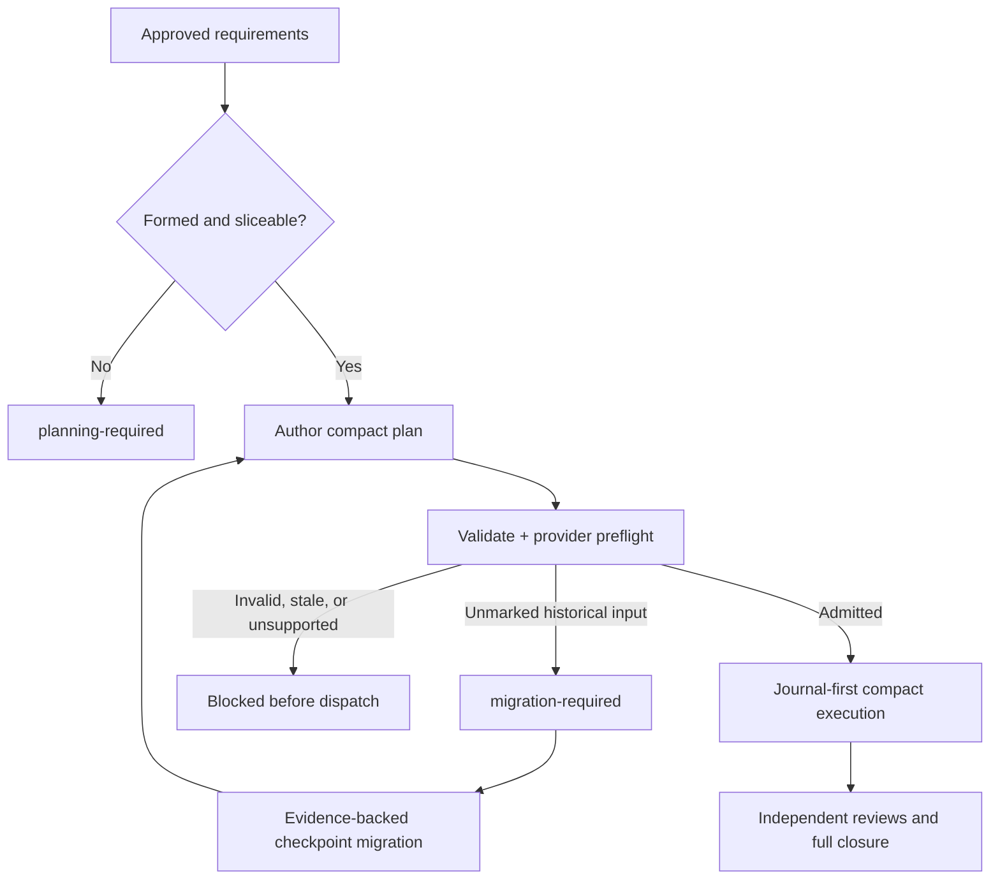

# Compact-only Unattended Execution — Product Brief

Audience: AWM maintainers, workflow owners, and implementing agents · Methodology: brief-spec (AWM product-brief)

## Business Need

- **N1** — AWM owners and users paying provider quotas can currently enter a high-cost execution topology without knowing it: an unmarked implementation plan is accepted as `legacy` with a successful exit code, and the executor preserves the old per-task path. Leaving this unresolved makes unattended cost unpredictable and allowed the issue #148 cycle to consume about 4% of the Codex quota during its first task.
- **N2** — The owner is present during discovery, brainstorming, product definition, and plan writing, but development then runs unattended. The system therefore needs mechanical admission and routing guarantees; recommendations that depend on the owner changing model or effort between tasks do not solve the operational problem.
- **N3** — AWM's existing quality comes from traceability, TDD, independent specification and code-quality review, final QA, documentation, retrospective learning, and verification gates. Cost reduction that removes those controls would trade away the harness's differentiator, so the workflow must reduce the number and payload cost of dispatches while retaining those outcomes.
- **N4** — An interrupted or already-running development must be resumable from durable evidence without restarting completed work or trusting conversational memory. Without a compact migration and checkpoint contract, stopping an expensive run either wastes valid work or risks certifying work that was never completed.

## Business Cases

- New formed serial plan: requirements and ownership are complete, so `writing-plans` emits exactly one supported compact contract and the execution admission gate accepts it.
- Incomplete or ambiguous input: missing requirements, product decisions, architecture decisions, or ownership prevents implementation-plan creation; the workflow returns `planning-required` instead of producing another executable format.
- Existing unmarked plan: the document remains readable as historical material, but validation returns `migration-required` with a non-zero exit and execution does not dispatch an agent.
- Partially executed historical plan: migration reconciles plan checkboxes, Git commits and diff, journal state when present, test and sensor evidence, and independent verdicts; only evidence-backed work is carried forward.
- Issue #148 recovery: its clean checkpoint, completed Task 1, Task 2 implementation evidence, tests, and pending quality re-review are mapped into a new compact continuation without repeating Task 1 or silently declaring Task 2 complete.
- Security, robustness, root configuration, public-contract, or uncertain cross-cutting risk: the affected compact slice receives full relevant context and full applicable verification while retaining the same reviews and closure gates.
- Parallel-track request under `compact-slices/v1`: the plan is serialized into explicit compact slices; parallel execution is unavailable until a later compact schema represents ownership, isolation, integration, and fallback mechanically.
- Unsupported future compact schema: the installed CLI blocks execution and directs the user to update AWM; it never guesses or downgrades to an older path.
- Supported provider model routing: a semantic slice profile resolves to a concrete provider model and effort before dispatch, without requiring the owner to remain present.
- Provider without model override: the workflow runs with the provider's safe full-capability default only when the degradation is explicit in preflight and durable evidence; it never claims model-routing savings for that run.
- Missing or invalid model-policy mapping: the affected profile fails loudly before its first dispatch unless the provider contract explicitly defines the visible full-capability degradation.
- Interactive execution: it uses the same compact admission, routing, reviews, and gates; interaction mode changes pauses and termination behavior, not plan format or quality.
- Unattended execution: it requires an initialized, current journal and a successful reconciliation before the first implementation dispatch.
- Plan amended after approval: any change to mode, slices, requirements, sources, commands, or routing profile changes the plan digest, requires revalidation, and invalidates evidence tied only to the previous digest.
- Cost forecast exceeds expectations: preflight reports planned slices, required role dispatches, closure roles, and unresolved cost fields before execution; it does not fabricate a quota percentage when provider billing data is unavailable.

## Users & Context

- The AWM owner makes product and quality decisions during attended phases, authorizes unattended execution, and needs the resulting run to honor the approved cost and quality policy without manual intervention.
- The planning agent converts an approved specification into an executable contract and must stop instead of improvising when the contract cannot be expressed safely.
- The unattended controller admits a plan, initializes or reconciles durable state, resolves provider capabilities, dispatches roles, and prevents duplicate or stale work.
- Implementers receive one cohesive slice and its bounded evidence; specification reviewers and code-quality reviewers receive independent, role-appropriate evidence.
- Final Track A and Track B QA, documentation, retrospective, verification, and branch-finishing phases consume the completed implementation while remaining independent of the cheaper implementer routing.
- AWM CLI and baseline-registry maintainers evolve the mechanical validator and the provider-neutral skill contracts as one versioned behavior even though the sources live in separate repositories.

## Constraints

- Plan execution: `compact-slices` is the only executable implementation-plan family. There is no successful `legacy` plan path.
- Historical compatibility: old plans remain readable and migratable; backward compatibility does not mean direct execution without current admission.
- Quality: requirement traceability, TDD, per-slice specification review, per-slice code-quality review, final code review, Track A and Track B QA, documentation, harness retro, sensors, and applicable full verification remain mandatory.
- Risk fallback: full-context fallback is allowed only inside an admitted compact slice and changes context breadth, never roles, gates, or evidence requirements.
- Unattended durability: unattended mode requires journal-first operation; absence, corruption, ambiguity, or stale plan identity blocks dispatch.
- Provider neutrality: plans declare semantic profiles and required behavior, never hard-coded provider model names. Provider adapters or local policy resolve concrete model and effort.
- Provider coverage: Antigravity, OpenCode, Claude Code, Codex, Cursor, and Copilot are mandatory capability-matrix targets. Compact admission applies to all six; unattended, subagent, model, and effort behavior is certified independently and may block or degrade only according to its declared capability.
- Repository boundary: CLI behavior belongs to `agentic-workflow`; skill and reference behavior belongs to `awm-baseline-registry`. Release evidence must prove their installed versions agree.
- Cost: no new paid infrastructure is introduced. AWM reports only provider usage and prices it can attribute honestly.
- Privacy: journals and reports must not persist prompts, chain-of-thought, unrestricted source bodies, secrets, credentials, or unrestricted model responses.
- Integrity: no plan mutation, mode patch, manual checkbox, agent report, or stale test result may bypass current-plan validation and file-derived reconciliation.
- Robustness: every changed public function validates inputs and fails loudly; invalid values never silently become `undefined`, `NaN`, `Infinity`, success, or a weaker execution mode.
- Release safety: publication and release automation remain governed by the repository constitution; this initiative does not publish directly from a development session.

## Non-Assumption Mandate

This brief was built from read-only inspection of the current CLI, installed baseline skill contracts, the historical issue #126 brief, and the checkpoint reported by the paused issue #148 task. The following facts were verified against the current sources:

- AWM CLI 9.7.1 exposes `awm plan validate` but no `awm plan analyze` implementation.
- A plan with no compact marker is classified as `legacy`; command output describes the old full-quality path and returns exit code `0`.
- `writing-plans` permits legacy output when its agent judges a plan ineligible, and `subagent-driven-development` preserves unmarked-plan execution.
- The product-brief contract requires identifiers shaped like `RF-x.y` and `RNF-x.y`, while the compact CLI validator currently rejects the dot character in IDs.
- The compact reference documents five combined Markdown sections that do not match the five subsection names required by the CLI validator.
- Journal-first execution is optional when no journal exists, including for a plan later patched to `desatendido`.
- After building the TypeScript and native artifacts, the repository baseline produced 3,539 passing tests and one environment-sensitive Git fixture; after declaring its expected `master` default, that file passed all 12 tests.

The following have **not** been verified and must be resolved by Release 0 before the affected implementation commitment:

- The exact interactive, unattended-controller, subagent, model, reasoning-effort, observed-identity, and durable-resume surfaces exposed by each of the six AWM targets.
- Whether every other declared provider can select models per dispatch or must use a visible full-capability degradation.
- The exact local configuration boundary for model-policy defaults and user overrides across providers.
- The provider usage fields that can be attributed reliably to a slice, role, retry, cache operation, or full cycle.
- The safest durable mapping between compact slice state and the existing journal schema without duplicating another state machine.
- Whether a general migration command can mechanize evidence collection without pretending to make semantic slice decisions.
- The exact compact schema extension needed for parallel tracks and whether its value justifies implementation after serial compact admission is stable.
- The final set of files and release transactions required to keep CLI code, registry source, installed skills, and documentation current together.

Any contradiction discovered during Release 0 is reported in GitHub issue #126 and recorded as a brief update or new `DA-#`; it is never silently resolved. Exact schemas, function signatures, commands, model names, and adapter mechanics are delegated to development only after read-only discovery verifies the current system.

## Glossary

| Term | Definition |
|------|------------|
| Compact plan | An implementation plan carrying a supported, mechanically validated `compact-slices/*` manifest and complete slice prose. |
| Executable plan | A compact plan that passes schema validation, currentness, provider-policy preflight, and the execution-mode admission gate. |
| Migration-required | Non-success state for a readable historical or unmarked plan that cannot execute until evidence-backed conversion. |
| Planning-required | Non-success state indicating that requirements, decisions, ownership, or safe boundaries are insufficient to author an implementation plan. |
| Cohesive slice | Smallest independently implementable and reviewable behavioral unit with one owner per requirement and explicit dependencies. |
| Full-context fallback | Expansion of the relevant evidence supplied to a compact slice because of declared risk; never a fallback to another plan format or fewer controls. |
| Evidence capsule | Bounded role-specific package of clauses, sources, surfaces, results, and findings used for one dispatch. |
| Semantic model profile | Provider-neutral intent such as `mechanical`, `integration`, or `judgment`, resolved to a concrete model and effort at runtime. |
| Provider resolution | Mapping from semantic profile to a currently available native model/effort or an explicit safe degradation. |
| Admission gate | Mechanical checks that must pass before any implementation or review dispatch begins. |
| Checkpoint migration | Reconstruction of remaining compact work from durable plan, Git, journal, tests, sensors, and verdict evidence. |
| Current plan identity | Digest binding the admitted plan content to journal work, verification evidence, and role verdicts. |

## Processes

- **PR-1 — Author a plan:** `writing-plans` accepts only a formed requirement set. It assigns every requirement to exactly one serial cohesive slice, declares sources, inert RED/GREEN commands, evidence, risks, fallbacks, execution mode, and semantic model profile, then validates the result. If it cannot do so without product or architecture judgment, it returns `planning-required` and creates no executable alternative.
- **PR-2 — Admit execution:** before any dispatch, the controller invokes the authoritative compact validator, verifies installed CLI/skill contract compatibility, resolves execution mode and provider policy, forecasts dispatch topology, and initializes or reconciles the journal. Only a supported valid compact plan with current durable state proceeds.
- **PR-3 — Migrate and resume:** an unmarked or partially executed plan enters migration. The workflow reads durable artifacts, proposes explicit remaining slices, preserves completed evidence, labels uncertain work pending, validates the replacement plan, binds it to a journal, and resumes from its first unmet obligation. Migration never runs arbitrary historical plan steps directly.
- **PR-4 — Route models:** each implementer slice declares a semantic profile derived from bounded complexity and risk signals. The provider resolver selects concrete model and effort from current policy. Review, architecture, ambiguity resolution, and final QA remain on the full-capability profile. Actual resolution and any degradation are recorded before dispatch.
- **PR-5 — Execute compact slices:** the controller dispatches one dependency-ready slice at a time with an evidence capsule, preserves RED → implementation → GREEN, obtains independent specification and code-quality verdicts, reconciles them against files and current plan identity, and records completion in the journal. Risk triggers expand relevant context without changing the plan family.
- **PR-6 — Close and learn:** after all slices, the workflow runs the full required branch verification, final review, Track A and Track B QA, documentation, harness retro, and finishing route. It reports planned versus actual dispatches, provider resolution, observable usage, retries, fallbacks, and unavailable cost fields, then links durable evidence from issue #126.

## Requirements

- **RF-1.1** — WHEN `writing-plans` receives complete approved requirements with explicit ownership, THE planning process SHALL produce a supported compact plan and SHALL NOT expose a legacy implementation-plan option.
  - **CA-1.1** — Generate plans from real serial specifications representing trivial, multi-file, and security-sensitive changes; each output validates as compact and no output or prompt offers legacy execution.
- **RF-1.2** — IF requirements, ownership, product decisions, architecture decisions, or safe slice boundaries are incomplete, THEN THE planning process SHALL return `planning-required` and SHALL NOT write an executable implementation plan.
  - **CA-1.2** — Exercise each missing-input class independently and verify no admitted plan is created, the missing facts are named, and execution cannot start.
- **RF-1.3** — WHEN product requirements use canonical `RF-x.y` or `RNF-x.y` identifiers, THE compact contract SHALL preserve those identifiers without lossy translation and SHALL validate them consistently in producer, CLI, and executor.
  - **CA-1.3** — Validate and execute a fixture containing `RF-1.1` and `RNF-T.1`; both identifiers remain byte-identical from brief through plan, journal, tests, reviews, and closure evidence.
- **RF-1.4** — WHEN a compact reference defines required slice sections, THE producer, reference example, CLI validator, and executor SHALL consume one canonical section vocabulary and heading structure.
  - **CA-1.4** — Run the published reference example through the compiled CLI validator and executor parser; it passes without fixture-only transformations, while each missing or duplicate required section fails with a stable diagnostic.
- **RF-1.5** — WHEN a skill instructs an agent to run an AWM command, THE installed CLI SHALL expose that command with the documented semantics, or THE skill SHALL omit the instruction.
  - **CA-1.5** — Extract every `awm plan` invocation from published planning/execution skills and verify each against compiled CLI help and a behavioral contract test; `awm plan analyze` cannot remain as an undocumented absence.
- **RF-1.6** — WHEN a compact plan is amended, THE workflow SHALL revalidate the entire current plan and SHALL produce a new plan identity before further execution.
  - **CA-1.6** — Change mode, requirements, sources, commands, profile, and slice prose one at a time; each change invalidates the previous identity and no old verdict or test result certifies the amended plan accidentally.

- **RF-2.1** — WHEN `awm plan validate` reads a plan with no supported compact contract, THE CLI SHALL return `migration-required` with a non-zero exit and SHALL NOT describe another executable path.
  - **CA-2.1** — Run the compiled CLI against an unmarked historical plan in human and JSON modes; both report `migration-required`, exit non-zero, preserve the file byte-for-byte, and contain no success or legacy-execution language.
- **RF-2.2** — WHEN any implementation executor starts, THE controller SHALL run the authoritative compact admission gate before its first subagent dispatch.
  - **CA-2.2** — Instrument every execution entry path exposed across the six AWM targets with an unmarked plan and verify zero implementation/review dispatches occur before the blocking verdict; repeat each supported path with a valid compact plan and verify execution proceeds.
- **RF-2.3** — IF a plan signals an invalid or future unsupported compact schema, THEN THE CLI and executor SHALL block with a distinct bounded diagnostic and SHALL NOT reinterpret it as historical input.
  - **CA-2.3** — Exercise malformed current, unsupported future, oversized, duplicate-key, and partial-marker plans against compiled CLI and real entry paths; every case blocks without execution, mutation, path disclosure, or schema downgrade.
- **RF-2.4** — IF a compact slice declares a security, robustness, root-configuration, public-contract, or uncertain cross-cutting trigger, THEN THE executor SHALL expand to full relevant context while retaining compact state, all reviewers, and all gates.
  - **CA-2.4** — Exercise each risk class in a real compact cycle and verify the journal records the trigger and expanded sources while dispatch count, reviewer obligations, and closure requirements are not reduced.
- **RF-2.5** — WHEN installed CLI and skill contracts disagree on supported schema, identifiers, sections, commands, or admission semantics, THE preflight SHALL block unattended execution and identify the mismatched components.
  - **CA-2.5** — Pair intentionally mismatched CLI and registry fixtures and verify preflight blocks before dispatch with installed/source versions and the incompatible contract named; a matched pair proceeds.

- **RF-3.1** — WHEN execution mode is `desatendido`, THE admission gate SHALL require an initialized journal bound to the current plan identity before any subagent dispatch.
  - **CA-3.1** — Start a valid unattended plan without a journal, with a corrupt journal, and with a stale-plan journal; each run dispatches zero agents and reports a distinct remedy. A current initialized journal proceeds.
- **RF-3.2** — WHEN an unattended controller starts or resumes, THE workflow SHALL reconcile journal, current plan, Git state, active jobs, tests, sensors, and verdict obligations before selecting its next slice.
  - **CA-3.2** — Interrupt controlled cycles during implementation, each review, a fix, verification, and closure; every recovered cycle chooses one correct next action without losing or duplicating completed obligations.
- **RF-3.3** — WHEN migrating a partially executed historical plan, THE workflow SHALL carry forward only work whose completion is supported by current file-derived and durable evidence.
  - **CA-3.3** — Migrate a fixture containing a checked task without a commit, a commit without passing tests, passing tests without required review, and a fully evidenced task; only the fully evidenced task becomes complete.
- **RF-3.4** — WHEN issue #148 resumes after Release 1, THE migration SHALL preserve its verified Task 1 evidence, represent Task 2 as pending its missing quality verdict, and retain Tasks 3 through 14 as unstarted unless newer durable evidence proves otherwise.
  - **CA-3.4** — From a fresh session using the #148 branch, its plan, Git history, and issue links, produce a compact current state that selects the pending Task 2 quality obligation and does not re-dispatch Task 1.
- **RF-3.5** — IF migration encounters ambiguous ownership, conflicting evidence, or work that cannot be mapped to a safe slice, THEN THE workflow SHALL stop with `planning-required` or `blocked` and SHALL NOT infer completion.
  - **CA-3.5** — Seed each ambiguity class in migration fixtures and verify the unresolved item, affected requirements, and required decision are reported without source mutation or agent dispatch.

- **RF-4.1** — WHEN a compact slice is authored, THE plan SHALL declare one provider-neutral implementer profile from a versioned semantic vocabulary and SHALL NOT embed a provider model name.
  - **CA-4.1** — Validate fixtures for every supported profile and reject unknown profiles and concrete provider identifiers in the semantic field; valid plans remain portable unchanged across all six AWM targets.
- **RF-4.2** — WHEN dispatching an implementer, THE provider resolver SHALL map the slice profile to a currently available concrete model and reasoning effort according to validated local policy.
  - **CA-4.2** — On every provider R0 certifies for native routing, run one real mechanical and one integration slice; for every other target, verify the declared degraded or blocked result. Durable evidence records the requested profile, resolution, policy version, provider, and actual observed identity where exposed.
- **RF-4.3** — WHEN dispatching specification review, code-quality review, final review, architecture judgment, or QA, THE workflow SHALL use the full-capability review profile independently of the implementer profile.
  - **CA-4.3** — Inspect a real cycle whose implementer uses the least-cost profile and verify every review/QA dispatch resolves to the configured full-capability profile with distinct role identity.
- **RF-4.4** — IF a provider cannot select a model or effort per dispatch, THEN THE resolver SHALL use the provider's declared safe full-capability behavior, record a visible degradation, and suppress model-routing savings claims.
  - **CA-4.4** — Execute a capability fixture without override support; the cycle completes with all quality gates, preflight and final report show the degradation, and routing savings remain unavailable rather than zero.
- **RF-4.5** — IF a required provider mapping is missing, invalid, unavailable, or resolves to an unrecognized capability, THEN THE resolver SHALL fail loudly before dispatch unless RF-4.4's declared degradation applies.
  - **CA-4.5** — Exercise missing, malformed, stale, unavailable-model, and unsupported-effort mappings; each produces a bounded non-success verdict and zero affected dispatches.

- **RF-5.1** — WHEN a formed specification contains adjacent requirements sharing behavior, surfaces, dependencies, and verification boundaries, THE planner SHALL group them into the smallest justified cohesive slices rather than reproducing one execution task per requirement.
  - **CA-5.1** — Convert representative 15-task historical plans and verify each resulting slice owns all and only its requirements, states its grouping rationale, and preserves every test and review obligation with fewer implementer cycles.
- **RF-5.2** — WHEN admission succeeds, THE preflight SHALL report the planned number of implementer, per-slice reviewer, final-review, QA, documentation, retro, and finishing dispatches before execution.
  - **CA-5.2** — Recompute the forecast from a real compact manifest and closure policy; every category reconciles exactly with the planned topology and no hidden invocation category is omitted.
- **RF-5.3** — WHEN a role is dispatched, THE controller SHALL send the stable role contract plus one bounded evidence capsule and SHALL exclude unrelated full plans, histories, and source bodies by default.
  - **CA-5.3** — Inspect real implementer and reviewer payload manifests for multiple slices and verify every included item is allowlisted and traceable while unrelated slices are absent.
- **RF-5.4** — WHEN a slice completes implementation, THE workflow SHALL obtain independent specification and code-quality verdicts and SHALL reconcile them with current files, tests, sensors, requirements, and plan identity before marking it complete.
  - **CA-5.4** — Omit or stale each evidence class in controlled runs; the slice remains incomplete until current evidence and both clean verdicts exist.
- **RF-5.5** — WHEN all slices are locally complete, THE workflow SHALL still execute the full required final review, Track A and Track B QA, documentation, retro, sensor, verification, and finishing gates.
  - **CA-5.5** — Complete a real compact cycle and verify every configured closure obligation appears once with a current passing or explicitly accepted verdict before branch completion.
- **RF-5.6** — WHEN usage or price evidence is incomplete, THE report SHALL distinguish observed, derived, unavailable, and degraded values and SHALL NOT convert missing data into zero or a claimed percentage saving.
  - **CA-5.6** — Remove each provider usage field in turn and verify reports remain parseable, disclose provenance and uncertainty, and suppress unsupported totals and savings claims.

- **RF-6.1** — WHEN a material artifact, decision, implementation checkpoint, measurement, commit, or pull request changes, THE initiative SHALL link its durable evidence from GitHub issue #126.
  - **CA-6.1** — From a fresh session using issue #126 only, locate the current brief, readiness verdict, implementation plan, active branch/worktree, #148 recovery state, verification evidence, and next action without chat history.
- **RF-6.2** — WHEN execution completes or blocks, THE cycle SHALL report planned versus actual dispatches by role, retries, full-context fallbacks, provider resolution, and current-plan identity.
  - **CA-6.2** — Reconcile a completed and a blocked real cycle against journal records; counts and identities agree exactly and unresolved provider fields are labeled unavailable.

- **RNF-T.1** — THE provider contract SHALL enumerate Antigravity, OpenCode, Claude Code, Codex, Cursor, and Copilot and SHALL represent each execution capability honestly instead of inferring it from artifact support or imposing divergent quality semantics.
  - **CA-T.1** — Run the common contract suite across all six targets, execute real flows for every capability available in the environment, and verify unsupported or unverified capabilities produce their declared degraded or blocked result rather than a compatibility claim.
- **RNF-T.2** — THE workflow SHALL validate all public inputs, bound reads and diagnostics, reject unsafe paths and commands, and fail loudly without partial writes.
  - **CA-T.2** — Run unit, integration, adversarial input, typecheck, dependency, sensor, and atomicity suites for every changed public surface and verify safe explicit failures.
- **RNF-T.3** — THE journal, routing evidence, and usage reports SHALL be local, bounded, atomic, and redacted, excluding prompts, chain-of-thought, source bodies, secrets, and credentials.
  - **CA-T.3** — Seed forbidden content into real execution inputs and scan all persisted artifacts; none contains forbidden values while required IDs, counts, verdicts, and provenance remain usable.
- **RNF-T.4** — THE workflow SHALL preserve historical plans byte-for-byte unless the owner explicitly accepts a separately written migrated artifact; migration SHALL never overwrite the only copy.
  - **CA-T.4** — Hash historical input before and after inspection and migration; the original is unchanged and the new compact artifact has its own identity and trace link.
- **RNF-T.5** — THE workflow SHALL expose every fallback, degradation, migration, retry, and invalidation in preflight or durable evidence; none may silently select a more expensive or weaker path.
  - **CA-T.5** — Exercise every configured alternate path and verify one deterministic visible record names its trigger, effect, and whether cost comparison remains valid.
- **RNF-T.6** — THE workflow SHALL retain the current quality gates and SHALL reject an optimization whenever acceptance coverage, review obligations, robustness, security, or final QA regresses, regardless of cost.
  - **CA-T.6** — Run controlled candidates with one omitted obligation or seeded important defect each; every candidate is rejected before completion.
- **RNF-T.7** — THE unattended workflow SHALL be deterministic and idempotent for current plan identity, slice, role, command, and verdict obligations across interruption and retry.
  - **CA-T.7** — Reissue identical concurrent and recovered requests and verify they reuse or reconcile the same durable obligation rather than creating duplicate active work.
- **RNF-T.8** — THE initiative SHALL target at least 50% lower billed-equivalent model cost on the agreed representative cycle while meeting every quality CA, and SHALL report the result as inconclusive when comparable provider evidence is unavailable.
  - **CA-T.8** — Execute paired baseline and compact cycles under matched provider/model policy and acceptance obligations; accept the target only when quality passes and attributable billed-equivalent cost falls by at least 50%.

## Open Decisions

| ID | Decision | Blocks | Known Positions |
|----|----------|--------|------------------|
| DA-1 | **RESUELTA 2026-09-14 (owner):** unmarked plans are readable historical inputs but never executable; validation returns `migration-required` with non-zero exit. | none | Compact-only execution approved. |
| DA-2 | **RESUELTA 2026-09-14 (owner):** `compact-slices/v1` remains serial; track plans must be serialized until a later compact schema can represent parallel safety mechanically. | none | Quality and deterministic admission precede parallel speed. |
| DA-3 | **RESUELTA 2026-09-14 (owner):** a provider without native model selection may degrade visibly to its safe full-capability default and cannot claim routing savings. | none | Cross-provider execution remains available without silent cost claims. |
| DA-4 | **RESUELTA 2026-09-14 (owner):** issue #148 resumes through evidence-backed checkpoint migration and does not restart from zero. | none | Completed work is preserved only when durable evidence supports it. |
| DA-5 | **RESUELTA 2026-09-14 (owner):** implementers may use lower-cost profiles; reviewers, architecture judgment, and QA remain on full capability. | none | Quality apparatus remains intact. |
| DA-6 | Which concrete default model and reasoning-effort mapping should ship for each semantic profile on each of the six targets after R0 capability verification? | Release 2 | Owner-approved process: R0 recommends the matrix, the owner approves it once before R2, and providers without native routing retain an explicit full-capability degradation or unattended block. |

## Out of Scope

- Removing, merging, sampling, or conditionally skipping specification review, code-quality review, final review, Track A, Track B, TDD, documentation, retro, sensors, or branch verification.
- Removing historical compatibility labeled `legacy` from sensors, journals, context kernels, bundle formats, or unrelated CLI domains; this brief removes only the successful unmarked implementation-plan execution path.
- Automatically declaring semantic slice boundaries or completed work when requirements or durable evidence are ambiguous.
- Overwriting the original #148 plan or discarding its existing branch, commits, tests, and pending review state.
- Hard-coding provider prices or assuming visible token counts equal billed cost.
- Promising model routing on a provider before its current native capability is verified.
- Direct npm publication, registry publication, merge, or release outside the repository's finishing and authorization contracts.
- Adaptive reviewer downgrading or reviewer-model cost experiments; those require a separate owner decision and non-inferiority brief.

## Releases

No release starts before the prior release's acceptance criteria pass. A later open decision never blocks the compact-only safety value of Release 1.

### Release 0 — Contract and capability truth

- **Value:** Produces a reproducible map of the current failure and the actual provider, CLI, registry, journal, and checkpoint boundaries before mutating either repository.
- **Scope:** Non-Assumption Mandate verification; RF-6.1; RNF-T.1, RNF-T.2, RNF-T.4.
- **Blocked by:** none.
- **Acceptance:** CA-6.1, CA-T.1, CA-T.2, CA-T.4, plus versioned fixtures reproducing the `legacy` exit-0 path, ID mismatch, heading mismatch, missing command, unattended-without-journal path, and #148 checkpoint.

### Release 1 — Compact-only admission, durable unattended execution, and migration

- **Value:** Immediately prevents every new or resumed unattended cycle from entering the costly unmarked path while preserving valid completed work and all quality gates.
- **Scope:** PR-1, PR-2, PR-3; RF-1.1 through RF-1.6; RF-2.1 through RF-2.5; RF-3.1 through RF-3.5; RF-5.1, RF-5.4, RF-5.5; RF-6.1; RNF-T.2 through RNF-T.7.
- **Blocked by:** none.
- **Acceptance:** CA-1.1 through CA-1.6; CA-2.1 through CA-2.5; CA-3.1 through CA-3.5; CA-5.1, CA-5.4, CA-5.5; CA-6.1; CA-T.2 through CA-T.7; real Codex acceptance that blocks an unmarked plan and admits a compact plan; successful #148 checkpoint migration dry run.

### Release 2 — Provider-neutral implementer routing and dispatch forecast

- **Value:** Removes the owner's need to switch models manually and reduces implementer cost while keeping reviewers and QA at full capability.
- **Scope:** PR-4; RF-4.1 through RF-4.5; RF-5.2; RF-6.2; RNF-T.1 through RNF-T.7.
- **Blocked by:** DA-6 and successful Release 1 acceptance.
- **Acceptance:** CA-4.1 through CA-4.5; CA-5.2; CA-6.2; CA-T.1 through CA-T.7; one real routed compact cycle on every target R0 certifies for native routing, with explicit degraded or blocked acceptance for the remaining targets.

### Release 3 — Evidence capsules and honest cost comparison

- **Value:** Reduces repeated payload, exposes actual dispatch and fallback cost, and determines whether compact routing meets the economic target without weakening quality.
- **Scope:** PR-5, PR-6; RF-5.3 through RF-5.6; RF-6.1, RF-6.2; RNF-T.1 through RNF-T.8.
- **Blocked by:** successful Release 2 acceptance.
- **Acceptance:** CA-5.3 through CA-5.6; CA-6.1, CA-6.2; CA-T.1 through CA-T.8; paired representative cycles with an explicit pass, fail, or inconclusive economic verdict.

### Release 4 — Compact parallel tracks

- **Value:** Restores safe parallel speed only after compact-only serial execution is stable, using a schema that can prove isolation, ownership, integration, and serial fallback.
- **Scope:** A separately versioned compact schema and requirements derived from verified track behavior in Release 0.
- **Blocked by:** successful Releases 1 through 3 and a new owner-approved design for the schema extension.
- **Acceptance:** Real equivalent serial and isolated-parallel executions, conflict and undeclared-resource fixtures, integration verification, provider parity, and no reintroduction of an unmarked execution path.

## Risks

| Risk | Impact | Mitigation |
|------|--------|------------|
| Contradictions between this brief and the real system | Incorrect implementation or rework | Release 0 read-only discovery, non-assumption mandate, and issue #126 decision log. |
| Removing exit-0 legacy admission breaks historical automation | Existing scripts stop rather than run | Intentional fail-closed break, distinct `migration-required` diagnostic, dry-run migration, and release notes. |
| Compact producer and validator drift again | Plans fail after approval or bypass admission | One canonical contract fixture consumed by registry reference, compiled CLI, and executor; installed-version preflight. |
| Cohesive slices become too broad | Larger implementation context or hidden ownership | One owner per requirement, explicit grouping rationale, bounded surfaces, dependency validation, and amendment-required fallback. |
| Migration repeats or over-certifies #148 work | Wasted quota or false completion | File-derived reconciliation, current tests, required verdicts, original artifact preservation, and dry run before resume. |
| Mandatory journal introduces a new unattended blocker | Runs stop before useful work | Actionable initialization remedy, real provider acceptance, atomic state, and deterministic recovery tests. |
| Cheap implementer profile cannot handle a slice | Retry cost erases savings or defects increase | Complexity signals, explicit escalation, reviewers at full capability, actual resolution evidence, and no quality-gate reduction. |
| Provider model identifiers or controls drift | Routing fails or silently uses another model | Runtime capability resolution, versioned local policy, visible degradation, and fail-loud invalid mappings. |
| Other providers lack model override | Cost savings are inconsistent | Safe full-capability degradation, provider-specific savings marked unavailable, required quality preserved. |
| Serial compact temporarily removes track speed | Longer wall time for independent work | Preserve correctness first, measure impact, and introduce compact parallel schema only with mechanical isolation. |
| Dispatch forecast is mistaken for billed-cost certainty | Owner makes decisions from false precision | Separate topology counts from provider usage and billed-equivalent cost; unavailable remains unavailable. |
| Coordinated CLI and registry changes publish out of order | Installed behavior becomes internally inconsistent | Contract currentness preflight, paired acceptance, ordered release procedure, and no direct publication from development. |
