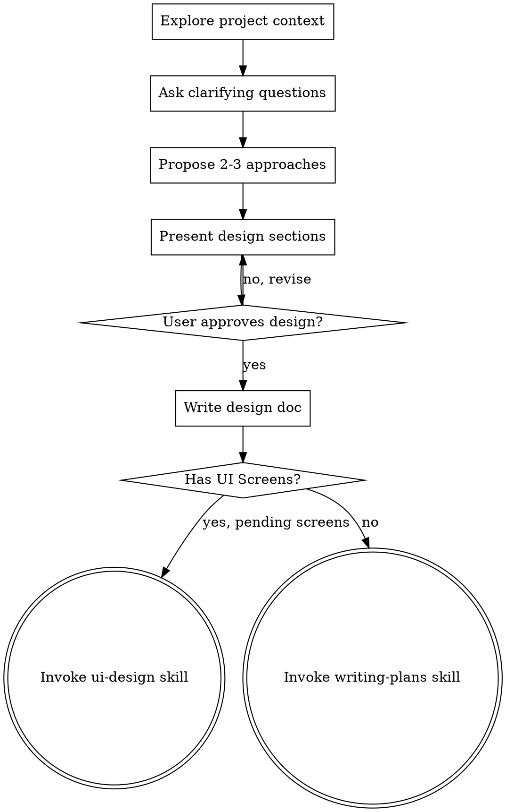

# Brainstorming Ideas Into Designs

## Overview

Help turn ideas into fully formed designs and specs through natural collaborative dialogue.

Start by understanding the current project context, then ask questions one at a time to refine the idea. Once you understand what you're building, present the design and get user approval.

<HARD-GATE>
Do NOT invoke any implementation skill, write any code, scaffold any project, or take any implementation action until you have presented a design and the user has approved it. This applies to EVERY project regardless of perceived simplicity.
</HARD-GATE>

## Anti-Pattern: "This Is Too Simple To Need A Design"

Every project goes through this process. A todo list, a single-function utility, a config change — all of them. "Simple" projects are where unexamined assumptions cause the most wasted work. The design can be short (a few sentences for truly simple projects), but you MUST present it and get approval.

## Checklist

You MUST create a task for each of these items and complete them in order:

1. **Explore project context** — check files, docs, recent commits
2. **Ask clarifying questions** — one at a time, understand purpose/constraints/success criteria
3. **Propose 2-3 approaches** — with trade-offs and your recommendation
4. **Present design** — in sections scaled to their complexity, get user approval after each section
5. **Write design doc** — save to `docs/plans/YYYY-MM-DD-<topic>-design.md` and commit
6. **Transition to next step** — if the design doc has `## UI Screens` with pending screens, invoke `ui-design`; otherwise invoke `writing-plans`

## Process Flow



**The terminal state is invoking either `ui-design` or `writing-plans`:**
- If the design doc contains a `## UI Screens` section with pending screens → invoke `ui-design`
- If no `## UI Screens` section exists → invoke `writing-plans`

Do NOT invoke any other implementation skill.

## The Process

**Understanding the idea:**
- Check out the current project state first (files, docs, recent commits)
- Ask questions one at a time to refine the idea
- Prefer multiple choice questions when possible, but open-ended is fine too
- Only one question per message - if a topic needs more exploration, break it into multiple questions
- Focus on understanding: purpose, constraints, success criteria

**Exploring approaches:**
- Propose 2-3 different approaches with trade-offs
- Present options conversationally with your recommendation and reasoning
- Lead with your recommended option and explain why

**Presenting the design:**
- Once you believe you understand what you're building, present the design
- Scale each section to its complexity: a few sentences if straightforward, up to 200-300 words if nuanced
- Ask after each section whether it looks right so far
- Cover: architecture, components, data flow, error handling, testing
- Be ready to go back and clarify if something doesn't make sense

## After the Design

**Documentation:**
- Write the validated design to `docs/plans/YYYY-MM-DD-<topic>-design.md`
- Use elements-of-style:writing-clearly-and-concisely skill if available
- Commit the design document to git

**Next step routing:**
- If the design doc has a `## UI Screens` section with pending screens → invoke `ui-design`
- Otherwise → invoke `writing-plans` to create a detailed implementation plan
- Do NOT invoke any other skill.

## UI Screen Detection

During the "Presenting the design" phase, evaluate whether the feature involves UI screens that would benefit from visual design with Stitch:

**Criteria (all must be true):**
1. The feature has direct user interaction (not purely backend, API, or CLI)
2. It requires new screens or significant layout changes
3. The visual complexity justifies a designer (a button text change does not)

**If UI screens are detected:**

After the user approves the full design, identify any UI screens detected. Before finalizing the design doc, ask the user:

> "I detected N screens that could benefit from UI design with Stitch: [list screens]. Do you want to go through the UI design phase or skip it?"

- **User accepts** → write the design doc including a `## UI Screens` section with a table:

```markdown
## UI Screens

| Screen | Description | Device | Status |
|--------|-------------|--------|--------|
| [name] | [description] | [MOBILE/DESKTOP/TABLET] | pending |
```

- **User skips** → write the design doc WITHOUT the `## UI Screens` section. Then invoke `writing-plans` directly.

**If no UI screens detected:** Do not add the section. Proceed directly to `writing-plans`.

> **Routing contract:** The `development-process` orchestrator and the `ui-design` skill route based on the presence of a `## UI Screens` table with at least one row where `Status` is exactly `pending`. Always use `pending` (lowercase) as the initial status value — using any other value will break routing.

## Key Principles

- **One question at a time** - Don't overwhelm with multiple questions
- **Multiple choice preferred** - Easier to answer than open-ended when possible
- **YAGNI ruthlessly** - Remove unnecessary features from all designs
- **Explore alternatives** - Always propose 2-3 approaches before settling
- **Incremental validation** - Present design, get approval before moving on
- **Be flexible** - Go back and clarify when something doesn't make sense

## Specialist Skills Awareness

During the approach exploration phase (Propose 2-3 approaches), if you detect the conversation involves decisions of significant complexity in these areas, you may invoke the corresponding specialist skill in **contextual mode** to enrich the discussion:

| Area | Skill | When to invoke |
|------|-------|----------------|
| Architecture design | `architecture-advisor` | Designing system architecture, choosing patterns, defining components, evaluating integrations |
| CI/CD pipeline | `cicd-proposal-builder` | Defining delivery pipeline, branching strategy, environments, deploy strategy |
| Non-functional requirements | `nfr-checklist-generator` | Identifying and prioritizing NFRs early in design |
| Technology selection | `technology-evaluator` | Evaluating and comparing technology options with structured criteria |

**Rules:**
- Only invoke for decisions of **significant complexity** — do not invoke for trivial choices.
- Invoke in **contextual mode** — the specialist answers a specific question and returns control to you.
- The specialist's output is integrated into the design document you are building, not written as a separate artifact.
- You remain in control of the brainstorming flow. The specialist is a consultant, not a replacement.