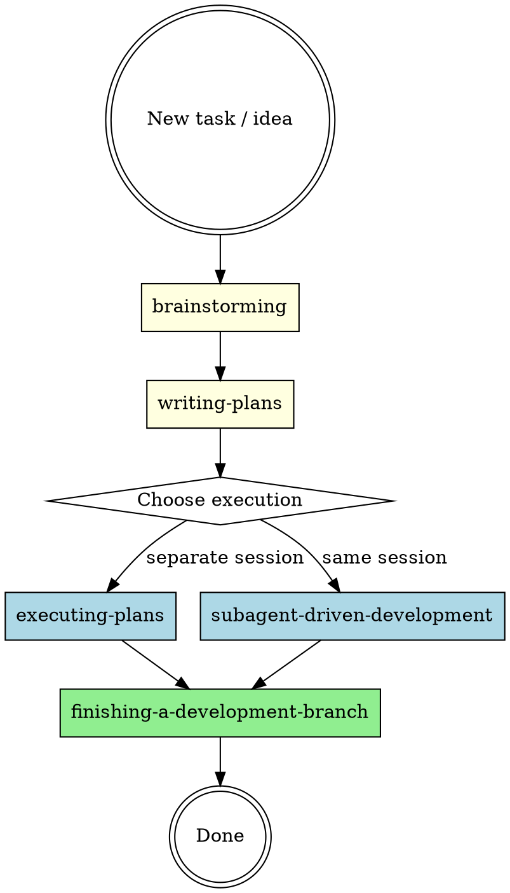

# Development Process Orchestrator

## Overview

Orchestrates the development lifecycle by identifying project state and invoking the correct skill at the correct time. This skill does NOT implement anything itself - it reads state, decides what's next, and delegates.

**Core principle:** Read state, decide phase, invoke skill, never skip phases.

## Development Lifecycle

### Pipeline Skills (sequential phases)

| Phase | Skill | Trigger | Output |
|-------|-------|---------|--------|
| 1. Design | `brainstorming` | New feature, new task, creative work | Design doc in `docs/plans/YYYY-MM-DD-<topic>-design.md` |
| 2. Planning | `writing-plans` | Design doc approved | Implementation plan in `docs/plans/YYYY-MM-DD-<topic>-plan.md` |
| 3a. Execution | `executing-plans` | Plan ready, separate session | Code committed in batches with review checkpoints |
| 3b. Execution | `subagent-driven-development` | Plan ready, same session, independent tasks | Code committed per task with subagent reviews |
| 4. Completion | `finishing-a-development-branch` | All tasks done, tests pass | Merge, PR, or branch cleanup |

### Cross-Cutting Skills (used during any phase)

| Skill | When to invoke |
|-------|----------------|
| `test-driven-development` | During ALL implementation - write test first, watch it fail, write minimal code |
| `systematic-debugging` | When any bug, test failure, or unexpected behavior occurs |
| `requesting-code-review` | After completing tasks, features, or before merging |
| `receiving-code-review` | When processing code review feedback - verify before implementing |
| `verification-before-completion` | Before ANY claim that work is done, fixed, or passing |

## Orchestration Process

### Step 1: Identify Project State

Scan `docs/plans/` for existing artifacts:

| Files found | State | Next action |
|-------------|-------|-------------|
| No design or plan files for the topic | **New** | Invoke `brainstorming` |
| `*-design.md` exists but no `*-plan.md` | **Designed** | Invoke `writing-plans` |
| `*-plan.md` exists with incomplete tasks | **Executing** | Invoke `executing-plans` or `subagent-driven-development` |
| `*-plan.md` exists, all tasks complete | **Finishing** | Invoke `finishing-a-development-branch` |

### Step 2: Present State to User

Report what you found:
- Current phase and artifacts detected
- The skill you recommend invoking next
- Why this is the logical next step

### Step 3: Get Explicit Approval

**Never invoke the next skill without user confirmation.** Present the recommendation and wait.

### Step 4: Invoke the Skill and Transfer Control

Once approved, invoke the skill. The invoked skill takes full control of the session from this point.

## Decision Rules

### When user says "build X" or "add feature Y"
1. Check `docs/plans/` for existing design/plan
2. If nothing exists → `brainstorming` (do NOT skip to coding)
3. If design exists → `writing-plans`
4. If plan exists → execution skill

### When user says "fix bug" or "something is broken"
1. Invoke `systematic-debugging` immediately
2. After root cause is found, if fix is non-trivial → `brainstorming` for the fix approach
3. If fix is straightforward → `test-driven-development` directly

### When user says "continue" or "resume work"
1. Scan `docs/plans/` for the most recent artifacts
2. Determine phase from artifact state
3. Invoke the appropriate skill

### When user says "review this" or "is this ready?"
1. Invoke `requesting-code-review`

## Red Flags

| Temptation | Reality |
|------------|---------|
| "Let me just write the code directly" | No. Check for design/plan first. Invoke `brainstorming` if missing. |
| "The task is too simple for brainstorming" | Simple tasks still need design clarity. Use the process. |
| "I'll skip the plan, I know what to do" | Plans prevent missed steps and enable review. Never skip. |
| "Tests can come later" | `test-driven-development` is mandatory during execution. No exceptions. |
| "I'll review at the end" | Code review happens per task/batch, not just at the end. |
| "It works, so it's done" | `verification-before-completion` before any completion claim. |
